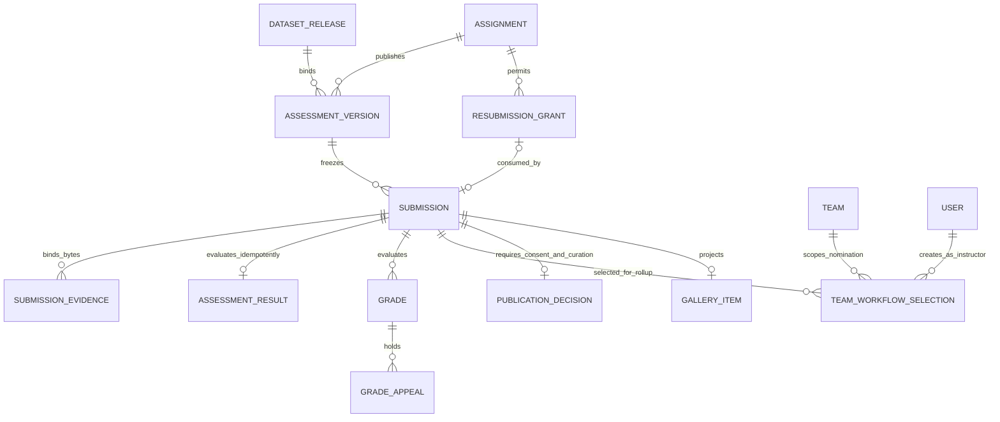
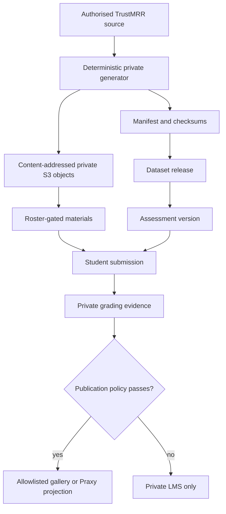
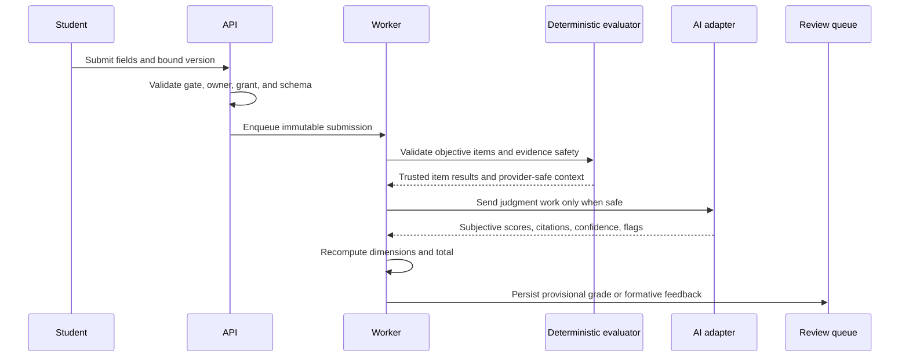
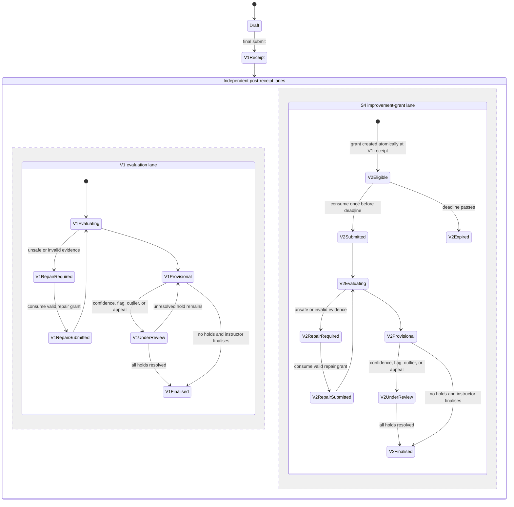
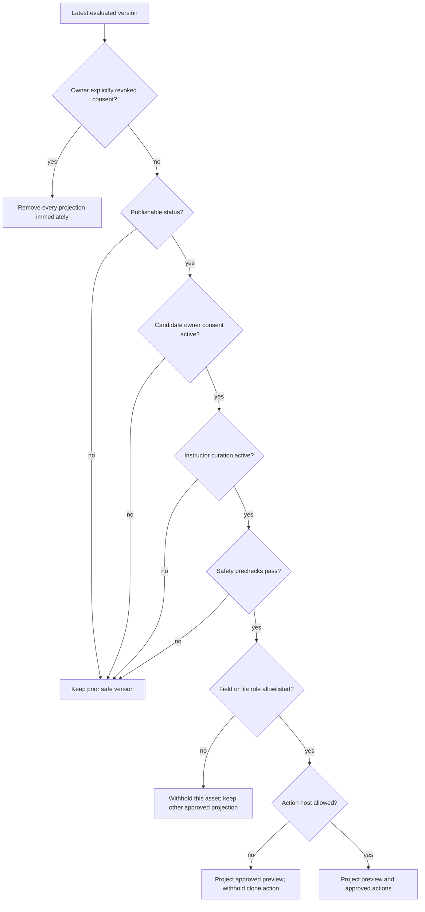

# Sessions 3-5 Forge Redesign - Plan

## Goal Capsule

- **Objective:** Replace the stale Sessions 3–5 LMS contract with private TrustMRR data work, a Lovable product build with controlled V2 evidence, and a staged Make.com workflow build.
- **Authority:** `lms/docs/build/SOURCE_OF_TRUTH.md` then `lms/docs/build/10_sessions_3_5_redesign_brief.md`, COT v3, scoring methodology, `lms/docs/DECISIONS.md`, live code/tests, and the taught evidence under `lms/docs/taught/`.
- **Execution profile:** Forward-only Prisma/Postgres changes, data-defined assignments, pg-boss workers, private S3, Clerk boundaries, and Railway web/worker/agent services.
- **Stop conditions:** Do not publish or open gates if private release checksums differ, hidden evaluator data appears in learner/export payloads, unresolved review holds can be finalised, the live migration is not forward-safe, the Railway target is ambiguous, the independently owned Clerk-credential incident prerequisite is not closed and verified, any S3–S5 gate or exception is unexpectedly open, a production canary fails, or the relevant session lacks a current teaching-readiness receipt.
- **Tail ownership:** Compound Engineering execution owns local implementation, verification, review, release hardening, and the Railway deployment requested by the user.

---

## Product Contract

### Summary

The Forge will deliver a private-evidence-to-product-to-system arc. Session 3 evaluates defensible analysis at small and over-context scale, Session 4 captures a testable Lovable V1 and one later V2, and Session 5 gives formative workflow-design feedback before grading and publishing a safe final workflow artifact.

### Problem Frame

The live LMS still implements the superseded Moxie/stocks data memo, a thin app URL form, and a team workflow upload. Its mutable assignment definitions can change the contract after submission, all second submissions are rejected, the worker cannot see PNG flowcharts, and gallery logic cannot safely show a workflow image with clone and sample-output actions.

The redesign also introduces private source data, deterministic answer keys, third-party workflow evidence, and delayed revisions. These surfaces require immutable version binding, field-level upload controls, explicit public projections, retry-safe grading, and human review boundaries before any release.

### Actors

- A1. **Student** analyses private data, builds and verifies an app, designs a workflow, receives feedback, appeals a provisional grade, and controls publication consent.
- A2. **Instructor** controls gates, reviews flagged grades, grants repair revisions, finalises results, and curates gallery publication.
- A3. **Grading worker** validates evidence, computes deterministic results, calls approved AI providers behind `lib/ai`, and persists provisional outcomes without authority to finalise them.
- A4. **Release operator** publishes content-addressed private assets, runs additive migrations and loaders, verifies canaries, and opens each section's ordered session-release gate set only after the release checks pass.

### Requirements

#### Immutable assessment and data contracts

- R1. Every redesigned draft and submission binds to the published assessment version, immutable owner kind, rubric, evaluator configuration, material manifest, and optional dataset release shown to the learner; a `versioned` assignment fails closed when that binding is absent, while explicitly `legacy` assignments alone may use the compatibility path.
- R2. Published assessment and dataset versions are database-enforced append-only records and keep content-addressed S3 keys, SHA-256 checksums, lineage, source date, audience, processing rules, approved AI processors, retention class, and file roles. A retention matrix maps every dataset, evaluator, prompt-log, draft upload, quarantined object, submission, audit, and public projection class to expiry, deletion authority, legal-hold behavior, and verified S3/database cleanup.
- R3. Student APIs, DPDP exports, Praxy exports, galleries, prompt logs, and client bundles never contain private answer keys or evaluator-only anchors.
- R4. TrustMRR source rows, row-level derivatives, detailed calculations, and assessment evidence remain roster-gated and private.

#### Session 3 data judgment

- R5. Session 3 exposes number, single-choice, multi-choice, text, writeup, and constrained file evidence through the generic assignment form. A server-created draft binds to the displayed assessment version on first save or presign and exposes unsaved, saving, saved, conflict, failed/retry, upload, replace/remove, validation, and quarantine states without revealing correctness.
- R6. Objective items are scored deterministically with versioned normalization, units, rounding, tolerances, null rules, and accepted alternatives.
- R7. Only judgment responses and aggregate summaries that contain no TrustMRR row values reach an approved no-training/no-retention AI processor behind `lib/ai`; the disclosure basis is bound to R2, and model output cannot change objective correctness or the server-computed total.
- R8. The scored data artifact retains the four 0–10 Artifact Quality dimensions and stays outside the MCQ best-three calculation.
- R9. The visualization choice-and-rationale activity is formative and does not enter the best-three quiz component.
- R10. Small data, over-context data, schema/sample, and evaluator assets are separate gated materials bound to one release manifest.

#### Session 4 product build

- R11. The app submission captures the selected product, permitted source evidence, feature contract, first prompt, V1 URL, acceptance evidence, V2 URL, and change note without requiring GitHub. The supported first-release lane uses the frozen original-brand SignalShelf/Liinks-analogue contract; an alternate TrustMRR product is allowed only after the feasibility checkpoint freezes an equivalent contract and never raises the grade ceiling.
- R12. Final V1 submission atomically creates the one course-policy improvement grant targeting V2; its ten-calendar-day clock starts at V1 receipt, and an instructor may auditably extend it for a documented vendor-credit cap or outage. A repair-flagged attempt can receive a separate instructor-issued one-use repair grant targeting the next immutable attempt. Grants record issuer, trigger, kind, target, expiry, extension, and consumption; concurrent requests cannot create duplicate owner/version/attempt rows or a second improvement revision.
- R13. While V2 is pending or grading, the LMS distinguishes latest submitted, latest evaluated, latest scoreable, and latest publishable versions across every consumer.
- R14. App publication uses original student branding, an HTTPS URL that passes destination-pinned DNS/redirect revalidation and private-network/cloud-metadata egress denial before capture, a safe preview, explicit non-affiliation, and the latest safe publishable version. Publication stores a reviewed content fingerprint and automatically withholds the action if a recrawl detects material change.

#### Session 5 workflow build

- R15. The initial flowchart is an individual formative submission that returns AI advice on triggers, states, branches, loops, error paths, retries, idempotency, approvals, and complexity without producing a weighted score.
- R16. The final individual workflow submission captures the revised flowchart, Make blueprint JSON, redacted run log, final PNG, scenario/share URL where available, sanitized sample output, limitations, and ownership evidence.
- R17. File definitions enforce field-specific MIME and byte limits, including Make blueprint JSON strictly below 2,000,000 bytes and image-only PNG evidence. Each upload uses a server-created one-use reservation with owner/assignment/version/attempt/field quotas; final evidence is authorized only through a committed receipt containing the inspected magic type, role parser result, byte count, SHA-256, S3 VersionId/ETag, scan state, and immutable object version.
- R18. Local prechecks parse all machine-readable blueprint, log, and sample-output roles; locally decode and OCR bounded image/PDF evidence; scan secrets and sensitive data; and block third-party processing when evidence is unsafe or unreadable. Image evidence is never auto-published: it requires an approved processor for grading and instructor confirmation for publication. Repair feedback names detector, file role, and offset only—never the matched value—and confirmed unsafe objects remain quarantined until a clean repair replaces them.
- R19. The workflow gallery shows only an instructor-approved PNG preview, an official Make public-scenario link as the clone action, a sanitized sample-output action, public summary, and ownership label. The preferred clone target is an instructor-controlled connectionless scenario copy; any student-owned dynamic link requires a recorded review fingerprint and is withheld after detected change until re-review. If the public-scenario link is absent or unsafe, the clone action is withheld; raw blueprint JSON, logs, arbitrary attachments, grades, prompts, confidence, and TrustMRR rows are never public.

#### Review, scoring, operations, and release

- R20. Low-confidence, flagged, repair, or appeal holds keep a grade provisional until an audited instructor resolution clears every hold. Assessment-version cohort membership closes at the published submission cutoff; only then are persisted outlier holds computed, and batch finalisation cannot run before that freeze.
- R21. One open student appeal per grade records reason, status, actor, outcome, and audit history without exposing grader internals.
- R22. Bound or currently active assessment-version metadata—not mutable assignment fields or hard-coded slugs—owns scoring component, formative/graded purpose, portfolio fields, publication allowlists, preview source, and export policy; Assignment retains its legacy compatibility slug during migration.
- R23. The Sessions 3–5 loader is idempotent, changes only records it owns, creates missing gates locked, preserves instructor gate state and submissions, and cannot be undone by Session 2 setup or production bootstrap.
- R24. The release uses forward-only migrations, private S3 publication, live-database tests, grading calibration, privacy scans, responsive browser checks, and web/worker grading canaries before gates open.
- R25. Railway serves production web, worker, and agent processes from the same verified commit and schema; readiness checks include a database-backed path rather than only process health.
- R26. Instructor-granted repair revisions are one-use, visible to the learner with reason and expiry, bound to the original assessment version, and audited separately from Session 4's one improvement grant.
- R27. Only the submission owner may grant or revoke learner publication consent. Instructor curation is a separate approve/withhold/revoke decision and cannot synthesize consent; publication requires both active states, and owner revocation removes gallery previews and actions from every LMS/Praxy projection without deleting the private submission record.
- R28. Grading queues use configured concurrency, one initial attempt plus up to four pg-boss retries before dead-letter, an atomic evaluation claim and idempotency key, per-submission and per-cohort cost logs, and a filterable review queue. Bulk like-cause resolution operates on explicitly selected visible rows, previews impact, requires a reason, reports partial/stale failures, and records one audit decision per grade.
- R29. One deployment may publish all three sessions, but launch readiness and gate opening are evaluated per session: Session 3 is not blocked by a Session 5 content-specific canary after the shared R20–R28 platform controls pass.

### Key Flows

- F1. **Session 3 mixed grading**
  - **Trigger:** A1 submits the bound Session 3 assessment.
  - **Actors:** A1, A3, A2.
  - **Steps:** Validate the version and fields, compute deterministic items, screen evidence, grade only judgment work, merge results server-side, create a provisional grade, and route holds to A2.
  - **Outcome:** A defensible private artifact with per-item evidence and an immutable release identity.
  - **Covered by:** R1–R10, R20–R21.
- F2. **Session 4 controlled revision**
  - **Trigger:** A1 submits V1 and later uses a valid V2 grant.
  - **Actors:** A1, A2, A3.
  - **Steps:** Preserve V1, create the course-policy V2 grant and ten-day deadline at V1 receipt, show unavailable/eligible/expired/consumed states, consume the target-version grant transactionally, grade V2 against its bound contract, and keep V1 published until V2 becomes safe and publishable.
  - **Outcome:** Auditable improvement without duplicate versions or a temporary empty portfolio.
  - **Covered by:** R11–R14, R20–R22.
- F3. **Session 5 feedback to gallery**
  - **Trigger:** A1 submits a flowchart, revises it, then submits final workflow evidence.
  - **Actors:** A1, A3, A2.
  - **Steps:** Persist the initial design, return formative advice, require a revised design before build access (or an audited instructor outage bypass), preflight final files, grade safe evidence, finalise through review, then require both learner consent and instructor publication approval.
  - **Outcome:** A working, inspectable workflow with a safe PNG, clone action, and sample output.
  - **Covered by:** R15–R22, R27.
- F4. **Railway release**
  - **Trigger:** A4 selects the verified commit and target environment.
  - **Actors:** A4, A2.
  - **Steps:** Snapshot Postgres, deploy additive migration and services, load private releases twice, run authenticated canaries and privacy probes, then open each section's ordered session-release gate set: parent session page and start-of-session materials/assessments first, while timed reveal and submission gates remain scheduled/locked until their authored event.
  - **Outcome:** One reproducible production release with rollback-safe application images and no database rollback dependency.
  - **Covered by:** R23–R25, R28–R29.

### Acceptance Examples

- AE1. **Objective authority:** Given an S3 model response that contradicts a correct deterministic numeric answer, when the worker persists the result, then objective correctness and the total use the deterministic result and record the conflict as evidence.
- AE2. **Queued-version stability:** Given an S3 submission bound to assessment v1, when v2 is published before its job runs, then the worker still uses v1 schema, evaluator, rubric, and dataset checksum.
- AE3. **One V2 only:** Given two concurrent S4 V2 requests with one valid grant, when both submit, then one immutable version-2 row consumes the grant and the other returns the existing/conflict outcome without creating V3.
- AE4. **Pending V2:** Given a graded V1 and submitted V2, when a gallery and gradebook load, then the gallery retains V1 until V2 is publishable while the gradebook labels V2 pending.
- AE5. **Unsafe evidence:** Given a blueprint, log, PNG, or PDF containing a credential pattern, when local preflight runs, then no provider call occurs, the immutable evidence receipt becomes quarantined, repair feedback contains no matched value, and no download, export, or gallery path exposes the object.
- AE6. **Workflow projection:** Given a finalised workflow with active owner consent, active instructor curation, a safe PNG, a Make scenario link, a sanitized sample output, and a raw log, when the gallery loads, then only the first three public-safe assets appear.
- AE7. **Review hold:** Given a grade with a low-confidence flag and an open appeal, when batch finalisation runs, then the grade remains provisional until both holds are resolved by A2.
- AE8. **Loader safety:** Given configured S3–S5 gates and learner submissions, when the S3–S5 loader runs twice and the narrowed S2 loader runs once, then content is unchanged, gates retain state, and learner data remains intact.
- AE9. **Repair after improvement:** Given a submitted S4 V2 or S5 final attempt that is quarantined for unsafe evidence, when one repair grant is consumed, then the clean replacement becomes the next immutable repair attempt without creating a second improvement revision or duplicating ownership keys.
- AE10. **Consent withdrawal:** Given a published app or workflow with instructor approval, when the student withdraws consent, then the gallery and Praxy projections remove its preview and actions immediately while the roster-gated submission and audit history remain intact; an instructor cannot restore it without new owner consent.

### Success Criteria

- All redesigned contracts are loaded from versioned data, not code-only special cases.
- Objective S3 answers reproduce from the frozen checksum and cannot be changed by AI output.
- The S4 V1-to-V2 and S5 formative-to-final journeys pass unit, integration, and browser tests.
- Gallery and Praxy payload deep scans contain no private rows, raw logs, hidden keys, grades, confidence, or prompts.
- The loader is order-independent for Sessions 2–5 and leaves existing learner records untouched.
- A 480-job synthetic staging burst at configured concurrency produces zero duplicates/dead letters/stuck rows and drains within 30 minutes; a separate 30-job approved-provider rehearsal drains within 15 minutes, keeps retry rate below 5%, and stays below the release-configured cost ceiling.
- Calibration fixtures achieve at least 85% dimension agreement within ±1 point and total agreement within ±4 points against instructor anchors, with zero objective-answer overrides or unsafe-evidence false negatives; provisional holds remain at or below the instructor-set 20% review ceiling.
- Railway web, worker, and agent processes pass database and grading canaries from the same commit before gates open.
- Each session has a current teaching-readiness receipt: S3 data/notebook/visual checks; S4 fresh-Free golden build, at least four mixed-confidence learner dry runs, and T-7 Lovable verification; S5 five-fixture plus outage rehearsal and T-7 Make verification.

### Key Product Decisions

- **Replace the earlier Sessions 3–5 plan.** (session-settled: user-directed — chosen over continuing the RAG/packaged-skill/controlled-workflow arc: the user explicitly instructed the course to use TrustMRR, Lovable, and Make.com instead.) Governs R5–R19.
- **Process the supplied TrustMRR tab for this project.** (session-settled: user-directed — chosen over retaining the licensing preflight as a blocker: the user explicitly overrode that check and authorised project processing.) Governs R2–R4 and R10.
- **Deploy on Railway.** This is a user directive validated against the repository's existing Railway service configuration. Governs R24–R25.
- **Use one deployment with per-session readiness and per-section gate sets.** The shared schema, review, privacy, and queue controls land once; each session's materials and content-specific canary authorise only that session's ordered gate set for each section. Governs R24 and R29.

An **ordered session-release gate set** means the parent session-page gate plus that session's material, assessment, and assignment gates for one section. Release opens the parent and start-of-session items only; authored timed reveals and submission windows remain locked until their scheduled event.

### Scope Boundaries

- The standard MCQ quiz engine remains unchanged; redesigned mixed and formative activities use assignment assessments.
- The LMS does not recreate proprietary Liinks branding, code, integrations, or private data. The classroom build uses an original brand and a verified feature contract.
- The LMS does not store external service credentials in learner-visible records and does not proxy user file bytes.
- Clone actions use official Make public-scenario links only; blueprint JSON remains private evidence even when it has passed the scanner.
- OAuth consent, vendor credential entry, discretionary extensions, repair grants, grade finalisation, appeal resolution, and instructor curation remain human-only actions. The single policy-defined S4 improvement grant is created automatically at V1 receipt.
- TrustMRR data never becomes a cohort gallery or Praxy artifact.

#### Deferred to Follow-Up Work

- General instructor CRUD for arbitrary assessment-version authoring; the first release uses an idempotent trusted loader.
- Agent tools for instructor review, grant management, and publication preview; the current release provides audited UI/API actions and keeps final authority human-gated.
- A general simulator for Sessions 3–5; real datasets, Lovable apps, and Make scenarios are the assessed environments.

---

## Planning Contract

### Key Technical Decisions

- KTD1. **Immutable `AssessmentVersion` and `DatasetRelease` records.** Published versions freeze public schema, private evaluator config, rubric, purpose, owner kind, publication/export policy, material manifest, and checksum; database triggers reject update/delete after publication. `Assignment.contractMode` distinguishes explicit `legacy` fallback from fail-closed `versioned` operation, and `activeAssessmentVersionId` is the sole mutable pointer for a new draft. Every draft binds that version at first save/presign and every later consumer uses the bound version. Covers R1–R3.
- KTD2. **Mixed work stays on the assignment pipeline.** Extend generic field definitions with `number`, `singleChoice`, `multiChoice`, and optional file constraints; leave `lib/quizzes` unchanged. Covers R5–R10 and R17.
- KTD3. **Deterministic-first composite grading.** Pure server code evaluates objective items and owns the total; `lib/ai` receives only judgment content plus trusted summaries and returns evidence-linked subjective scores. Covers R6–R8 and AE1–AE2.
- KTD4. **One transactional `ResubmissionGrant` model with explicit kinds.** Final V1 submission creates one course-policy `improvement` grant whose ten-day expiry begins at receipt; instructors may extend it for documented vendor limits. Instructor-issued `repair` grants create the next immutable attempt for the same V1/V2 deliverable. Grants name canonical owner, assignment, issuer/trigger, kind, target version/attempt, reason, expiry/extension, and consumed submission; database uniqueness protects races. Covers R12–R13, R26, AE3–AE4 and AE9.
- KTD5. **Central version selectors.** Shared helpers define latest submitted, evaluated, scoreable, and publishable records so dashboards, matrices, scoring, portfolio, review, screenshots, galleries, and exports cannot drift. Covers R13, R20–R22.
- KTD6. **`AssessmentResult` separates evaluation from weighted grades.** The worker atomically claims a submission/version/attempt evaluation, persists deterministic results before provider work, and updates provider state, structured feedback, citations, version hashes, retry/dead-letter state, and audit metadata idempotently. Formative purposes never create a weighted `Grade`, enter outliers/finalisation, display `/40`, or reach Praxy. Covers R6–R9, R15 and R28.
- KTD7. **`SubmissionEvidence` is the authorization boundary.** One-use upload reservations enforce per-owner/per-assignment quotas and exact declared `Content-Length`; a commit step inspects magic bytes and role structure and stores checksum, S3 VersionId/ETag, size/type, scan state, quarantine reason code, and clean-replacement relation. Machine-readable text and locally decoded/OCR image evidence are secret/PII screened before provider use. Every presign, extraction, export, grading, and publication path authorizes the bound immutable receipt, never a bare S3 key. Covers R17–R19, R26 and AE5.
- KTD8. **Publication is a two-party revocable allowlisted projection.** Version metadata names wall, preview role, approved actions, caption, and export policy. The learner owns consent; the instructor owns curation. Both must be active. Gallery reads never select grades or infer fields by kind, raw blueprints remain private, and mutable external links carry a reviewed fingerprint and are withheld on detected change. Covers R14, R19, R22, R27, AE6 and AE10.
- KTD9. **Legacy slugs remain compatibility anchors, not behavior owners.** Preserve `data-memo`, `app`, and `workflow` during rollout, but move scoring, portfolio, screenshot, and publication behavior to version metadata. Covers R8, R14, R19, R22.
- KTD10. **Loaders own only named stable IDs.** The S3–S5 loader publishes new immutable versions and creates missing locked gates without resetting existing state; S2 setup is narrowed to S2-owned records. Covers R23 and AE8.
- KTD11. **Agent parity is internal for this release.** Grading and feedback workers receive the same versioned context and durable records as the UI, while high-impact instructor actions remain human-gated and audited. Covers R1, R15, R20–R21.
- KTD12. **Railway keeps the existing migrate-on-web owner, then canaries.** Scale the web service to one replica, let its entrypoint apply the forward-only migration once, verify the migration head, then deploy/scale web, worker, and agent from one build-derived commit. A durable `ServiceHeartbeat` records service, image-baked source SHA, Railway deployment/image digest, schema head, and last-seen time; the worker writes directly and the agent uses an authenticated internal endpoint. Database, queue, grading, private-S3, authenticated-path, digest, and heartbeat checks must pass before any section's relevant session-release gate set opens. Covers R24–R25 and R29.
- KTD13. **Individual prototypes feed an explicit team workflow rollup.** Each S5 submission keeps individual ownership evidence and a version-bound workflow evaluation. A team may record a nomination, but an instructor alone creates the audited `TeamWorkflowSelection`, which targets exactly one existing finalised submission version. Only that selected version supplies team usefulness/execution, verified `SignOff` supplies company validation, and member prototypes are never averaged. Covers R16, R22 and the frozen workflow component.
- KTD14. **Retention is executable policy.** Version metadata references an approved retention class. Lifecycle jobs delete expired uncommitted uploads and eligible quarantined versions, preserve submission/audit records under their distinct rules, honor legal holds, and emit deletion receipts verified against S3 versioning and database rows. Covers R2, R4 and R18.

### Assumptions

- A ten-calendar-day S4 V2 window is the concrete interpretation of the requested “10 days or so”; it starts when V1 is received, while instructors can extend it for documented vendor limits and issue a separate repair grant for technical failure.
- S5 design and final evidence are individual submissions linked to team context. The team may nominate a candidate, but only the instructor creates the audited selection of exactly one existing finalised submission version for team usefulness/execution; verified sign-off remains team-level and ownership remains individual.
- The S3 visualization scenario is formative because counting it again in best-three quizzes would double-count the same evidence.
- Liinks is the instructor's supported product benchmark and SignalShelf is the frozen first-release classroom contract; student alternatives remain data-defined, independently verified, checkpoint-gated, and separately frozen before build access.
- The tracked deterministic Python generator under `lms/scripts/course-data/` produces byte-reproducible private files and manifests before S3 publication; Railway receives release metadata and content-addressed object keys, not ignored local datasets.
- Only assignments explicitly marked `legacy` may continue through mutable compatibility fallback. Redesigned `versioned` assignments fail closed if an active/bound contract or required dataset release is missing.

### High-Level Technical Design

#### Entity topology

#### Private-to-public data flow

#### Mixed-grading protocol

#### Submission and review lifecycle

For S4, V2 eligibility begins immediately when the atomic V1 receipt transaction creates the improvement grant; it does not wait for evaluation or finalisation. The learner may consume that one grant at any time before its deadline, while V1 evaluation and review proceed independently.

#### Publication decision

`Keep prior safe version` applies only when that prior version has its own still-active owner consent and instructor curation. Explicit owner revocation removes the affected work from every projection; it never falls back to another version of the same revoked work.

### System-Wide Impact

- **Persistence:** New immutable version, release, grant, evidence receipt, assessment result, appeal, publication decision, team-selection, retention receipt, heartbeat, and generic preview metadata must coexist with legacy rows through additive migrations.
- **Queues:** Jobs atomically claim the submission-bound result key and make grade, cost, notification, and result writes conflict-safe across redelivery, version publication, and worker restarts.
- **Privacy:** Private evaluator data, TrustMRR rows, and raw workflow evidence require negative tests across student APIs, DPDP, Praxy, screenshots, galleries, and prompt logs.
- **Scoring:** The four-dimension `/40` contract remains stable while formative feedback and deterministic item detail stay outside weighted components.
- **Agent context:** AI workers gain context parity through immutable versions. The policy-defined S4 improvement grant is automatic; repair grants, discretionary extensions, finalisation, credentials, owner consent, and instructor curation remain human-controlled.
- **Operations:** Release order couples migrations, three Railway services, private S3 publication, loader execution, session readiness receipts, and each section's ordered gate set.
- **Release identity:** Web exposes build-derived source SHA, Railway deployment/image digest, and schema view; worker and agent write authenticated heartbeats carrying the same immutable identity so a shared runtime environment value cannot make a mixed deployment look ready.

### Risks and Mitigations

| Risk | Mitigation |
|---|---|
| Nullable legacy relations create mixed semantics | Add compatibility selectors, backfill versioned S3–S5 rows, and test both paths before removing fallbacks. |
| Concurrent V2 or repair requests create duplicates | Use owner/version/attempt uniqueness and consume the typed target grant in the same transaction as submission creation. |
| Hidden keys leak through audits or exports | Keep private config in a server-only relation, serialize trusted result summaries only, and deep-scan every projection. |
| Blueprint/log secrets reach an AI provider | Run local parsing and secret/PII scans first; stop the job and issue repair feedback on any unsafe finding. |
| Image pixels contain a secret or prompt injection | Decode and OCR bounded images locally, scan extracted text before provider use, quarantine unreadable/unsafe evidence, and keep score policy server-owned. |
| An uploaded object is spoofed or replaced after submit | Commit a magic-byte/role-validated evidence receipt with checksum and S3 VersionId; workers and projections re-authorize that immutable version only. |
| Presign abuse creates storage cost or orphaned evidence | Use one-use server reservations, request/byte quotas, transactional consumption, and lifecycle deletion of expired uncommitted objects. |
| Gallery curation exposes all attachments | Replace featured-file inference with explicit file-role and action allowlists. |
| S2 or production seed overwrites new content | Narrow S2 ownership, remove stale production seed from startup, and verify loader order permutations. |
| A V2 temporarily removes a good V1 | Define publishable-version selection independently from latest submitted/evaluated selection. |
| Railway reports healthy while DB/worker is broken | Add database-backed readiness and a real grading-job canary before opening gates. |
| An existing open gate or exception bypasses release locks | Audit every S3–S5 section/session/material/assignment gate and active exception/grant before deployment; stop unless all governed targets are locked and live overrides are zero. |
| A detector copies a live secret into feedback | Persist only detector, file role, and offset; quarantine the object and assert the matched substring appears nowhere in feedback, logs, exports, or prompts. |
| A public URL enables SSRF during screenshot capture | Resolve once, pin the actual connection to the validated public destination, revalidate redirects/subresources, deny private/link-local/cloud-metadata ranges at egress, and cap bytes/time. |
| An approved Lovable or Make URL changes later | Prefer instructor-controlled copies, store reviewed fingerprints, recheck on schedule/access, and withhold actions after material change until re-review. |
| A working-tree redaction leaves a usable historical credential | Treat rotation/history remediation as an independently owned incident prerequisite; U10 only verifies closure, old-value rejection, and authentication smoke evidence before deployment. |

### Sources and Research

- `lms/docs/build/SOURCE_OF_TRUTH.md` and `lms/docs/build/10_sessions_3_5_redesign_brief.md` own current product behavior.
- `lms/docs/build/04_course_outline_COT_v3.md` and `lms/docs/build/01_scoring_methodology.md` own the course and grading contracts.
- `lms/CLAUDE.md` owns application invariants and release commands.
- `lms/lib/submissions.ts`, `lms/worker/jobs/grade-submission.ts`, `lms/lib/review-queue.ts`, `lms/lib/galleries.ts`, and `lms/lib/materials.ts` are the patterns to extend.
- `lms/scripts/session2-setup.ts` is the stable-ID loader pattern but its global relocking behavior must not be copied.
- No `docs/solutions/` institutional-learning corpus exists; live code, tests, decisions, and build docs are the planning evidence.

---

## Implementation Units

| Unit | Title | Primary files | Depends on |
|---|---|---|---|
| U1 | Immutable contracts and migration | `lms/prisma/schema.prisma`, migration | — |
| U2 | Generic mixed fields and upload policy | `lms/lib/submission-schema.ts`, form and presign route | U1 |
| U3 | Controlled versions and selectors | submission, gates, version selectors | U1–U2 |
| U4 | Deterministic composite assessment | assessment modules and grading worker | U1–U3 |
| U5 | Review holds and appeals | review service, APIs, grade UI | U1, U4 |
| U6 | Workflow evidence preflight and visual grading | evidence modules and worker | U2, U4 |
| U7 | Policy-driven galleries and exports | gallery, portfolio, scoring, Praxy | U1, U3, U6 |
| U8 | Sessions 3–5 loader and private releases | setup scripts, seed/bootstrap | S3 after U4; S4 after U3 and U7; S5 after U5–U7 |
| U9 | Incremental student and instructor journeys | assignment, review, gallery components and routes | U2 plus the relevant U3–U8 vertical slice |
| U10 | Railway readiness and release proof | Docker/Railway config, readiness, load/e2e | Shared readiness after U1–U7; per-session canaries add the relevant U8/U9 slice |
| U11 | Classroom validation and rehearsal | session packages, receipts, runbooks | Shared U10 plus the relevant U8/U9 session slice |

### U1. Add immutable contract models and forward migration

- **Goal:** Introduce database-enforced assessment/data releases, explicit grading purpose and ownership, version-bound drafts/submissions, byte-bound evidence, durable assessment results, auditable grants/appeals/publication, team workflow selection, retention receipts, and service heartbeats without changing explicit legacy behavior.
- **Requirements:** R1–R4, R12, R20–R22.
- **Dependencies:** None.
- **Files:** `lms/prisma/schema.prisma`; `lms/prisma/migrations/<timestamp>_sessions_3_5_contracts/migration.sql`; `lms/tests/schema.test.ts`; new `lms/tests/assessment-versions.test.ts`.
- **Approach:** Add nullable relations first, then an explicit `Assignment.contractMode`. `AssessmentVersion.ownerKind` freezes individual/team identity; `activeAssessmentVersionId` is the sole pointer for a new draft. Add learner-visible version plus attempt identity, race-safe canonical-owner/version/attempt uniqueness, `AssessmentResult` with unique evaluation key, `SubmissionEvidence`, upload reservations, publication decision, team workflow selection, retention/deletion receipt, and service heartbeat. Add database triggers that reject update/delete on published contracts after duplicate preflight. Preserve legacy fields and migrations; private evaluator configuration remains server-only.
- **Execution note:** Write schema and migration characterization tests before applying the migration to a disposable database.
- **Patterns to follow:** Existing Prisma relations, `InterviewRetake` transactional consumption, and forward-only migration rules in `lms/CLAUDE.md`.
- **Test scenarios:**
  - A published assessment version cannot be mutated through the repository service.
  - Direct Prisma/SQL update or delete of a published assessment/dataset version fails at the database boundary while unpublished authoring remains editable.
  - New individual S5 workflow rows coexist with historical team-owned workflow rows because ownership comes from the bound version, not mutable type metadata.
  - A versioned assignment with a null active pointer fails closed; only explicit legacy mode may use the compatibility schema/rubric.
  - Deterministic/formative results persist independently from weighted Grade rows, and duplicate evaluation keys cannot create a second result.
  - Evidence, publication, team-selection, retention, and heartbeat records preserve actor/time/version references and required uniqueness.
  - Activating v2 changes only the assignment pointer for new work; a queued or historical v1 submission still resolves v1.
  - A submission remains bound to v1 after v2 becomes active.
  - Legacy submissions with no bound version still load through the compatibility path.
  - Duplicate owner/version/attempt data aborts the migration preflight with a precise operator message.
  - An appeal and grant record retains creator, reason, expiry/status, consumption, and audit references.
- **Verification:** Prisma validation passes, the additive migration applies to a disposable database, and schema tests prove both versioned and legacy paths.

### U2. Extend generic fields and field-specific uploads

- **Goal:** Render and validate numeric, choice, multi-choice, and constrained file fields from versioned public schemas, with version-bound drafts and verified upload receipts.
- **Requirements:** R5, R11, R16–R18.
- **Dependencies:** U1.
- **Files:** `lms/lib/submission-schema.ts`; `lms/components/submission-form.tsx`; `lms/app/api/uploads/submission-url/route.ts`; new `lms/app/api/uploads/submission-commit/route.ts`; `lms/lib/s3/index.ts`; `lms/tests/submissions.test.ts`; `lms/tests/s3-presign.test.ts`.
- **Approach:** Keep field parsing in one module. Add student-safe labels, options, unit/help text, accepted MIME types, maximum bytes, publication/export flags, and field-key-aware presigning. First save/presign creates a server draft bound permanently to the displayed version. Mint a one-use upload reservation after per-owner/per-assignment request and byte quotas pass; derive the key from authenticated owner/assignment/version/attempt/field/upload ID, validate declared size against the field cap, and sign exact content type and exact declared `Content-Length`. A commit endpoint inspects magic bytes/role structure, computes SHA-256, captures S3 VersionId/ETag/size/type, and creates the evidence receipt; final submit consumes only committed clean receipts. Reject client keys, unknown schema keys, mismatched roles, stale drafts, and expired reservations. Mark expired/uncommitted reservations for the U6 retention executor; U2 does not directly delete unverified object versions.
- **Execution note:** Start from failing validator and presign tests for boundary values and spoofed field keys.
- **Patterns to follow:** Current `parseSubmissionSchema`, `validateSubmissionFields`, S3 caps, and app-tier presigned transfer invariant.
- **Test scenarios:**
  - Numeric zero is accepted while empty and non-finite input is rejected.
  - Single-choice accepts one declared option and rejects arbitrary values.
  - Multi-choice ignores order for validation but rejects duplicates and undeclared values.
  - A blueprint at 1,999,999 bytes is accepted; exactly 2,000,000 bytes, a larger body, a mismatched signed length, or wrong/magic-spoofed MIME is rejected.
  - A PNG field rejects JSON even when the caller spoofs a filename.
  - A locked gate, foreign owner, client-supplied key, or body larger than the signed cap is rejected before storage.
  - Reusing a reservation, exceeding quota, submitting an uncommitted upload, or overwriting an object after commit is rejected; a worker reads only the recorded object version and checksum.
  - A draft rendered on v1 remains bound to v1 after v2 activates, including every upload receipt and final validation.
  - Legacy schemas with the original field kinds continue to render and validate.
- **Verification:** Focused schema/form/presign tests pass and browser controls remain keyboard- and screen-reader-operable.

### U3. Implement controlled versions and shared selection semantics

- **Goal:** Make one-use V2/repair grants race-safe and align all read surfaces on explicit submission selectors.
- **Requirements:** R12–R13, R20, R22, R26.
- **Dependencies:** U1–U2.
- **Files:** `lms/lib/submissions.ts`; new `lms/lib/submission-versions.ts`; `lms/lib/gates/index.ts`; `lms/app/api/gates/exception/route.ts`; `lms/lib/dashboard.ts`; `lms/lib/matrix.ts`; `lms/lib/materials.ts`; `lms/components/use-gate-poll.ts`; `lms/tests/submissions.test.ts`; `lms/tests/gates.test.ts`; `lms/tests/dashboard-data.test.ts`.
- **Approach:** Resolve canonical owner identity from the bound version once, create the one improvement grant atomically with final V1 receipt, consume typed grants transactionally, and centralize latest submitted/evaluated/scoreable/publishable selectors. Include grant/extension changes in gate polling. Preserve immutable history; make V2 permission independent from general gate reopening; and represent a repair as the next attempt of the same learner-visible version rather than a second improvement version.
- **Execution note:** Prove the concurrency failure first with parallel submit tests.
- **Patterns to follow:** Quiz idempotency uniqueness, interview-retake consumption, current owner-chain gallery logic, and `resolveGate` as the only gate resolver.
- **Test scenarios:**
  - V1 succeeds with no grant and V2 fails before its grant/window.
  - V1 receipt creates exactly one V2 grant whose clock starts at receipt; eligible, expired, consumed, and audited extension states are deterministic.
  - One improvement grant permits only learner-visible version 2 and rejects a second improvement revision.
  - Two concurrent V2 requests create one version/attempt and consume one grant.
  - A repair grant overrides closed parent/child gates only for the named student, version, and next attempt; repair after V2 creates V2 attempt 2, not learner-visible V3.
  - Pending V2 leaves V1 scoreable and publishable while the dashboard shows V2 pending.
  - Grant creation or consumption changes the live polling hash.
- **Verification:** Submission, gate, dashboard, matrix, and version-selector tests pass with one consistent owner history.

### U4. Add deterministic-first composite assessment grading

- **Goal:** Grade S3 objective items reproducibly and judgment items with evidence-linked AI output under one immutable contract.
- **Requirements:** R1, R3, R5–R10, R20, R28.
- **Dependencies:** U1–U3.
- **Files:** new `lms/lib/assessments/types.ts`; new `lms/lib/assessments/evaluate-objective.ts`; new `lms/lib/assessments/compose-grade.ts`; new `lms/lib/ai/assessment-grading.ts`; `lms/worker/jobs/grade-submission.ts`; `lms/lib/ai/grading.ts`; `lms/tests/grading-context.test.ts`; `lms/tests/grading-pipeline.test.ts`; new `lms/tests/deterministic-assessment.test.ts`; grading fixtures under `lms/fixtures/grading/`.
- **Approach:** Atomically claim the version/attempt evaluation key, load only the submission-bound private evaluator server-side, evaluate objective items as pure functions, and persist deterministic `AssessmentResult` state before provider work. Build provider context from subjective fields and aggregate summaries that contain no TrustMRR row values, and call only the approved processor. Validate citations, apply policy, recompute dimensions/total, and conflict-safely create one result, weighted Grade (only when graded), CostLog, and notification.
- **Execution note:** Begin with red tests showing the model cannot alter objective results or receive the hidden key.
- **Patterns to follow:** Current structured AI output, corrective retry, prompt-injection policy, cost logs, transaction, job retry, and dead-letter flow.
- **Test scenarios:**
  - Exact, tolerance-bound, rounded, unit-normalized, normalized-string, and set answers score at both boundary sides.
  - Objective-only work performs no AI provider call.
  - Prompt injection in a judgment field cannot expose the answer spec or change objective scores.
  - A provider context deep scan contains no TrustMRR row value or unapproved processor configuration.
  - Invalid citations, missing evidence, malformed model output, timeout, retry, and dead-letter paths retain deterministic results.
  - Two concurrent deliveries perform at most one provider claim and persist one result, one Grade, one CostLog, and one notification for the evaluation key.
  - A v1 job queued before v2 publication uses only v1 config and checksum.
  - The final total equals the server recomputation and preserves the four `/10` rubric dimensions.
- **Verification:** Deterministic, context, pipeline, retry, fixture, and privacy tests pass; the grading evaluation harness meets the agreed anchor bands.

### U5. Unify review holds and add appeals

- **Goal:** Prevent finalisation while any confidence, flag, outlier, repair, or appeal hold remains and give students an auditable appeal path.
- **Requirements:** R20–R21, R28.
- **Dependencies:** U1, U4.
- **Files:** `lms/lib/review-queue.ts`; new `lms/lib/grade-holds.ts`; instructor review routes under `lms/app/api/instructor/`; new student appeal route under `lms/app/api/grades/`; relevant student/instructor grade components; `lms/tests/review-queue.test.ts`; new `lms/tests/grade-appeals.test.ts`; `lms/tests/dpdp.test.ts`.
- **Approach:** Freeze assessment-version cohort membership at the published cutoff, persist outlier holds, and derive every unresolved hold through one server function. Instructor accept/override/repair decisions record actor and reason. Bulk resolution requires explicit visible-row selection for one hold cause, selected-count/impact preview, confirmation/reason, per-row optimistic concurrency, partial-failure reporting, and one audit record per grade. Appeal creation is student-owned and one-open-per-grade with safe learner-visible closure states. Feedback-only assessments bypass weighted review/finalisation.
- **Execution note:** Characterize current percentile-only finalisation before changing it.
- **Patterns to follow:** Existing review queue, audit logs, grade override fields, and instructor authorization helpers.
- **Test scenarios:**
  - Each hold reason independently blocks batch finalisation.
  - Batch finalisation before cohort cutoff/freeze is rejected, and later submissions cannot silently change persisted outlier membership for a closed cohort.
  - Multiple simultaneous holds require every hold to clear.
  - A student can appeal only their own grade and only once while open.
  - Instructor resolution records actor, reason, outcome, and audit event.
  - Feedback-only flowcharts never enter weighted review or display `/40`.
  - Calibration meets the 85% agreement/20% hold ceilings before gates open, and bulk like-cause resolution cannot clear a different hold class.
  - Bulk resolution cannot act on an unselected/stale row and reports mixed success without implying that every hold cleared.
  - DPDP export includes the student's appeal history but excludes evaluator-only config.
- **Verification:** Review, appeal, DPDP, authorization, and audit tests pass; no low-confidence or flagged item can be finalised without a resolution.

### U6. Preflight workflow evidence and support visual grading

- **Goal:** Parse, screen, and grade Make.com blueprints, logs, revised flowcharts, and final PNGs without leaking credentials or silently ignoring visual evidence.
- **Requirements:** R2, R4, R15–R19.
- **Dependencies:** U2, U4.
- **Files:** new `lms/lib/evidence/make-blueprint.ts`; new `lms/lib/evidence/sensitive-data.ts`; new `lms/lib/evidence/retention.ts`; `lms/lib/ai/client.ts`; `lms/lib/ai/extract.ts`; `lms/worker/jobs/grade-submission.ts`; new `lms/worker/jobs/retention-cleanup.ts`; `lms/tests/grading-pipeline.test.ts`; new `lms/tests/workflow-evidence.test.ts`; new `lms/tests/evidence-retention.test.ts`; workflow fixtures under `lms/fixtures/workflows/`.
- **Approach:** Authorize only committed `SubmissionEvidence` receipts. Validate JSON structure and the strict-below-2,000,000-byte contract; scan blueprint, log, and sample-output text; locally decode/OCR bounded PNG/PDF pages; and scan extracted text for high-risk key names, tokens, PII, and prompt injection before any provider call. Detector output never stores the match. Unsafe or unreadable objects are quarantined and produce redacted repair feedback without grading; clean visual blocks go only to the approved processor, and images cannot become public until a distinct instructor confirmation. Implement the retention-class executor here: delete expired uncommitted uploads and eligible quarantined object versions, honor legal holds, preserve longer-lived submission/audit rows, and write deletion receipts. U10 owns production scheduling and operational verification of this job.
- **Execution note:** Build normal, duplicate, malformed, timeout, approval, and secret-bearing fixtures before production code.
- **Patterns to follow:** Existing image block support, extraction caps, safe policy flags, and worker retry behavior.
- **Test scenarios:**
  - Valid blueprints parse without requiring account connections.
  - Malformed, oversized, or unsupported blueprint structures get actionable repair feedback.
  - Credential and sensitive-data fixtures stop before any provider call.
  - Repair feedback for a credential fixture contains no matched value or surrounding secret text, and the quarantined object cannot be presigned, exported, or published.
  - Redacted logs pass while raw tokens, email/phone fixtures, and high-entropy secrets fail.
  - PNG and supported PDF flowcharts reach the model as visual evidence.
  - A token rendered only inside a PNG/PDF is caught locally, produces no provider call, and is never copied into feedback.
  - An image-borne prompt-injection fixture cannot change score policy, citation validation, or publication approval.
  - Duplicate, timeout, and approval fixtures produce the expected reliability feedback dimensions.
  - Retention cleanup skips legal holds, deletes only policy-eligible object versions, preserves submission/audit rows, and emits a verifiable deletion receipt without leaking object contents.
- **Verification:** Evidence fixture tests, provider-call spies, image-input tests, retry tests, grading anchors, and the dedicated retention-policy/deletion-receipt suite pass.

### U7. Make scoring, portfolio, exports, and galleries policy-driven

- **Goal:** Remove hard-coded field/slugs from cross-surface behavior and publish only approved S4/S5 fields and file roles.
- **Requirements:** R3–R4, R8, R13–R14, R19, R22, R27.
- **Dependencies:** U1, U3, U6.
- **Files:** new `lms/lib/publication-policy.ts`; `lms/lib/galleries.ts`; gallery components; `lms/worker/jobs/screenshot-capture.ts`; `lms/lib/scoring/assemble.ts`; `lms/lib/portfolio.ts`; `lms/app/api/praxy/export/route.ts`; `lms/app/api/admin/dpdp/export/route.ts`; `lms/tests/galleries.test.ts`; `lms/tests/scoring.test.ts`; `lms/tests/portfolio.test.ts`; `lms/tests/praxy-export.test.ts`; `lms/tests/dpdp.test.ts`.
- **Approach:** Read typed policy from the submission-bound version or active pointer for a new draft. Preserve explicit legacy fallback. Keep grades out of gallery queries. Require active owner consent plus independent instructor curation, safe publishable selection, explicit caption/preview/action fields, host/file-role allowlists, destination-pinned HTTPS capture with egress denial, reviewed content fingerprints, and official Make public-scenario links only. A team nomination is advisory; only an audited instructor selection of exactly one existing finalised submission version supplies usefulness/execution, while verified sign-off feeds company validation and individual ownership remains student-specific. Treat TrustMRR URLs/metrics and raw blueprints as private non-exportable fields.
- **Execution note:** Seed sentinel secrets and TrustMRR fields into negative projection tests before changing queries.
- **Patterns to follow:** Current strict gallery projection, safe screenshot capture, presigned downloads, and grade-free Praxy contract.
- **Test scenarios:**
  - App V1 stays visible until a safe V2 is graded and V2 has both active owner consent and instructor curation; only then does the item move and preview refresh.
  - Workflow cards show PNG, allowed Make clone/share URL, and sanitized sample output only.
  - Raw log, blueprint, private data, hidden key, grade, prompt, confidence, and arbitrary link fields never serialize.
  - A non-Make clone host or missing publication consent withholds the action.
  - Instructor approval without owner consent, or owner consent without instructor approval, publishes nothing; either revocation removes an existing projection immediately.
  - Material change at a mutable Lovable/Make URL invalidates its reviewed fingerprint and withholds the action until re-review.
  - Only the audited instructor-selected finalised workflow version feeds team usefulness/execution; a team nomination alone has no effect, member prototypes are not averaged, and no selection can fabricate sign-off.
  - Withdrawing consent removes an existing card and every action from LMS and Praxy projections while preserving the private record.
  - A URL resolving or redirecting to loopback, link-local, or private address is never fetched or screenshotted.
  - Feedback-only assignments do not affect scoring or portfolio completeness.
  - Legacy map/app/workflow items still render through compatibility policy.
- **Verification:** Gallery, screenshot, scoring, portfolio, Praxy, DPDP, and deep negative-projection tests pass.

### U8. Load current Sessions 3–5 and private releases idempotently

- **Goal:** Replace stale seeded content with the authored packages, manifests, assignments, assessment versions, materials, gates, and grader fixtures without mutating unrelated sessions.
- **Requirements:** R2, R5–R19, R23.
- **Dependencies:** By vertical slice: S3 after U4; S4 after U3 and U7; S5 after U5–U7. A later-session loader may remain unimplemented and locked while an earlier slice is complete.
- **Files:** new `lms/scripts/sessions3-5-setup.ts`; new `lms/scripts/load/private-course-data.ts`; `lms/scripts/session2-setup.ts`; `lms/prisma/seed.ts`; `lms/package.json`; `lms/course/session-03/`; `lms/course/session-04/`; `lms/course/session-05/`; `lms/tests/seed.test.ts`; new `lms/tests/sessions3-5-loader.test.ts`; `lms/tests/materials.test.ts`.
- **Approach:** Deliver the loader as three vertical slices behind shared version services: S3 after deterministic grading is ready, S4 after revision/publication policy is ready, and S5 after evidence/team-rollup policy is ready. Run the tracked generator, verify byte-identical output/checksums, parse public manifests and private checksum manifests separately, and publish content-addressed S3 objects before database upserts. Reuse canonical slugs/stable IDs, create only missing locked gates, and fail if a published row differs instead of mutating it. Fingerprint governed rows before/after every loader/order run.
- **Execution note:** Write the loader-order and two-run idempotency tests before replacing stale seed behavior.
- **Patterns to follow:** Stable IDs in Session 2 setup, material gate resolution, and current seed helpers, with global relocking removed.
- **Test scenarios:**
  - Two S3–S5 loader runs create no duplicates and no mutable-version drift.
  - Running S2 setup before and after the new loader does not change S3–S5 gates/content.
  - Missing or mismatched private S3 checksum stops loading before DB publication.
  - Two generator runs produce byte-identical small, schema/sample, over-context, evaluator, and manifest artifacts.
  - Instructor-only evaluator material is never returned to students.
  - Existing submissions, grades, appeals, featured state, and gate state survive loader reruns.
  - The loaded S3/S4/S5 fields and rubrics match the authored manifests exactly.
- **Verification:** Seed, loader, material, gate, checksum, and order-permutation tests pass against a disposable database and S3 test double.

### U9. Complete student and instructor browser journeys incrementally

- **Goal:** Expose assessment, feedback, V2, appeal, review, evidence, publication, and workflow-gallery states accessibly across desktop and mobile, in vertical slices that test each backend contract as it lands.
- **Requirements:** R5, R9, R11–R16, R19–R21.
- **Dependencies:** U2 plus the relevant U3–U8 vertical slice; browser journeys ship and remain gated per session.
- **Files:** student assignment/session pages under `lms/app/(student)/`; instructor pages under `lms/app/instructor/`; `lms/components/submission-form.tsx`; gallery and review components; `lms/e2e/demo.spec.ts`; `lms/e2e/instructor.spec.ts`; component/unit tests added beside affected modules.
- **Approach:** Keep one generic renderer driven by the versioned public schema. Land S3 form/result UI after U4, review/appeal UI after U5, and S4/S5 publication UI after U7; run the final seeded cross-session journey after U8. Show dataset/version identity; draft unsaved/saving/saved/save-failed/conflict states; per-role validating/uploading/uploaded/failed/replace/remove/quarantined states; formative delayed/failed/bypassed/ready states; V1/V2 unavailable/eligible/expired/consumed/pending/graded states; repair history; appeal available/submitting/open/resolved/error states; grading pending/retrying/dead-letter-failed states; and owner-consent plus instructor-publication pending/approved/withheld/revoked states. Final submit is enabled only after the bound draft is saved and every required evidence receipt is committed clean. Preserve brand, zero-radius controls, text alternatives, focus order, and non-color status cues.
- **Execution note:** Add component/browser flows with each vertical slice, including interrupted draft/upload recovery, then the full seeded cross-journey before visual polish.
- **Patterns to follow:** Current student assignment page, instructor matrix/review pages, gate banner, vote wall, and Praxel brand rules.
- **Test scenarios:**
  - S3 locked/open/material-reveal/submission/provisional-review states work by keyboard and screen reader labels.
  - S4 shows V1 history, blocks early/expired V2, accepts one valid V2, and retains visible V1 while V2 is pending.
  - S5 opens revision after formative feedback or an audited outage bypass, requires the revised design before final build evidence, and shows safe gallery preview/actions.
  - Retrying and terminal grading-failed states are distinct from normal pending and always confirm that the immutable submission is preserved.
  - Grading finalisation alone never publishes; owner consent and instructor approve/withhold each have an explicit audited browser flow.
  - Bulk review uses explicit keyboard-operable row selection, impact confirmation, and per-row partial-failure results.
  - Students cannot view another student's private answers, files, grades, appeal, or withheld evidence.
  - Instructor review resolves holds, grants repair, and records audit without exposing evaluator keys.
  - Desktop and mobile layouts have no overflow, overlap, or color-only meaning.
- **Verification:** Component, accessibility, responsive browser, student Playwright, and instructor Playwright checks pass with seeded versioned contracts.

### U10. Harden Railway rollout and prove production readiness

- **Goal:** Deploy the verified migration, web, worker, agent, private releases, and current content to Railway with database-backed readiness, build-derived identity, and rollback-safe gates.
- **Requirements:** R24–R25.
- **Dependencies:** Shared platform readiness follows U1–U7. Each per-session release canary additionally depends on that session's U8 loader and U9 journey; later slices may remain locked.
- **Files:** `lms/Dockerfile.web`; worker/agent Dockerfiles; `lms/railway.json`; `lms/railway.staging.json`; readiness route under `lms/app/api/`; `lms/scripts/load/`; retention-job scheduling/verification; `lms/docs/LAUNCH-STATUS.md`; new release runbook under `lms/docs/operations/`; deployment and readiness tests.
- **Approach:** Remove development-server and stale-seed startup behavior. Keep the documented web-entrypoint migration owner: scale web to one replica, migrate once, verify head, then deploy/scale remaining services; run loaders only as explicit one-off jobs. Bake source SHA into each image and compare Railway deployment/image digests, schema head, and recent durable heartbeats before any session-release gate set opens; never accept a shared runtime `RELEASE_SHA` as artifact proof. Schedule the U6 retention job at the approved cadence, monitor its heartbeat/error count, and verify deletion receipts against both S3 version state and preserved database rows. Run an isolated non-scoring staff canary that cannot enter portfolio, review percentiles, galleries, Praxy, or cohort grades. Before deploy, verify all governed gates locked and live exceptions/grants zero, private bucket/CORS, disabled production test login, bounded queue/cost thresholds, and the independently owned Clerk incident-closure receipt plus real auth smoke.
- **Execution note:** Treat rollout proof as smoke-first operational verification; never test-login or load-test production.
- **Patterns to follow:** Existing Railway service split, production Docker entrypoints, `/api/health`, pg-boss worker, and forward-only migration rule.
- **Test scenarios:**
  - Readiness fails when Postgres is unavailable while process health remains distinguishable.
  - Web, worker, and agent report the same image-baked source commit, Railway deployment/image digest family, and schema version; worker/agent heartbeats are newer than two intervals.
  - A token-gated canary submission transitions `submitted → grading → graded` within five minutes, creates exactly one Grade and one CostLog, and exposes no private/public/export payload.
  - Staging startup never invokes stale global seed or `next dev`.
  - A 480-job synthetic staging burst drains within 30 minutes with zero duplicate versions/grades, dead letters, or rows stuck past ten minutes; a 30-job approved-provider rehearsal drains within 15 minutes with retry rate below 5% and cost below the configured release ceiling.
  - Gallery/Praxy privacy probes and loader checks pass before any section's session-release gate set opens.
  - The scheduled retention job runs once in staging, leaves held/ineligible evidence intact, removes only eligible object versions, emits matching deletion receipts, and surfaces a failed deletion without recording object contents.
  - The independently owned Clerk incident receipt proves rotation, prior-value rejection, current/reachable-history scans, and a real sign-in/webhook smoke with the replacement; U10 verifies but does not own that incident remediation.
- **Verification:** The previous and new web/worker images both smoke against the forward-migrated staging database; migration-head, readiness, authenticated page, build/digest heartbeat, real worker canary, retention schedule/receipt, queue/load receipt, privacy/secret-prerequisite verification, and zero-open-gate/override audits pass before production promotion.

### U11. Validate and rehearse each classroom release

- **Goal:** Make opening a section's ordered session-release gate set depend on evidence that the teaching experience works, not only that the deployment is healthy.
- **Requirements:** R5–R19, R24 and R29.
- **Dependencies:** The relevant U8 loader/U9 journey and shared U10 platform gate; later session slices may remain incomplete and locked.
- **Files:** `lms/course/session-03/`; `lms/course/session-04/`; `lms/course/session-05/`; new receipts under `lms/docs/operations/classroom-readiness/`; session release checklist tests.
- **Approach:** Issue one signed, dated, expiring receipt per session. S3 must reproduce data/evaluator outputs, run Sheets/Colab and visualization checks, and rehearse the context-wall fallback. S4 must recheck official Lovable Free credits, Plan mode and publishing at T-7, pass a fresh-Free golden build and at least four mixed-confidence learner dry runs against the frozen contract. S5 must recheck official Make blueprint/scenario-sharing behavior at T-7 and rehearse all five fixtures, privacy screening, and the provider/Make outage bypass. Record owners, environment, source URLs/check times, failures, repairs, and approval; do not upgrade package lifecycle from Authored until its stated evidence passes.
- **Test scenarios:**
  - A green Railway canary without a current session receipt cannot open that session's release gate set for any section.
  - S3 release gate sets may open section by section after shared controls and its receipt pass while every S4/S5 governed gate remains locked.
  - A vendor recheck or golden-run failure expires only the affected session receipt and names its fallback/repair path.
  - Receipt evidence corresponds to the exact assessment/material manifest and deployed build digest.
- **Verification:** Session packages reach `Validated` and `Rehearsed`, instructor sign-off is recorded, and only then may the release operator open the relevant section's parent session/start-material gates; timed reveal and assignment gates still follow the authored schedule.

---

## Verification Contract

| Gate | Command or evidence | Units | Done signal |
|---|---|---|---|
| Static schema | `pnpm prisma validate` and `pnpm typecheck` | U1–U11 | Prisma and TypeScript accept versioned contracts and generated client. |
| Focused tests | `pnpm test -- <affected test files>` | U1–U9 | Each unit's named scenarios pass before the next dependent unit starts. |
| Full tests | `pnpm test` | U1–U11 | Existing and redesigned suites pass with no skipped database suite caused by missing setup. |
| Lint and build | `pnpm lint` then `pnpm build` | U2–U10 | Production Next build succeeds with no new lint error. |
| Grading evaluation | `pnpm eval:grading` plus redesigned S3/S5 fixtures | U4–U6 | Anchor bands, citations, confidence/flags, injection cases, and deterministic authority meet the fixture contract. |
| Browser flows | `pnpm e2e` against a migrated seeded database | U3, U5, U7–U11 | For a per-session release, that session's student/instructor journey passes at desktop and mobile widths; final program DoD runs the combined S3–S5 journey. |
| Loader safety | Run the relevant session loader slice twice and the narrowed S2 loader in both orders; at final program DoD run all S3–S5 slices in every supported order | U8 | The releasing slice has no duplicate rows, gate drift, published-version mutation, or learner-data change; final integration proves cross-session order independence. |
| Migration safety | `pnpm prisma migrate status` and disposable-DB migration apply | U1, U10 | Only additive forward migrations apply and preflight reports no owner/version/attempt duplicates. |
| Privacy | Automated deep scans of learner APIs, DPDP, Praxy, gallery, screenshots, presigned downloads, detector feedback, and prompt logs | U4–U10 | No private rows, answer keys, raw logs, matched secrets, grades, confidence, or prompts cross their policy boundary. |
| Load | 480 synthetic jobs plus 30 approved-provider jobs against staging | U3–U6, U10 | Synthetic queue drains in 30 minutes with zero duplicates/dead letters/stuck rows; provider queue drains in 15 minutes with <5% retries and cost below the configured release ceiling. |
| Railway canary | Migration head, token-gated DB readiness, authenticated read, isolated real grading job, S3 fetch, build-SHA/deployment-digest/heartbeat check | U10 | Web, worker, and agent prove one built artifact family, the canary finishes within five minutes, and governed gates/overrides remain zero-open before the relevant section's session-release gate set opens. |
| Classroom readiness | Signed per-session validation/rehearsal receipt plus T-7 official-source checks | U11 | The relevant package is `Validated` and `Rehearsed`; S3 may release independently while later sessions remain locked. |

---

## Definition of Done

- R1–R29 and AE1–AE10 are implemented without changing the frozen scoring weights.
- Every behavior-bearing unit has proof-first or characterization evidence and its named tests pass.
- The redesigned Session 3–5 content and private release manifests are loaded idempotently with gates locked.
- S3 deterministic answers reproduce from the published dataset checksum and remain authoritative over AI output.
- S4 supports one valid V2 with immutable V1 history and stable scoreable/publishable semantics.
- S5 produces formative flowchart advice, validates final workflow evidence, and publishes only the safe gallery projection.
- S5 individual workflow evaluations roll up only through an audited instructor selection of exactly one existing finalised version plus human-verified sign-off; team nomination is advisory and ownership remains individual.
- Low-confidence, flagged, outlier, repair, and appeal holds cannot be bypassed by batch finalisation.
- Legacy sessions and artifacts still render and score through the compatibility path.
- Full tests, typecheck, lint, build, grading evaluation, Playwright, loader order checks, privacy scans, and staging load proof pass.
- Railway web, worker, and agent prove the same image-baked source commit/deployment digest family and pass database/S3/grading canaries.
- The independently owned Clerk incident prerequisite is closed: the exposed credential is rotated and rejected, repository/history scans are clean, real auth works, and no deployment depends on the prior value.
- Production gates remain locked until the relevant signed teaching-readiness receipt passes; official Lovable/Make claims are rechecked at T-7.
- Abandoned experiments, temporary secrets, stale seed behavior, generated scratch files, and superseded implementation paths are absent from the final diff.
