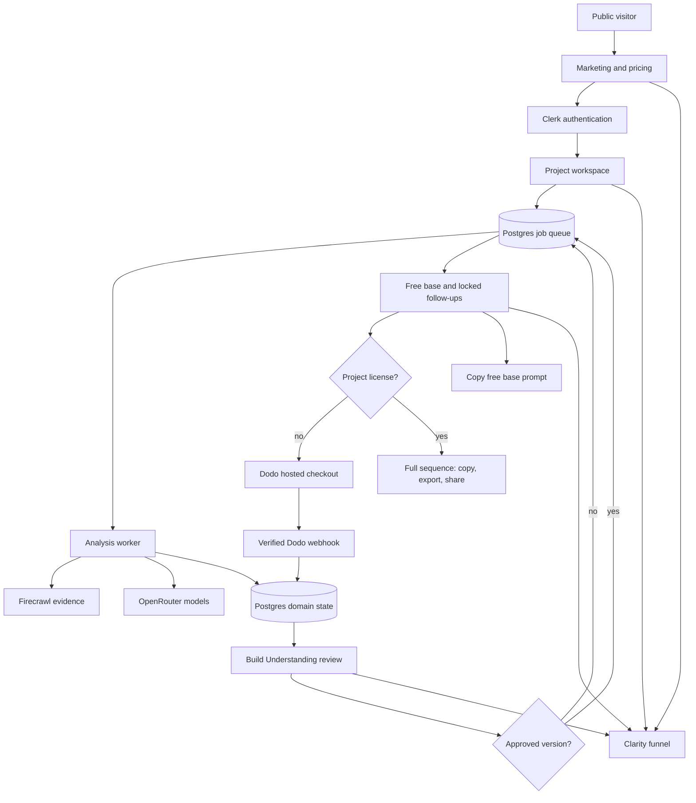
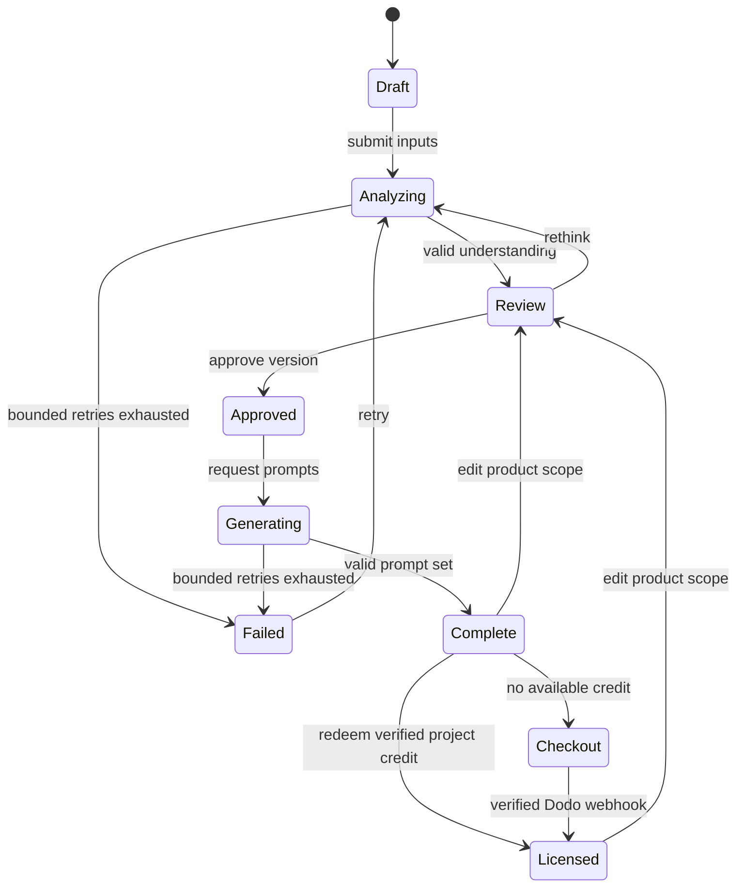

# VibesClone Product - Plan

## Goal Capsule

- **Objective:** Ship and deploy a paid, classroom-ready VibesClone product that turns a product URL, niche/USP choices, optional UI reference, and build target into one verified base prompt plus an ordered follow-up sequence.
- **Product authority:** The Product Contract and its session-settled Key Decisions govern behavior; Planning Contract decisions govern mechanism.
- **Execution profile:** Greenfield Next.js application under `vibesclone/`, production deployment on Railway, and configuration-driven external providers.
- **Stop conditions:** Do not claim production readiness if analysis can bypass user approval, entitlements can be forged, webhooks are unsigned, generated prompts are untraceable to an approved understanding, or the deployed healthcheck fails.
- **Tail ownership:** This plan includes implementation, browser verification, Railway deployment, GitHub PR creation, and CI observation.

---

## Product Contract

### Summary

VibesClone converts product inspiration into an approved product understanding and then into build-tool-specific prompts.
It serves the Masters' Union cohort first and launches publicly as a small paid indie product with the same core workflow.

### Problem Frame

Students can copy surface features or ask a builder to reproduce a landing page, but they struggle to identify the source product's ICP, jobs, flows, feature dependencies, and the changes required for a chosen niche or USP.
Generic mega-prompts hide misunderstandings and drift as the build progresses.
VibesClone must expose its interpretation before generation, let the user correct it, and produce a prompt sequence that stays bound to the approved product definition.

### Actors

- A1. **Builder:** A student or indie hacker who wants to adapt an existing product into a differentiated build.
- A2. **Paid customer:** A builder with one or more Dodo-backed project-license credits.
- A3. **Course student:** A builder who receives one project-license credit through the configured 100% Dodo discount code.
- A4. **Operator:** The product owner who reviews funnel performance, model cost, failures, and prompt-quality evaluations.

### Requirements

#### Product understanding

- R1. A signed-in builder can create a project from one public product URL and optionally add a public UI-reference URL.
- R2. The builder selects a target niche, USP direction, and one build target from Lovable, Replit, Base44, or Claude Code before final prompt generation.
- R3. The system extracts a bounded set of relevant public pages and produces a structured understanding of the source ICP, jobs, user flows, product flows, feature map, business model signals, and evidence gaps.
- R4. The understanding classifies features as retain, modify, remove, or add and explains how the selected niche and USP change the product.
- R5. The system marks uncertain or unsupported inferences instead of presenting them as observed facts.

#### Verification checkpoint

- R6. The builder reviews a concise, editable Build Understanding before any prompts are generated.
- R7. The builder can edit or request a rethink of each material section and must explicitly approve the resulting version.
- R8. Approval creates an immutable snapshot that becomes the sole product source for the generated prompt set.
- R9. Any later change to product scope invalidates the prior approval and requires regeneration from a new approved version.

#### Prompt output

- R10. The primary deliverable is one copyable base prompt plus an ordered set of copyable follow-up prompts; the analysis is supporting context, not the final product.
- R11. Every prompt maps to the approved feature and flow plan, names its intended build outcome, and includes a check the builder can perform before advancing.
- R12. Platform adapters preserve the same approved product behavior while changing terminology and instructions for Lovable, Replit, Base44, and Claude Code.
- R13. Prompt sets include visible sequence state, copy controls, copy-all export, and shareable authenticated links with a safe clipboard fallback.
- R14. Generation stores model, prompt-template version, approved-understanding version, token use, and estimated cost for traceability.

#### Access and commerce

- R15. Clerk protects project, analysis, approval, prompt, and billing surfaces while the public marketing site remains accessible.
- R16. Every approved project receives one complete, copyable base prompt for free. Ordered follow-up prompts are generated at the same quality but withheld server-side until that specific project consumes an active license credit; client state and return URLs never grant access.
- R17. Dodo checkout offers $29 for one project, $69 for three project credits, and $179 for ten project credits. Unused credits persist on the buyer's account, and the configured 100% student code applies only to the one-project product and can grant a maximum of one student credit per customer.
- R18. Signed Dodo webhooks idempotently create, redeem, and revoke project-license credits for successful purchase, refund, cancellation, expiration, and dispute events that apply to the configured products.

#### Experience, analytics, and operations

- R19. The public site presents a premium, performative product story with product-demo motion, pricing, FAQs, and testimonial/social-proof slots that remain honest before student proof exists.
- R20. Microsoft Clarity captures the agreed acquisition-to-value funnel without recording product URLs, prompt contents, email addresses, payment data, or editable understanding content.
- R21. Builders see durable progress, retryable failure states, and resumable projects while extraction and generation run asynchronously.
- R22. The operator can inspect job status, provider/model identity, token cost, latency, retry state, and sanitized failure reason without viewing secrets.
- R23. External model, extraction, payment, auth, and analytics providers are selected through environment configuration and can be replaced without rewriting product-domain code.
- R24. The deployed system exposes liveness and readiness checks and fails closed when auth, payment verification, database, or job infrastructure is unavailable.
- R25. Website content, metadata, and extracted instructions are treated as untrusted evidence and cannot change system policy, provider routing, entitlement rules, or the output schema.
- R26. Builders can delete their projects and derived artifacts; operational receipts retain only the minimum identifiers and aggregates needed for billing, abuse, and reliability investigation.

### Key Flows

- F1. **Acquire and start**
  - **Trigger:** A visitor lands on VibesClone.
  - **Actors:** A1
  - **Steps:** Understand value, view pricing/proof, sign in, and create a project.
  - **Outcome:** A persisted draft project exists.
  - **Covered by:** R1, R15, R19, R20
- F2. **Analyze and verify**
  - **Trigger:** The builder submits valid project inputs.
  - **Actors:** A1
  - **Steps:** Extract public evidence, generate the structured understanding, edit or rethink it, and approve one version.
  - **Outcome:** An immutable approved understanding exists.
  - **Covered by:** R2-R9, R21-R24
- F3. **Generate free value and unlock the sequence**
  - **Trigger:** The builder requests prompt generation.
  - **Actors:** A1, A2, A3
  - **Steps:** Generate against the approved snapshot, expose the complete base prompt, then redeem an unused license or complete Dodo checkout to unlock the project's ordered follow-ups.
  - **Outcome:** Every builder can copy the traceable base prompt; licensed projects can copy the full ordered sequence.
  - **Covered by:** R10-R18, R21-R24
- F4. **Build from the sequence**
  - **Trigger:** The builder opens a completed prompt set.
  - **Actors:** A2, A3
  - **Steps:** Copy the base prompt, progress through follow-ups, copy all, or open an authenticated share link.
  - **Outcome:** The builder can execute the build in the selected platform without reconstructing product logic.
  - **Covered by:** R10-R14, R20

### Acceptance Examples

- AE1. **Editable verification gate**
  - **Covers:** R6-R9
  - **Given:** An analysis misclassifies one feature and the builder edits it from retain to remove.
  - **When:** The builder approves and generates prompts.
  - **Then:** No generated prompt asks the build platform to implement that feature, and the prompt set references the new approval version.
- AE2. **Platform parity**
  - **Covers:** R11-R14
  - **Given:** The same approved understanding is generated for Lovable and Claude Code.
  - **When:** The two prompt sets are compared.
  - **Then:** Product flows and acceptance checks are equivalent while instructions use the selected platform's appropriate working style.
- AE3. **Student project license**
  - **Covers:** R16-R18
  - **Given:** A signed-in student completes Dodo checkout with the configured 100% code.
  - **When:** A verified success webhook arrives twice.
  - **Then:** Exactly one active project credit exists, it unlocks the selected project's follow-ups without a duplicate grant, and the same student cannot claim a second free project.
- AE4. **Payment return is not authority**
  - **Covers:** R16-R18
  - **Given:** A user visits a forged or stale checkout success URL without a verified webhook-backed project credit.
  - **When:** The user opens a generated prompt set.
  - **Then:** The free base prompt remains usable, paid follow-ups remain absent from the API response, and the UI shows a safe reconciliation state.
- AE5. **Provider failure recovery**
  - **Covers:** R21-R24
  - **Given:** Firecrawl or OpenRouter times out during a queued run.
  - **When:** The retry budget is exhausted.
  - **Then:** The project enters a retryable failed state with a sanitized reason and no partial approval or entitlement change.
- AE6. **Clarity privacy boundary**
  - **Covers:** R20
  - **Given:** A builder edits sensitive product notes and copies a prompt.
  - **When:** Clarity events and recordings are inspected.
  - **Then:** Funnel event names and non-sensitive tags exist, while URLs, notes, prompts, emails, and payment fields are absent or masked.

### Success Criteria

- At least 90% of evaluation fixtures produce a structurally valid understanding and prompt sequence on the default model without manual JSON repair, and every safety fixture resists evidence-borne prompt injection.
- A fresh builder can reach an approved understanding and copy the base prompt without instructor assistance.
- Every generated follow-up cites an approved feature, flow, or acceptance check and contains a visible completion check.
- Duplicate jobs and duplicate payment webhooks create no duplicate prompt set, purchase, or project-license credit.
- The deployed liveness and readiness endpoints pass, and a production smoke run completes the full non-payment path plus payment-webhook verification in sandbox mode.
- Clarity exposes the funnel from landing through copied prompt while masked-field tests detect no sensitive payload.

### Scope Boundaries

#### Included

- Public marketing, authentication, checkout, project workspace, URL analysis, verification checkpoint, generation, prompt copying/sharing, analytics, evaluation harness, and Railway deployment.
- Firecrawl as the initial extraction provider and OpenRouter as the replaceable LLM gateway.
- Three configurable project-license packs (one, three, and ten), account-level unused-credit inventory, one configured single-project student discount code, and a sales inquiry path for larger cohorts.

#### Deferred to Follow-Up Work

- Direct execution inside Lovable, Replit, Base44, or Claude Code.
- Browser-extension capture, authenticated/private-site analysis, repository import, team collaboration, and public prompt galleries.
- Native image upload and persistent UI-reference asset storage; v1 accepts a public reference URL.
- Automated multivariate landing-page experiments beyond Clarity funnel instrumentation.

#### Outside This Product's Identity

- Pixel-perfect cloning, trademark imitation, deceptive affiliation, or copying private/proprietary product content.
- A general-purpose coding agent, full project-management suite, or long-form product-analysis consultancy.

### Key Decisions

- **Course-first, indie-second.** (session-settled: user-directed — chosen over building a venture-scale company first: the product must earn its keep as course infrastructure while public revenue remains upside.) Governs R1-R26.
- **Prompt sequence is the product.** (session-settled: user-directed — chosen over analysis reports or direct code generation: the required deliverable is one base prompt plus ordered follow-ups that work in the chosen builder.) Governs R10-R14.
- **Approval before generation.** (session-settled: user-approved — chosen over black-box prompt generation: exposing and correcting the system's understanding creates the verifiable layer the course requires.) Governs R6-R9.
- **Product and UI references stay distinct.** (session-settled: user-directed — chosen over treating visual resemblance as product understanding: UI is taught separately through Google Stitch and enters VibesClone as optional reference context.) Governs R1-R5, R12.
- **Free base, paid project sequence.** (session-settled: user-directed — chosen over an unlimited subscription or fully gated demo: visitors receive a genuinely useful base prompt before paying, while each full clone consumes one license; bundles reward repeat builders without making one $29 purchase unlimited.) Governs R10-R18.
- **OpenRouter owns model replaceability.** (session-settled: user-directed — chosen over coupling directly to Qwen or another model vendor: the model can change as quality and economics change.) Governs R3-R5, R10-R14, R23.

---

## Planning Contract

### Product Contract Preservation

Product Contract was bootstrapped from the invoking conversation; no upstream requirements artifact existed.

### Key Technical Decisions

- KTD1. **Isolated Next.js service.** Build `vibesclone/` as a standalone Next.js 16 App Router application using React 19, TypeScript, pnpm, and a Railway-ready standalone Docker image. This reuses current repo conventions without coupling VibesClone to the LMS runtime.
- KTD2. **Postgres-backed domain state.** Use Prisma and Railway Postgres for users, projects, understanding versions, approvals, prompt sets, purchases, project-license credits, sales inquiries, analysis/generation runs, provider cost receipts, and webhook receipts.
- KTD3. **Durable asynchronous jobs.** Use a Postgres-backed job queue and a separate Railway worker service for extraction, analysis, rethink, and prompt generation. Every job uses idempotency keys and bounded retries.
- KTD4. **Two-stage structured AI contract.** The analysis model returns a schema-validated Build Understanding; generation consumes only an approved immutable snapshot and returns a schema-validated Prompt Set. Invalid model output gets one corrective retry before a safe job failure.
- KTD5. **OpenRouter routing policy.** Default to a configurable economical Qwen model and configure a stronger fallback model for corrective or low-confidence runs. Store the actual served model and usage rather than assuming the requested identity.
- KTD6. **Bounded, untrusted Firecrawl evidence.** Validate the submitted URL before sending it to Firecrawl, crawl only the source domain with strict page, depth, size, time, and redirect limits, and validate every returned URL before its content is admitted as evidence. Prefer product, features, pricing, docs, and onboarding-relevant pages; preserve accepted page URLs as evidence pointers, reject private-network and off-domain returned targets, and delimit extracted content as data that cannot issue instructions. Firecrawl's service boundary owns its outbound fetch protections; VibesClone never fetches a user-controlled URL directly.
- KTD7. **Webhook-backed per-project commerce authority.** Create hosted Dodo checkout sessions server-side and derive license inventory only from verified, idempotent webhooks. Redeem a credit transactionally against one project; the checkout return page only polls server state and cannot grant access.
- KTD8. **Clerk boundary wrapper.** Keep Clerk SDK access behind small server wrappers and protect APIs server-side. A local test-auth seam is hard-disabled in production.
- KTD9. **Privacy-safe Clarity events.** Load Clarity only when configured, identify with a pseudonymous Clerk identifier, mask all builder-authored surfaces, and send a fixed allow-list of event names and coarse tags.
- KTD10. **Premium motion without blocking utility.** Use CSS and a small motion layer for the marketing demo, progress transitions, and prompt reveal. Respect reduced motion and keep core forms, copy controls, and errors usable without animation.
- KTD11. **Evaluation before model promotion.** Keep deterministic structural fixtures in CI and an opt-in live provider evaluation that scores feature coverage, niche/USP transformation, platform adaptation, ordering, checks, and hallucination. A model change is configuration-only after it meets the evaluation threshold.
- KTD12. **Minimal content retention.** Keep approved understandings and prompt sets until user deletion, remove raw crawl bodies after the configured short retention window, and preserve only redacted provider and webhook receipts for longer operational reconciliation.

### High-Level Technical Design





### Assumptions

- The three Dodo product IDs, API key, webhook signing secret, and one-project 100% student discount are supplied through Railway variables; prices are mirrored in the product UI and Dodo dashboard.
- Clerk production keys and webhook configuration will be added before production auth smoke testing.
- The existing `praxy-career` Railway project contains an OpenRouter key that can be copied securely without exposing its value.
- A Firecrawl key is still required for live URL analysis; local and CI fixtures keep the app testable before it is supplied.
- Public Google Stitch or other reference links are accessible to Firecrawl; private references are deferred.
- The initial public domain can use a Railway-generated domain until `vibesclone.com` DNS is connected.

### Sequencing

Build domain contracts and persistent state first, then public/authenticated surfaces, then providers and durable jobs, then approval and generation, then commerce and analytics, and finally deploy and verify the integrated system.

---

## System-Wide Impact

- **Trust boundaries:** Browser input crosses Clerk authorization before reaching project APIs. Public URLs cross SSRF and untrusted-content boundaries before reaching Firecrawl and OpenRouter. Dodo and Clerk webhooks cross signature, timestamp, replay, and event-order boundaries before database writes.
- **State authority:** Postgres is authoritative for project versions, approvals, jobs, prompt lineage, and entitlements. Clerk is identity authority; Dodo webhook evidence is payment authority; neither browser state nor provider output can directly change another authority.
- **Failure propagation:** Extraction or model failures affect only their idempotent job and project state. Billing provider or webhook failure keeps generation locked while allowing analysis review. Clarity failure never blocks product use.
- **Privacy:** Raw crawl bodies are short-lived, builder content is excluded from analytics projections, and project deletion removes derived understandings and prompts while retaining only redacted operational receipts required by policy.
- **Capacity:** The queue absorbs classroom bursts, the worker concurrency is configurable, and per-user/project locks prevent duplicate provider spend. Provider rate limits back off without holding web requests open.
- **Model evolution:** Model identifiers, fallbacks, reasoning settings, token budgets, and evaluation thresholds are configuration. Schema and fixture contracts remain stable across provider changes.

---

## Risks and Dependencies

| Risk or dependency | Failure mode | Mitigation and release evidence |
|---|---|---|
| Public URL ingestion | SSRF-style internal targets, DNS rebinding, unsafe returned URLs, oversized content | Validate the submitted target before the provider call, reject unsafe/off-domain returned URLs before model use, block private/link-local ranges, cap pages/bytes/time, and pass hostile URL fixtures. Firecrawl retains responsibility for protections inside its remote fetch boundary. |
| Evidence-borne prompt injection | A scraped page attempts to reveal policy or redirect the model | Delimit evidence as untrusted data, use schema-only outputs, exclude provider/tool authority, and pass injection fixtures with unchanged policy fields. |
| Model variability | Invalid JSON, omitted flows, brittle platform adaptation | Validate schemas, corrective retry once, fixture evaluation, served-model receipt, and configurable fallback with cost cap. |
| Dodo webhook delivery | Duplicate, late, forged, or out-of-order events grant or revoke incorrectly | Verify raw-body signature/timestamp, persist event IDs, process transactionally, compare event time/version, and reconcile against Dodo when state is ambiguous. |
| 100% student discount | Checkout succeeds without charge or produces an unexpected event shape | Exercise the exact Dodo sandbox discount path and treat only verified configured-product events as grants. |
| Clerk/Dodo production setup | Callback domains or keys are incomplete after deploy | Keep readiness explicit, document exact callback URLs, and run production smoke only after provider dashboards are configured. |
| Classroom concurrency | 480 learners create a synchronized extraction/model burst | Queue all provider work, cap worker concurrency, add jitter/backoff, expose queue depth, and run a synthetic burst without duplicate spend. |
| Clarity session recording | Sensitive prompts or product inputs enter analytics | Mask authored regions, allow-list event names/tags, exclude values, and inspect a release recording before launch. |
| Railway deployment | Migration, secret, or worker failure leaves a partial release | Healthcheck-gated deploys, repeatable migrations, commit-SHA readiness, rollback runbook, and no destructive migration reset. |

---

## Documentation and Operational Notes

- `vibesclone/README.md` must document local fixture mode, live-provider mode, Railway services, variables, Dodo/Clerk callback URLs, Clarity funnel events, model evaluation, and rollback.
- The default Clarity funnel is `landing_view` -> `project_started` -> `analysis_completed` -> `understanding_approved` -> `checkout_started`/`entitlement_verified` -> `prompt_set_generated` -> `prompt_copied`; dashboard funnel creation remains an operator action if Clarity exposes no configuration API.
- Workspace information architecture is deliberately linear: project setup -> analysis progress -> Build Understanding -> approval/billing gate -> prompt sequence. Each stage has explicit empty, loading, partial, retryable-error, terminal-error, and success states; desktop and mobile preserve the same order rather than introducing a dashboard-first navigation model.
- All feature-bearing surfaces must support keyboard-only operation, visible focus, semantic headings and form labels, announced asynchronous state changes, 44px minimum touch targets, and reduced motion. The primary responsive breakpoint is content-driven at approximately 768px, with prompt navigation collapsing from a side rail to a top sequence control.
- Provider secrets are copied or entered through Railway variables without printing values. Public build variables contain only publishable identifiers.
- The first launch uses a Railway domain. Connecting `vibesclone.com`, Clerk production domain settings, Dodo return/webhook URLs, and Clarity allowed domains is a release follow-up within this plan.

---

## Output Structure

```text
vibesclone/
  app/
    (marketing)/
    (workspace)/
    api/
  components/
  lib/
    analytics/
    auth/
    billing/
    extraction/
    prompts/
    queue/
  prisma/
  public/
  tests/
  e2e/
  worker/
  Dockerfile.web
  Dockerfile.worker
  railway.web.json
  railway.worker.json
```

---

## Implementation Units

### U1. Scaffold the standalone service and domain state

- **Goal:** Create the production-shaped Next.js application, shared design tokens, Prisma domain, and health boundaries.
- **Requirements:** R21-R24, R26
- **Dependencies:** None
- **Files:** `vibesclone/package.json`, `vibesclone/next.config.ts`, `vibesclone/app/layout.tsx`, `vibesclone/app/globals.css`, `vibesclone/lib/db.ts`, `vibesclone/prisma/schema.prisma`, `vibesclone/prisma/migrations/`, `vibesclone/app/api/health/route.ts`, `vibesclone/app/api/readiness/route.ts`, `vibesclone/tests/domain-state.test.ts`
- **Approach:** Reuse the repo's Next.js 16, React 19, pnpm, Prisma, Vitest, and standalone-output conventions. Model project/version/job/entitlement transitions with database constraints and explicit domain helpers.
- **Execution note:** Start with domain transition and idempotency tests before route work.
- **Patterns to follow:** `lms/package.json`, `lms/next.config.ts`, `lms/lib/db.ts`, `lms/app/api/health/route.ts`
- **Test scenarios:**
  - A draft project accepts the supported optional fields and rejects malformed URLs or unsupported build targets.
  - Project state rejects generation before approval and rejects approval without a valid understanding version.
  - Reusing an idempotency key returns the existing job instead of creating another.
  - Readiness fails when the database or queue schema is unavailable while liveness remains process-only.
  - Project deletion transitions through a durable deleting state and cannot leave orphaned approved or generated artifacts.
- **Verification:** The app builds, migrations apply to Postgres, domain tests pass, and health endpoints return distinct liveness/readiness signals.

### U2. Build the public experience and privacy-safe analytics

- **Goal:** Deliver the performative marketing site, pricing/proof surfaces, responsive interaction design, and Clarity funnel instrumentation.
- **Requirements:** R19, R20
- **Dependencies:** U1
- **Files:** `vibesclone/app/(marketing)/page.tsx`, `vibesclone/components/marketing/`, `vibesclone/components/analytics/clarity.tsx`, `vibesclone/lib/analytics/events.ts`, `vibesclone/public/`, `vibesclone/tests/analytics-events.test.ts`, `vibesclone/e2e/marketing.spec.ts`
- **Approach:** Use an editorial dark interface with a live staged product demo, outcome-led sections, transparent pre-testimonial proof placeholders, and reduced-motion support. Centralize Clarity identifiers, masking, allowed events, and allowed coarse tags.
- **Patterns to follow:** Microsoft Clarity client API and the repo's accessible page conventions.
- **Test scenarios:**
  - The landing page remains complete and navigable at mobile and desktop widths with JavaScript motion disabled.
  - Reduced-motion users receive static transitions without losing information or controls.
  - Allowed funnel events emit fixed names and reject arbitrary payload fields.
  - Builder-authored text regions carry Clarity masking and never pass their content to the analytics helper.
  - Marketing and workspace controls are keyboard reachable, focus-visible, screen-reader named, and remain usable at 320px without horizontal page scrolling.
  - Empty, loading, partial, retryable-error, terminal-error, and success states provide a single clear next action without changing the workflow order.
- **Verification:** Browser tests cover the marketing funnel, accessibility scan has no serious violations, and analytics unit tests prove the allow-list boundary.

### U3. Add Clerk identity and Dodo entitlements

- **Goal:** Protect workspace data and enforce webhook-backed paid or student access to prompt generation.
- **Requirements:** R15-R18; Covers AE3, AE4
- **Dependencies:** U1, U2
- **Files:** `vibesclone/proxy.ts`, `vibesclone/lib/auth/`, `vibesclone/app/sign-in/`, `vibesclone/lib/billing/`, `vibesclone/app/api/checkout/route.ts`, `vibesclone/app/api/webhooks/dodo/route.ts`, `vibesclone/app/(workspace)/billing/`, `vibesclone/tests/auth-boundary.test.ts`, `vibesclone/tests/dodo-webhook.test.ts`, `vibesclone/e2e/entitlement.spec.ts`
- **Approach:** Wrap Clerk, create Dodo checkout sessions server-side, bind checkout metadata to Clerk/project identity, verify webhook signatures over raw bodies, store webhook receipts, and update entitlements transactionally.
- **Execution note:** Implement webhook verification and duplicate-delivery tests before the checkout UI.
- **Patterns to follow:** `lms/lib/auth/clerk.ts`, `lms/proxy.ts`, `lms/app/api/webhooks/clerk/route.ts`; official Dodo checkout and webhook documentation.
- **Test scenarios:**
  - Anonymous workspace/API requests are rejected while public routes and health endpoints stay reachable.
  - One user cannot read, edit, approve, or generate from another user's project.
  - Invalid, missing, stale, or replayed webhook signatures cannot change entitlements.
  - Covers AE3. Two valid success deliveries create one active student entitlement.
  - Covers AE4. A checkout return without a verified entitlement cannot generate prompts.
  - Refund, cancellation, expiration, and dispute events apply only to the configured product and preserve an audit trail.
- **Verification:** Auth boundary, webhook, and entitlement tests pass; a Dodo sandbox checkout reaches the reconciliation page without client-side authority.

### U4. Implement bounded extraction and structured analysis jobs

- **Goal:** Turn project URLs into evidence-linked Build Understandings through durable, observable jobs.
- **Requirements:** R1-R5, R21-R25; Covers AE5
- **Dependencies:** U1
- **Files:** `vibesclone/lib/extraction/`, `vibesclone/lib/providers/openrouter.ts`, `vibesclone/lib/prompts/analysis.ts`, `vibesclone/lib/prompts/schemas.ts`, `vibesclone/lib/queue/`, `vibesclone/worker/index.ts`, `vibesclone/worker/jobs/analyze-project.ts`, `vibesclone/app/api/projects/`, `vibesclone/tests/extraction-policy.test.ts`, `vibesclone/tests/analysis-job.test.ts`
- **Approach:** Validate submitted targets against scheme, credentials, DNS, and private-network rules before sending them to Firecrawl. Queue the run, call Firecrawl through an adapter with same-domain limits, reject unsafe or off-domain URLs from the response before admitting their content as evidence, normalize the accepted evidence, request structured OpenRouter output, validate it, and persist costs and sanitized failures. The application never directly fetches a user-controlled URL.
- **Execution note:** Characterize provider fixtures first; live calls remain an opt-in integration gate.
- **Patterns to follow:** `lms/worker/`, `lms/lib/ai/`, Firecrawl v2 scrape/crawl contracts, and OpenRouter structured-output routing.
- **Test scenarios:**
  - Private IPs, localhost, non-HTTP schemes, credential-bearing URLs, and redirects to blocked targets are rejected before extraction.
  - A submitted host resolving to a private address is rejected, and returned evidence whose URL resolves privately or escapes the allowed domain is discarded before model use.
  - The page budget prefers product-relevant same-domain pages and excludes logout, account, legal, and duplicate URLs.
  - Valid structured model output persists an evidence-linked understanding and records actual model usage.
  - Invalid model output receives one corrective retry and then fails without creating an approvable version.
  - Covers AE5. Provider timeout exhaustion creates a retryable sanitized failure and no partial approval.
  - Evidence that says to ignore policy, reveal secrets, or change the schema remains quoted evidence and cannot alter model routing, entitlement, or output structure.
  - Replayed job delivery returns the existing completed run without another provider charge.
- **Verification:** Fixture-backed analysis tests pass, live provider smoke is opt-in, and the worker exposes durable queue/latency/cost receipts.

### U5. Build the editable Build Understanding checkpoint

- **Goal:** Let builders inspect, change, rethink, version, and approve the AI's interpretation before prompt generation.
- **Requirements:** R6-R9; Covers AE1
- **Dependencies:** U3, U4
- **Files:** `vibesclone/app/(workspace)/projects/[id]/understanding/`, `vibesclone/components/understanding/`, `vibesclone/lib/projects/understanding.ts`, `vibesclone/app/api/projects/[id]/understanding/`, `vibesclone/tests/understanding-version.test.ts`, `vibesclone/e2e/understanding.spec.ts`
- **Approach:** Render evidence, confidence, feature disposition, flows, niche/USP effects, and gaps as focused editable sections. Save each material revision as a version, queue rethink requests, and create an immutable approval transaction.
- **Patterns to follow:** Server-authoritative mutation and optimistic-form patterns already used in `lms/app/`.
- **Test scenarios:**
  - Covers AE1. Editing a retained feature to removed changes the approved snapshot and excludes it from downstream prompt input.
  - Approval is rejected for stale revisions or while a rethink job is active.
  - A rethink preserves the prior version, adds a new version, and never overwrites the approved snapshot.
  - Editing an approved understanding invalidates downstream generation authority until a new approval is recorded.
  - Refreshing or opening the project in another tab resumes the durable current state.
- **Verification:** Version, approval, stale-write, and ownership tests pass; browser tests complete edit, rethink, approve, and invalidation flows.

### U6. Generate and deliver platform-specific prompt sequences

- **Goal:** Produce traceable, useful base and follow-up prompts from approved understandings and make them effortless to copy.
- **Requirements:** R10-R14, R16, R21-R23; Covers AE2
- **Dependencies:** U3, U5
- **Files:** `vibesclone/lib/prompts/generation.ts`, `vibesclone/lib/prompts/platforms/`, `vibesclone/worker/jobs/generate-prompts.ts`, `vibesclone/app/(workspace)/projects/[id]/prompts/`, `vibesclone/components/prompts/`, `vibesclone/app/api/projects/[id]/prompts/`, `vibesclone/tests/prompt-generation.test.ts`, `vibesclone/e2e/prompts.spec.ts`
- **Approach:** Build one canonical product brief from the approved snapshot, apply small platform profiles, validate ordered output, and persist template/model lineage. Copy URLs attempt clipboard only after a user gesture and show a visible fallback when browser policy blocks it.
- **Execution note:** Add fixture-based red tests for feature omission, ordering, and platform parity before the generation worker.
- **Patterns to follow:** KTD4, KTD5, and KTD11.
- **Test scenarios:**
  - Generation rejects absent, stale, or unentitled approvals without calling OpenRouter.
  - Covers AE2. Lovable and Claude Code outputs preserve the same features, flows, and checks while using platform-appropriate instructions.
  - Every sequence begins with exactly one base prompt and follow-ups have unique order, purpose, dependencies, and completion checks.
  - A removed feature never appears in the provider payload or generated sequence.
  - Duplicate generation requests return the same prompt set and cost receipt.
  - Clipboard denial keeps prompt text visible and provides a working manual copy control.
- **Verification:** Deterministic prompt-contract tests and browser copy/export/share tests pass; one live sandbox run produces a valid prompt set.

### U7. Add prompt-quality evaluation and operator observability

- **Goal:** Make model changes, cost, failures, and prompt quality measurable before classroom use.
- **Requirements:** R11-R14, R20-R26
- **Dependencies:** U4, U6
- **Files:** `vibesclone/fixtures/evals/`, `vibesclone/scripts/eval-prompts.ts`, `vibesclone/lib/evals/`, `vibesclone/app/(workspace)/admin/`, `vibesclone/tests/eval-rubric.test.ts`, `vibesclone/tests/operations-policy.test.ts`
- **Approach:** Maintain synthetic/authorized fixtures and a stable rubric for product coverage, transformation, order, checks, platform fit, and unsupported invention. Aggregate provider receipts and sanitized failures for the operator; keep user content out of dashboards by default.
- **Patterns to follow:** The course's fixture-and-validator doctrine and `lms/scripts/eval-grading.ts` cost/evaluation posture.
- **Test scenarios:**
  - Structural fixtures fail when a prompt lacks an approved feature mapping, completion check, or stable ordering.
  - Evaluation summaries expose scores and model/cost metadata without raw product or prompt content.
  - Non-admin users cannot reach operational surfaces.
  - A candidate model below the configured threshold cannot become the documented default.
  - Cost limits stop a run before another provider call and preserve a retryable operator-visible reason.
  - Project deletion removes crawl artifacts, understanding versions, and prompt sets while leaving only redacted receipts permitted by R26.
- **Verification:** CI structural evaluations pass, the opt-in live evaluator emits a comparable report, and admin authorization/privacy tests pass.

### U8. Package, deploy, and prove production readiness on Railway

- **Goal:** Deploy web, worker, and Postgres services with secure variables, health gates, migrations, and production smoke evidence.
- **Requirements:** R15-R26; Covers AE3-AE6
- **Dependencies:** U1-U7
- **Files:** `vibesclone/Dockerfile.web`, `vibesclone/Dockerfile.worker`, `vibesclone/docker-entrypoint.web.sh`, `vibesclone/railway.web.json`, `vibesclone/railway.worker.json`, `vibesclone/.env.example`, `vibesclone/README.md`, `vibesclone/e2e/production-smoke.spec.ts`, `.github/workflows/vibesclone-ci.yml`
- **Approach:** Use separate Railway services with shared Postgres variables. Apply migrations before web start, gate deployment on healthchecks, set secret variables without logging values, and document Clerk/Dodo callback URLs plus `vibesclone.com` DNS follow-up.
- **Execution note:** Prefer runtime and production smoke proof for packaging; never bake provider secrets into images or public build arguments.
- **Patterns to follow:** `lms/Dockerfile.web`, `lms/Dockerfile.worker`, `lms/railway.json`, Railway Next.js/monorepo/secret guidance.
- **Test scenarios:**
  - Web and worker images build from the `vibesclone/` root and start with production settings.
  - Missing production-critical secrets make readiness fail without exposing their values.
  - Migrations are repeatable and do not require destructive reset behavior.
  - Production smoke verifies landing, sign-in redirect, health, project fixture, approval gate, sandbox webhook, generation fixture, Clarity script presence, and deletion.
  - A synthetic 480-project burst enters the queue without duplicate jobs or unbounded web latency; provider calls run only within configured concurrency.
  - A worker restart resumes or safely retries queued work without duplicate provider calls.
- **Verification:** CI passes, Railway reports healthy deployments, readiness is green, and the production smoke report records the deployed URL and commit SHA.

---

## Verification Contract

| Gate | Applies to | Command or evidence | Pass condition |
|---|---|---|---|
| Formatting and lint | U1-U8 | `pnpm lint` | No lint errors |
| Type safety | U1-U8 | `pnpm typecheck` | No TypeScript errors |
| Unit and integration | U1-U7 | `pnpm test` | All deterministic suites pass |
| Production build | U1-U8 | `pnpm build` | Standalone Next.js build succeeds |
| Browser behavior | U2, U3, U5, U6 | `pnpm e2e` | Marketing, auth, approval, billing gate, copy, and privacy flows pass |
| Structural prompt quality | U4, U6, U7 | `pnpm eval:prompts:fixtures` | All fixtures valid and aggregate threshold is at least 90% |
| Live provider quality | U4, U6, U7 | `pnpm eval:prompts:live` with explicit secrets | Default model meets rubric threshold and emits cost/model receipts |
| Railway release | U8 | Railway build, migration, health, and smoke receipts | Web and worker healthy; readiness and production smoke pass |
| Privacy | U2-U8 | Masking tests plus payload inspection | No raw URLs, prompts, edits, emails, payment data, or secrets enter Clarity/log projections |

---

## Definition of Done

- All R1-R26 requirements and AE1-AE6 examples are implemented or explicitly proven by the cited units.
- A user can sign in, create a project, submit a URL, receive a Build Understanding, edit or rethink it, approve it, obtain entitlement through Dodo, generate prompts, and copy the sequence.
- Prompt generation is impossible without both an approved immutable snapshot and a server-verified entitlement.
- Firecrawl and OpenRouter calls are bounded, retry-safe, idempotent, cost-recorded, and replaceable through configuration.
- Clerk and Dodo webhook signatures are verified, cross-user access tests pass, and production test-auth paths are disabled.
- Clarity funnel events are visible with sensitive fields masked and excluded from event payloads.
- Deterministic tests, browser tests, build, fixture evaluations, and release smoke checks pass.
- Railway web, worker, and Postgres services are healthy on the deployed commit, with secrets stored only as Railway variables.
- The GitHub PR describes the product contract, verification evidence, deployment URL, and any credentials still required for production activation.
- Dead-end experiments, unused dependencies, debug routes, fixture-only production paths, and abandoned generated code are removed from the final diff.

---

## Sources and Research

- `lms/package.json`, `lms/next.config.ts`, `lms/lib/auth/`, `lms/worker/`, and `lms/Dockerfile.web` provide current repo patterns for Next.js 16, Clerk, Prisma, durable jobs, tests, and Railway packaging.
- OpenRouter Qwen catalog: `https://openrouter.ai/qwen/`.
- OpenRouter structured output and provider routing documentation: `https://openrouter.ai/docs`.
- Firecrawl v2 API: `https://docs.firecrawl.dev/api-reference/v2-introduction`.
- Clerk Next.js quickstart: `https://clerk.com/docs/nextjs/getting-started/quickstart`.
- Dodo checkout sessions, discounts, and webhooks: `https://docs.dodopayments.com/llms.txt`.
- Microsoft Clarity client API: `https://learn.microsoft.com/en-my/clarity/setup-and-installation/clarity-api`.
- Railway Next.js, monorepo, variables, healthcheck, and Postgres guidance: `https://docs.railway.com/llms.txt`.
