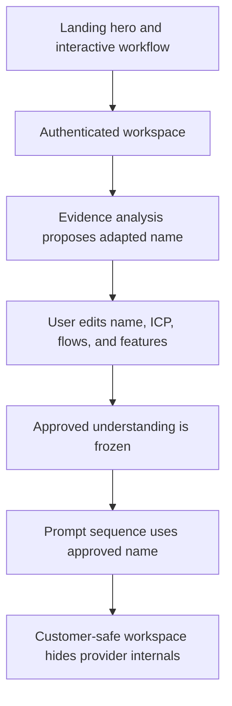
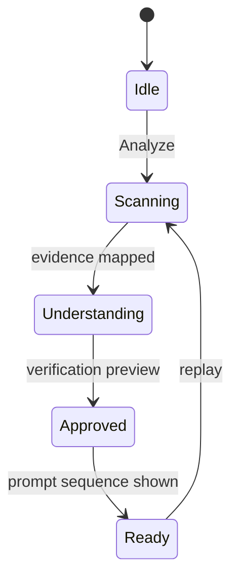

# fix: VibesClone launch polish and trust

## Goal Capsule

- **Objective:** Make the public product credible and self-explanatory for an indie launch while preventing VibesClone's own brand and infrastructure from leaking into customer outputs.
- **Authority:** The user's nine launch findings govern product behavior; existing payment, coupon, auth, analysis, and prompt entitlements remain intact.
- **Execution profile:** Standard, cross-cutting UI, prompt-quality, SEO, legal, and production deployment work.
- **Stop conditions:** Stop only for a destructive provider change, a required legal/business fact that cannot be inferred safely, or evidence that an existing paid/coupon entitlement would be broken.
- **Tail ownership:** Update the existing release branch and PR, deploy web and worker to Railway, then verify the live domain.

---

## Product Contract

### Summary

VibesClone should present a polished, market-neutral public experience, demonstrate its workflow through a useful animated interaction, and keep implementation vendors invisible. Before prompts are generated, users must verify an editable, niche-specific product name alongside the rest of the Build Understanding.

### Problem Frame

The live landing page currently wastes the hero's right side, contains a fake Analyze control and distracting visual rule, advertises course-only details, and shows proof that does not yet exist. The app lacks complete launch SEO/legal surfaces, the prompt workspace has no clear route back, and it exposes OpenRouter/Qwen. Most seriously, the generated build can inherit “VibesClone” as the target app name, confusing the platform brand with the customer's adaptation.

### Requirements

**Public trust and positioning**

- R1. The public site has complete baseline metadata, canonical URLs, crawl controls, branded favicon/app icons, social preview images, and a web manifest.
- R2. The desktop hero uses its right column for an animated product-flow visual, retains a clear CTA, and collapses cleanly on mobile and reduced-motion devices.
- R3. The workflow preview has a functioning Analyze interaction with visible staged progress and no decorative line crossing its content.
- R4. The public site contains no premature testimonials/proof placeholder and no Masters’ Union, cohort, student, faculty, instructor, or founder-response copy.
- R5. Public sales copy addresses teams and volume usage in market-neutral language and promises a response from the team.
- R6. Privacy and Terms pages are linked from the footer, appear in the sitemap, and state the service's actual data, AI, billing, acceptable-use, and contact practices without claiming legal review.

**Workspace clarity and output integrity**

- R7. Every workspace stage provides an obvious route home and an obvious way to begin another analysis without losing the current project.
- R8. Provider, model, and internal template identifiers are not rendered to customers; build target and entitlement state remain visible where useful.
- R9. Build Understanding makes the adapted product name visible and editable before approval.
- R10. Analysis proposes a distinctive niche-specific name and may not return VibesClone or the source product's brand as the adapted product name.
- R11. Prompt generation treats the approved product name as authoritative and explicitly prevents platform/source brand leakage into prompt titles or instructions.
- R12. Existing private one-project course-code redemption, payment packs, authentication, and project entitlements continue to work.

### Acceptance Examples

- AE1. Given a visitor on the landing page, when they activate Analyze in the workflow preview, then the preview progresses through analysis, understanding, approval, and ready states and offers a real Start build action.
- AE2. Given a crawler or social scraper, when it requests the homepage and icon/preview routes, then canonical metadata and valid branded assets are returned.
- AE3. Given an analyzed source such as Linear for a recruiting niche, when the user reviews Build Understanding, then the proposed name is editable and is neither “VibesClone” nor “Linear.”
- AE4. Given an approved understanding named “ScoutFlow,” when prompts are generated, then the base and follow-ups describe ScoutFlow and never initialize a VibesClone product.
- AE5. Given a user in the final prompt workspace, when they inspect the lineage rail, then they see source/approval/build-target/access context but no model, provider, or template identifier.

### Scope Boundaries

- Keep VibesClone as the public platform name and `vibesclone.com` as the domain; the naming fix applies to customer adaptations.
- Keep the course coupon functional inside the authenticated upgrade flow, but do not advertise it on the public landing page.
- Legal pages are practical launch copy, not a substitute for counsel or a compliance certification.
- Do not fabricate testimonials, customer logos, ratings, or performance claims.
- Do not replace existing providers, pricing, billing products, or entitlement rules.

---

## Planning Contract

### Key Technical Decisions

- KTD1. **Use a responsive two-column hero with a lightweight deterministic animation.** (session-settled: user-directed — chosen over an empty or static right side: the user requires visual context and prefers GIF-like motion.) The animation will be implemented as an accessible, browser-native staged composition following the HyperFrames motion grammar, with reduced-motion fallback, avoiding a large video payload for a UI-only sequence.
- KTD2. **Make the marketing demo a real client-side state machine.** (session-settled: user-directed — chosen over a non-functional mock control: every apparent action must respond.) No backend call is needed because the demo illustrates the verified workflow rather than analyzing arbitrary input.
- KTD3. **Treat product naming as approved domain data.** (session-settled: user-approved — chosen over silently trusting a model-generated name: the user's verification layer is the right control point.) The current schema remains stable; the editor exposes `productName`, prompt instructions add forbidden-brand rules, and deterministic validation guards regressions.
- KTD4. **Keep provider receipts operational but remove them from customer UI.** (session-settled: user-directed — chosen over showing OpenRouter/Qwen: those fields help operators, not builders.) Database and job observability remain unchanged.
- KTD5. **Ship generated Next.js metadata assets rather than hand-maintained binary files.** (session-settled: user-directed — chosen over incomplete favicon-only SEO: one brand system can serve favicon, app icon, and social cards.)

### High-Level Technical Design

### Assumptions

- `sales@vibesclone.com` is the appropriate public contact for legal and sales notices.
- The existing acid-green/dark visual identity remains the launch identity; this pass improves composition and motion rather than rebranding the platform.
- A CSS/React motion composition is preferable to an encoded GIF because it stays sharp, small, accessible, and responsive while delivering the same visual effect.

### Sequencing

Implement naming and prompt-quality guards before UI polish so the central product-integrity bug is testable independently. Then build public animation/SEO/legal, simplify customer-facing workspace details, run the complete quality suite, and deploy both services because prompt-worker behavior changes.

---

## System-Wide Impact

- **Customers:** Clearer public value, functioning demo controls, editable naming, safer generated prompts, and better workspace navigation.
- **Operations:** Provider/model receipts remain stored for debugging and cost control but are not part of the customer contract.
- **Search/social:** New icon, manifest, canonical, sitemap, and share-card routes create external URL contracts that require production smoke verification.
- **Billing/auth:** No entitlement logic changes; regression coverage must prove private code redemption and paywall behavior still pass.

---

## Risks and Dependencies

- Generated AI names can still be weak even when they are not forbidden; user editability is the final quality gate.
- Motion can harm performance or accessibility; constrain animation to transforms/opacity, honor reduced motion, and verify the production layout at desktop and mobile widths.
- Legal wording can become stale as processors or policies change; keep it provider-neutral where possible and include an effective date.
- Next metadata may appear correct locally but fail behind Railway/custom-domain redirects; verify canonical and asset responses on `https://vibesclone.com` after deployment.

---

## Documentation and Operational Notes

- Add a short design rationale for the hero composition and its motion states.
- Update the service README only where public sales terminology or launch verification is now inaccurate.
- Deploy the web service for all UI/SEO/legal changes and the worker service for analysis/generation prompt changes.

---

## Implementation Units

### U1. Guard adaptation naming and prompt identity

- **Goal:** Make the customer product name an explicit, approved input and prevent platform/source-brand leakage.
- **Requirements:** R9, R10, R11; covers AE3 and AE4.
- **Dependencies:** None.
- **Files:** `vibesclone/components/workspace.tsx`, `vibesclone/lib/prompts/analysis.ts`, `vibesclone/lib/prompts/generation.ts`, `vibesclone/lib/domain.ts`, `vibesclone/tests/prompt-quality.test.ts`, `vibesclone/tests/domain-state.test.ts`.
- **Approach:** Expose `productName` next to the summary; state forbidden-name rules in both model prompts; add a small reusable identity guard for exact platform-name leakage and source-host brand reuse where the source name is known; ensure approved data remains the generation authority.
- **Patterns to follow:** Existing Zod Build Understanding contract and fixture-based prompt evaluation.
- **Test scenarios:**
  - Covers AE3. Editing the proposed product name and saving creates a new understanding version that can be approved.
  - Covers AE4. An approved `productName` appears throughout the generated fixture sequence while `VibesClone` is absent from customer build instructions.
  - A forbidden exact platform name is rejected or replaced before approval without corrupting the rest of the understanding.
- **Verification:** Prompt-quality and domain-state tests demonstrate naming authority and existing approval versioning remains intact.

### U2. Recompose the hero and make the workflow demo interactive

- **Goal:** Use the hero's full width for a compelling animated explanation and make every demo control truthful.
- **Requirements:** R2, R3; covers AE1.
- **Dependencies:** None.
- **Files:** `vibesclone/DESIGN.md`, `vibesclone/app/page.tsx`, `vibesclone/app/globals.css`, `vibesclone/components/marketing-demo.tsx`, `vibesclone/components/hero-flow.tsx`, `vibesclone/e2e/landing.spec.ts`.
- **Approach:** Build a two-column hero, add a deterministic staged UI composition using the existing brand geometry and HyperFrames motion principles, implement an accessible demo state machine with replay/start actions, and remove the crossing green pseudo-element.
- **Execution note:** Establish static desktop/mobile layout first, then motion, then reduced-motion behavior.
- **Patterns to follow:** Existing dark/acid token system, button styles, and client-only MarketingDemo interaction.
- **Test scenarios:**
  - Covers AE1. Clicking Analyze advances visible status and eventually renders the ready output for the selected platform.
  - Changing platforms updates the output label before and after playback.
  - Reduced-motion mode shows all explanatory content without relying on animation.
  - At desktop width the hero contains balanced copy and visual columns; at mobile width it forms one readable column without horizontal overflow.
- **Verification:** Browser tests and screenshots prove interaction, responsive composition, and absence of the crossing line.

### U3. Complete SEO, legal, and market-neutral public copy

- **Goal:** Make the site launchable, crawlable, shareable, and free of premature/course-only public claims.
- **Requirements:** R1, R4, R5, R6; covers AE2.
- **Dependencies:** U2 for final hero metadata wording.
- **Files:** `vibesclone/app/layout.tsx`, `vibesclone/app/manifest.ts`, `vibesclone/app/icon.tsx`, `vibesclone/app/apple-icon.tsx`, `vibesclone/app/opengraph-image.tsx`, `vibesclone/app/twitter-image.tsx`, `vibesclone/app/privacy/page.tsx`, `vibesclone/app/terms/page.tsx`, `vibesclone/app/sitemap.ts`, `vibesclone/app/page.tsx`, `vibesclone/app/globals.css`, `vibesclone/components/sales-form.tsx`, `vibesclone/app/api/sales/route.ts`, `vibesclone/e2e/landing.spec.ts`.
- **Approach:** Expand Next metadata and branded generated assets; add practical privacy/terms pages and footer links; delete the proof placeholder and public student message; rewrite sales and form language around team usage, volume pricing, and a team response.
- **Patterns to follow:** Existing metadata and sitemap routes, existing sales form delivery, current brand typography/colors.
- **Test scenarios:**
  - Covers AE2. Homepage metadata exposes canonical, icons, manifest, Open Graph, Twitter, and crawl directives.
  - Privacy and Terms routes render, are linked in the footer, and appear in sitemap output.
  - The public page contains none of the banned course/proof/founder phrases while retaining all three price packs.
  - Sales submissions still validate and email a market-neutral team inquiry.
- **Verification:** Build succeeds; route and browser checks confirm metadata/assets/legal pages and copy removals.

### U4. Improve workspace navigation and customer-safe lineage

- **Goal:** Give users an obvious exit/new-project path and show only meaningful product lineage.
- **Requirements:** R7, R8, R12; covers AE5.
- **Dependencies:** U1.
- **Files:** `vibesclone/components/workspace.tsx`, `vibesclone/app/globals.css`, `vibesclone/e2e/workspace.spec.ts`, `vibesclone/tests/project-paywall.test.ts`.
- **Approach:** Add a visible home/back control and new-analysis action in the shared workspace header; remove model/provider/template fields from rendered lineage while keeping target and access; retain the private course-code affordance in the authenticated upgrade panel.
- **Patterns to follow:** Existing Next links, workspace header/status layout, and project creation/reset behavior.
- **Test scenarios:**
  - A user in review, approval, or prompt stages can return home and start a new analysis.
  - Covers AE5. Completed output renders target/access but no provider, model, or template text.
  - Existing paid and one-project code paywall tests continue passing.
- **Verification:** Workspace browser smoke covers navigation and lineage; paywall unit coverage remains green.

### U5. Release verification and production rollout

- **Goal:** Prove the remediation on the live custom domain without breaking monetization or analysis jobs.
- **Requirements:** R1-R12.
- **Dependencies:** U1, U2, U3, U4.
- **Files:** `vibesclone/README.md`, existing Railway service configuration, existing PR.
- **Approach:** Run formatting/lint/type/build/unit/prompt/browser gates, review the diff for simplicity and correctness, deploy web and worker, inspect production metadata/assets/legal routes, and exercise the landing CTA plus authenticated workspace smoke path.
- **Execution note:** Use smoke-first operational verification after the local test suite because the riskiest remaining failures are custom-domain and deployment integration issues.
- **Patterns to follow:** Existing Railway two-service release and `/api/health`/`/api/readiness` checks.
- **Test scenarios:**
  - Production homepage, legal routes, favicon, manifest, and social image return successful responses on the canonical domain.
  - Production Analyze CTA reaches the workspace and the marketing demo responds.
  - Health/readiness stay healthy after both deployments.
  - Existing checkout/paywall tests and prompt-quality fixtures remain green.
- **Verification:** Live-domain browser and HTTP checks pass, the release branch is pushed, and the existing PR/CI is green.

---

## Verification Contract

| Gate | Scope | Done signal |
|---|---|---|
| `pnpm test` | Domain, paywall, prompt, provider, and webhook regressions | All Vitest suites pass |
| `pnpm eval:prompts:fixtures` | Product-name and prompt-identity quality | Adapted name is authoritative; no VibesClone leakage |
| `pnpm typecheck` | Type contracts across app/worker | No TypeScript errors |
| `pnpm lint` | Application and test quality | No ESLint errors |
| `pnpm build` | Next metadata/assets/routes and Prisma client | Production build succeeds |
| `pnpm e2e` | Landing interaction, legal, navigation, lineage | Relevant browser scenarios pass |
| Production HTTP/browser smoke | Railway custom domain and assets | Canonical routes and service checks are healthy |

---

## Definition of Done

- All R1-R12 requirements and AE1-AE5 examples are demonstrably satisfied.
- The public homepage is market-neutral, contains no fabricated proof or course messaging, and uses a balanced animated hero.
- The demo Analyze interaction works by pointer and keyboard and remains understandable with reduced motion.
- Favicon, app icons, manifest, canonical metadata, social cards, sitemap, Privacy, and Terms work on `https://vibesclone.com`.
- Build Understanding exposes an editable product name, and generated customer prompts do not identify the target product as VibesClone or reuse the source brand.
- Workspace navigation is obvious and provider/model/template internals are absent from customer-visible UI.
- Existing payment packs, course-code redemption, auth, and project entitlements pass regression coverage.
- Local quality gates and production smoke checks pass; dead-end or superseded implementation code is removed.
- The existing release PR contains the reviewed changes and CI is green.

---

## Sources and Research

- `vibesclone/app/page.tsx` and `vibesclone/app/globals.css` contain the public copy, hero composition, decorative crossing line, and proof placeholder shown in the user's screenshots.
- `vibesclone/components/workspace.tsx` contains the Build Understanding editor, absent back navigation, course-code flow, and customer-visible provider/model/template lineage.
- `vibesclone/lib/prompts/analysis.ts` and `vibesclone/lib/prompts/generation.ts` are the authority boundaries for adapted naming and generated prompt identity.
- `docs/plans/2026-07-31-001-feat-vibesclone-product-plan.md` preserves the original launch architecture, monetization, provider, and deployment decisions that this remediation must not disturb.
