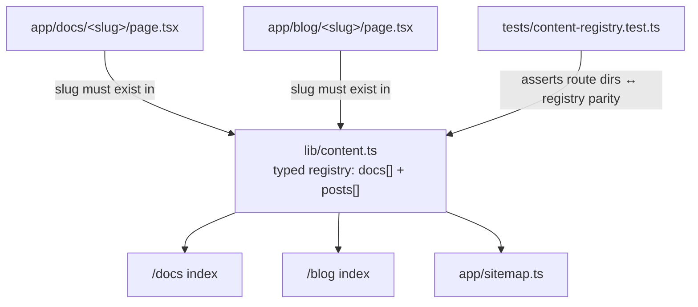

# VibesClone Content Platform and Build Sequence Positioning - Plan

## Goal Capsule

- **Objective:** Ship a public blog and documentation section inside the VibesClone app with a launch content set, and elevate "Build Sequence" to the named core value proposition across the landing page, docs, and blog.
- **Product authority:** The Product Contract below governs behavior. The surrounding areas named in How This Work Fits Together (interactive sequence tracking, lead capture, programmatic SEO) are not active scope.
- **Execution profile:** Additions inside the existing Next.js app under `vibesclone/` — new public routes, a typed content registry, CSS extensions, and landing copy edits. No new dependencies, no schema changes, no worker changes.
- **Stop conditions:** Do not ship if any content page requires authentication, quotes licensed follow-up prompt content, adds a Clarity event, or if any of `pnpm lint`, `pnpm typecheck`, `pnpm test`, `pnpm build`, `pnpm e2e` fails.
- **Tail ownership:** The invoking pipeline owns simplification, code review, commit, PR, and CI observation.
- **Product Contract preservation:** Product Contract unchanged.

---

## Product Contract

### Summary

Add public `/blog` and `/docs` sections to the VibesClone app, rendered from files versioned in the repo, shipped with an initial documentation set and launch blog posts. Rename and elevate the ordered prompt output as the "Build Sequence" — the product's named core concept — consistently across the landing page, content pages, and existing product surfaces that already use the phrase informally.

### Problem Frame

VibesClone launched with a single landing page, a workspace, and legal pages. A prospect who wants to understand how the product works, what is free versus licensed, which build platform to pick, or how refunds behave has nowhere to read about it; a builder mid-sequence has no reference material. The product also has no organic acquisition surface — the sitemap holds three URLs and nothing on the site targets the search intent the metadata keywords already name ("vibe coding", "Lovable prompts", "product teardown"). Meanwhile the product's strongest differentiator — an approval-bound, ordered prompt sequence with per-step completion checks — appears in the UI and generation system prompt as "build sequence" but is never named, explained, or marketed as a concept, so the value proposition reads as "prompts" rather than the sequence discipline that distinguishes it.

### Key Decisions

- KD1. **File-based content in the repo, not a CMS or external blog host.** Content ships and versions with code, needs no new database models, admin surface, or vendor; publishing via commit is acceptable for a solo operator. Governs R1, R6, R14.
- KD2. **"Build Sequence" is the product's named core concept** (session-settled: user-directed — chosen over keeping the unnamed "follow-up prompts" framing: the user asked to increase the core value prop around build sequences, and the vocabulary already exists informally in the hero, workspace sidebar, and generation system prompt). Governs R10, R11, R12.
- KD3. **This iteration elevates the value proposition through positioning and content only.** Interactive sequence features beyond what the workspace already has (for example persisted progress or checkpoint analytics) are deferred so this work never touches the license-gating or prompt-generation code paths. Governs R16.
- KD4. **Content pages stay public, unauthenticated, and outside the conversion funnel instrumentation.** The Clarity event allow-list is fixed; content pages add no events. Governs R15, R17.

### Actors

- A1. **Prospect:** A public visitor arriving from search, social, or a shared link who has not signed in.
- A2. **Builder:** A signed-in user who consults documentation before or during a build.
- A3. **Operator:** The product owner who authors and publishes content.

### Requirements

**Documentation**

- R1. A public `/docs` section presents an index and individual documentation pages, readable without authentication.
- R2. The launch documentation set covers, at minimum: getting started (URL to analysis to approval to Build Sequence), the Build Understanding and how to edit, rethink, and approve it, Build Sequences (the base prompt, ordered follow-ups, completion checks, and feature mapping), the four build targets (Lovable, Replit, Base44, Claude Code) and how to choose, and licenses and pricing (what is free, what a license unlocks, credit packs, the student code, and refund behavior).
- R3. Documentation states product behavior consistent with the shipped product's actual rules; where docs describe pricing, gating, or refunds they match the live behavior defined in the existing product plan.
- R4. All prompt examples in documentation are purpose-written for illustration; no page reproduces a real project's licensed follow-up prompt content.
- R5. Docs pages cross-link to each other and link to the workspace where the described action can be taken.

**Blog**

- R6. A public `/blog` section presents an index of posts, newest first, and individual article pages, readable without authentication.
- R7. The launch set contains at least four posts in the product's voice, covering positioning and education topics such as: why single mega-prompts fail and ordered sequences work, what a Build Sequence is, how to choose among the four build targets, and adapting a product's logic without imitating its identity.
- R8. Each post carries a title, description, publish date, and author attribution, and reads as original editorial content rather than generated filler.
- R9. Blog posts never analyze or teardown a named real company's product in a way that republishes its content; examples use invented or anonymized products.

**Build Sequence positioning**

- R10. "Build Sequence" is used as the consistent, capitalized name for the ordered prompt output across the landing page, docs, and blog, replacing informal variants where they appear in marketing copy.
- R11. The landing page presents the Build Sequence as the headline value: what the builder receives (one base prompt plus an ordered, checked sequence bound to an approved understanding), keeping the existing analyze-verify-approve-prompt narrative intact.
- R12. Workspace-facing terminology is aligned only where the phrase already appears; no workspace behavior changes.

**Discovery and navigation**

- R13. The site header and footer link to Docs and Blog from the landing page, and content pages link back to the landing page and workspace.
- R14. Every content page ships title, description, canonical URL, and social-preview metadata following the site's existing conventions, and every published content page appears in the sitemap.

**Guardrails**

- R15. Content pages emit no Clarity funnel events; the existing eight-event allow-list and the landing-only `landing_view` behavior are unchanged.
- R16. No changes to pricing, checkout, license gating, prompt generation, worker behavior, or database schema.
- R17. Content pages require no authentication and never render user- or project-specific data.

### Key Flows

- F1. **Prospect discovers via content.**
  - **Trigger:** A1 lands on a blog post or docs page from search or a shared link.
  - **Steps:** Reads the page; follows in-content links to related docs or the landing page; starts a project from the workspace link.
  - **Outcome:** A content visit becomes a workspace visit without any new tracking surface. **Covers R5, R6, R13, R15.**
- F2. **Builder consults the docs mid-build.**
  - **Trigger:** A2 wants to know what a completion check is or what a license unlocks.
  - **Steps:** Opens `/docs` from the site navigation; reads the Build Sequences or licensing page; returns to the workspace.
  - **Outcome:** The question is answered by documentation that matches live product behavior. **Covers R2, R3, R5.**
- F3. **Operator publishes a post.**
  - **Trigger:** A3 adds a new content file to the repo and deploys.
  - **Steps:** The post appears on the blog index and in the sitemap with its metadata; no other surface requires manual updating.
  - **Outcome:** Publishing is a commit, not an operations task. **Covers R6, R8, R14.**

### Acceptance Examples

- AE1. **Covers R1, R4, R17.** Given a signed-out visitor, when they open any docs or blog page, then the page renders fully without a sign-in prompt and contains no real project's licensed prompt content.
- AE2. **Covers R14.** Given a newly published blog post, when the sitemap is fetched, then the post's URL is present with the site's canonical host.
- AE3. **Covers R15.** Given a visitor who browses only blog and docs pages, when their session is inspected, then no Clarity custom event has fired, and `landing_view` still fires when they visit the landing page.
- AE4. **Covers R10, R11.** Given the updated landing page, when a visitor reads the hero and output sections, then the ordered prompt output is named "Build Sequence" and the free-versus-licensed boundary reads exactly as before: base prompt free, follow-ups licensed.

### Success Criteria

- A cold prospect can answer, from docs alone: what the product does, what is free, what a license costs and unlocks, and how refunds behave.
- Content pages pass the repo's existing quality gates (`pnpm lint`, `pnpm typecheck`, `pnpm test`, `pnpm build`, `pnpm e2e`), with the marketing e2e assertions updated in lockstep with any landing copy change.
- The blog launch set targets the search intent already named in the site metadata keywords rather than generic AI-content topics.

### Scope Boundaries

**Deferred for later**

- Interactive sequence progress beyond the workspace's existing controls: persisted completion state, checkpoint analytics, resume nudges.
- RSS/Atom feed, newsletter or email capture on content pages, and comment systems.
- Programmatic SEO pages (per-platform comparison or alternative pages) and a public changelog.
- A CMS or in-browser authoring surface.
- Markdown/MDX authoring toolchain — content is authored as typed TSX at launch; a markdown pipeline can be layered on later if authoring volume warrants it.

**Outside this product's identity**

- Publishing teardowns of named real products that republish their content or positioning — the product's own footer rule applies to its marketing: adapt the logic, don't imitate the identity.

<!-- ce-section: work-relationships -->
### How This Work Fits Together

This plan owns the public content platform and the Build Sequence positioning pass. The broader direction — strengthening the core value proposition — is the current understanding, not a committed roadmap:

- **Interactive Sequence Tracker** (persisted per-project progress, checkpoint analytics). Depends on the positioning language this plan establishes; touches license-gated surfaces, so it needs its own brainstorm and careful review. Can proceed independently of the blog.
- **Lead capture and lifecycle email.** Depends on the blog existing; still to decide whether it fits the solo-operator model.
- **Programmatic SEO surfaces** (platform comparisons, alternatives pages). Enables broader acquisition on top of this plan's metadata and sitemap groundwork; still to decide.

### Dependencies / Assumptions

- Launch content is authored as part of this work in the product's established voice and design language; the operator can revise any page afterward by editing its file.
- Publishing cadence via git commit and deploy is acceptable; no non-technical author needs access.
- Content is English-only at launch.
- The root layout's `force-dynamic` setting means content routes render dynamically; that is acceptable — content pages are cheap server components — and no rendering exception is carved out in this iteration.
- The landing H1 ("Copy the product logic. Build your version.") stays unchanged; Build Sequence elevation lands in the eyebrow, subhead, and section copy, which keeps the existing e2e H1 assertion intact.

---

## Planning Contract

### Key Technical Decisions

- KTD1. **Content is authored as typed TSX pages with a central typed registry, not MDX or markdown files.** Each docs page and blog post is a normal App Router route component; `lib/content.ts` exports typed metadata arrays (slug, title, description, date, and section/topic) that the indexes and sitemap consume. Zero new dependencies, no `next.config.ts` changes, fully typechecked, and compatible with the root layout's `force-dynamic`. Instantiates KD1 (governs R1, R6, R14). Rejected: `@next/mdx` or `react-markdown` — both add a toolchain and lockfile churn this iteration does not need; the Scope Boundaries defer markdown authoring explicitly.
- KTD2. **Content pages reuse the legal-page layout pattern.** A shared content layout mirrors `privacy`/`terms` structure (light header with `Brand` + back link, article column) using new `.content-*` classes modeled on `.legal-*` in `app/globals.css`, extended with the prose styles docs need (`h3`, inline `code`, `pre` blocks) and mobile overrides. Rejected: reusing `.legal-*` classes directly — legal styling would then be coupled to content churn.
- KTD3. **The sitemap derives content URLs from the content registry.** `app/sitemap.ts` maps over the registry so a new post appears in the sitemap with no sitemap edit (covers R14, F3). Rejected: extending the hardcoded array — it recreates the drift problem the registry exists to solve.
- KTD4. **Keep the existing static `public/robots.txt`; add no `robots.ts`.** A robots file already exists and already points at the sitemap; duplicating it as a route would create two sources of truth. This resolves the open question from the requirements phase.
- KTD5. **Landing edits stay within the existing e2e guardrails.** The marketing spec's banned-copy regex (`/Masters’ Union|cohort|faculty|founder|Student results|Honest proof/i`) and H1 assertion constrain copy; new copy avoids the banned terms, the H1 stays, and any assertion that names changed copy is updated in the same unit as the copy change.

### High-Level Technical Design

Single source-of-truth fan-out — the registry feeds every derived surface:



Route pages are static TSX authored per entry; the registry never imports page components (no circularity), and a unit test enforces registry-to-filesystem parity so a page cannot exist without appearing in the index and sitemap, or vice versa.

### Output Structure

```text
vibesclone/
  lib/content.ts                     # typed registry: docs + blog metadata
  components/content/layout.tsx      # shared ContentPage layout + article shell
  app/docs/page.tsx                  # docs index
  app/docs/getting-started/page.tsx
  app/docs/build-understanding/page.tsx
  app/docs/build-sequences/page.tsx
  app/docs/build-targets/page.tsx
  app/docs/licenses-and-pricing/page.tsx
  app/blog/page.tsx                  # blog index
  app/blog/why-mega-prompts-fail/page.tsx
  app/blog/what-is-a-build-sequence/page.tsx
  app/blog/choosing-your-build-target/page.tsx
  app/blog/adapt-the-logic-not-the-identity/page.tsx
  tests/content-registry.test.ts     # registry ↔ filesystem parity
  e2e/content.spec.ts                # public render + metadata assertions
```

Per-unit `**Files:**` lists remain authoritative; the implementer may adjust slugs if a better title emerges while writing.

---

## Implementation Units

### U1. Content registry, shared layout, and prose styles

- **Goal:** The foundation every content page uses: a typed registry, a shared content layout, and the CSS it needs.
- **Requirements:** R1, R6, R14 (per KD1/KTD1); layout groundwork for R13.
- **Dependencies:** None.
- **Files:** `vibesclone/lib/content.ts`, `vibesclone/components/content/layout.tsx`, `vibesclone/app/globals.css`, `vibesclone/tests/content-registry.test.ts`.
- **Approach:**
  1. Define `DocEntry` and `PostEntry` types (slug, title, description, and for posts an ISO date and author) and export ordered `docs` and `posts` arrays from `lib/content.ts`. The arrays ship empty in this unit — U2 and U3 add their entries alongside their route directories, so the parity test stays green at every unit boundary.
  2. Build a `ContentPage` layout component mirroring the privacy/terms shell (per KTD2): light header with `Brand`, back link, and links to `/docs` and `/blog`; article column; footer link back to the workspace.
  3. Add `.content-*` classes to `app/globals.css` modeled on `.legal-*`, plus `h3`, inline `code`, and `pre` prose styles and entries in the existing 760px media block.
- **Patterns to follow:** `vibesclone/app/privacy/page.tsx` (page shell, metadata shape), `.legal-*` block in `vibesclone/app/globals.css:315-328`, dense single-line JSX with explicit `React.ReactNode` return types.
- **Test scenarios:**
  - Every registry slug has a matching route directory under `app/docs/` or `app/blog/`, and every route directory has a registry entry — import the registry via the `@` alias and enumerate route directories with node `fs` using a path resolved from `import.meta.url` (the alias resolves modules, not filesystem paths). Passes vacuously while the registry is empty in U1.
  - Post dates parse as valid ISO dates and the `posts` array is sorted newest-first.
  - Slugs are unique across the registry.
- **Verification:** `pnpm test` passes including the new registry test; `pnpm typecheck` clean.

### U2. Documentation section and launch docs

- **Goal:** The `/docs` index and the five launch documentation pages.
- **Requirements:** R1, R2, R3, R4, R5, R14; F2; AE1.
- **Dependencies:** U1.
- **Files:** `vibesclone/app/docs/page.tsx`, `vibesclone/app/docs/{getting-started,build-understanding,build-sequences,build-targets,licenses-and-pricing}/page.tsx`.
- **Approach:**
  1. Add the five doc entries to the registry in the same change as their route directories (keeps U1's parity test green). Index page lists doc entries from the registry with descriptions, in reading order.
  2. Each doc page uses `ContentPage`, exports `metadata` with title, description, and `alternates.canonical` per the privacy-page pattern, and cross-links per R5.
  3. Content accuracy is bound by R3: pricing, gating, and refund statements must match the shipped rules ($29/$69/$179, base prompt free, follow-ups licensed per project, full-refund and dispute revocation, student code on the one-project product only).
  4. Prompt examples are purpose-written (R4) — short, obviously illustrative, never resembling exported product output.
- **Patterns to follow:** `vibesclone/app/privacy/page.tsx` metadata and shell; product behavior source: `docs/plans/2026-07-31-001-feat-vibesclone-product-plan.md` Requirements R16-R18.
- **Test scenarios:** Covered by U1's parity test plus U5's e2e scenarios (docs index and a sample doc page render signed-out with correct canonical). Test expectation beyond those: none — static content pages with no logic.
- **Verification:** `pnpm build` succeeds; docs pages render in the dev server without Clerk configured.

### U3. Blog section and launch posts

- **Goal:** The `/blog` index and four launch posts.
- **Requirements:** R6, R7, R8, R9, R14; F1, F3; AE1.
- **Dependencies:** U1.
- **Files:** `vibesclone/app/blog/page.tsx`, `vibesclone/app/blog/{why-mega-prompts-fail,what-is-a-build-sequence,choosing-your-build-target,adapt-the-logic-not-the-identity}/page.tsx`.
- **Approach:**
  1. Add the four post entries to the registry in the same change as their route directories (keeps U1's parity test green). Index lists posts newest-first from the registry with date, title, description.
  2. Each post uses `ContentPage`, exports metadata with canonical, and carries visible date and author attribution (R8).
  3. Editorial constraints: product voice per `vibesclone/DESIGN.md` (precise, useful, not decorative); no real-company teardowns (R9); each post ends with one link into `/docs` or the workspace, not a hard sell.
- **Patterns to follow:** U2's page shape; voice and vocabulary from `vibesclone/DESIGN.md` and the landing page.
- **Test scenarios:** Covered by U1's parity test plus U5's e2e scenarios (blog index newest-first, sample post renders signed-out with date and author visible). Test expectation beyond those: none — static content pages with no logic.
- **Verification:** `pnpm build` succeeds; blog index order matches registry dates.

### U4. Landing page positioning and site navigation

- **Goal:** Elevate "Build Sequence" on the landing page and wire Docs/Blog into the site header and footer.
- **Requirements:** R10, R11, R12, R13; AE4.
- **Dependencies:** U2, U3 (links must resolve).
- **Files:** `vibesclone/app/page.tsx`, `vibesclone/e2e/marketing.spec.ts`.
- **Approach:**
  1. Header nav gains `Docs` and `Blog` links; footer gains a small nav with the same links alongside the legal links. Small-viewport decision: the existing `.site-header nav { display: none; }` rule at max-width 760px stays — on mobile, R13 is satisfied by the footer nav, so the header-link e2e assertion is scoped to the desktop project while footer links are asserted on both projects. No new mobile header treatment this iteration.
  2. Copy pass per KD2/KTD5: eyebrow and hero subhead name the Build Sequence ("Get the exact Build Sequence to build it for your niche"); section 01 and 03 headings and body adopt the capitalized term; pricing copy names "Build Sequence" where it says "every mapped follow-up". H1 unchanged; analyze-verify-approve-prompt narrative unchanged; free-versus-licensed boundary wording preserved (AE4).
  3. Workspace labels are already "BUILD SEQUENCE" / "Your build sequence" — verify, change nothing behavioral (R12).
  4. Update `e2e/marketing.spec.ts` in the same change for any assertion that names edited copy; keep the banned-copy regex assertion passing (new copy avoids those terms).
- **Patterns to follow:** Existing dense JSX in `vibesclone/app/page.tsx`; assertion style in `vibesclone/e2e/marketing.spec.ts`.
- **Test scenarios:**
  - Covers AE4. Landing renders the term "Build Sequence" in hero/output copy and retains "base prompt" free framing (e2e text assertions).
  - Header exposes visible `Docs` and `Blog` links on the desktop project; footer exposes them on both desktop and mobile projects (e2e role-based assertions, scoped per the small-viewport decision above).
  - Banned-copy regex assertion still passes against the updated page.
- **Verification:** `pnpm e2e` marketing spec green on desktop and mobile projects.

### U5. Sitemap from registry and content e2e coverage

- **Goal:** Registry-driven sitemap and end-to-end proof of the public content surface.
- **Requirements:** R14, R15, R17; AE1, AE2, AE3.
- **Dependencies:** U1, U2, U3.
- **Files:** `vibesclone/app/sitemap.ts`, `vibesclone/e2e/content.spec.ts`.
- **Approach:**
  1. Rewrite `sitemap.ts` to keep the three existing entries and append `/docs`, `/blog`, and every registry entry URL (per KTD3), preserving the existing base-URL handling.
  2. New `e2e/content.spec.ts` asserts the public content surface signed-out.
  3. `public/robots.txt` is intentionally untouched (KTD4).
- **Patterns to follow:** Existing `vibesclone/app/sitemap.ts` base-URL handling; `e2e/marketing.spec.ts` structure and metadata assertion style.
- **Test scenarios:**
  - Covers AE1. Docs index, one doc page, blog index (verifying newest-first order matches registry dates), and one post (with visible publish date and author attribution per R8) render signed-out with expected headings and no sign-in redirect.
  - Covers AE2. `/sitemap.xml` contains the docs index, blog index, and every registry URL on the canonical host.
  - Covers AE3. A content page visit fires no Clarity custom event (content pages import no `track` call — asserted by the absence of the Clarity funnel event requests, or by a source-level grep-style unit assertion if network interception is brittle in fixture mode).
  - Content pages carry canonical link tags matching their route.
- **Verification:** `pnpm e2e` passes both specs; `pnpm build` succeeds.

---

## Verification Contract

| Gate | Command | Applies to | Done signal |
|---|---|---|---|
| Lint | `pnpm lint` | all units | exits clean |
| Types | `pnpm typecheck` | all units | exits clean |
| Unit tests | `pnpm test` | U1, U5 | all pass, including `tests/content-registry.test.ts` |
| Build | `pnpm build` | all units | production build succeeds |
| E2E | `pnpm e2e` | U4, U5 | `marketing.spec.ts` and `content.spec.ts` green on desktop and mobile |

All commands run from `vibesclone/`.

---

## Definition of Done

- U1-U5 complete in dependency order; all Verification Contract gates green.
- R1-R17 satisfied; AE1-AE4 enforced by the test scenarios that cite them.
- No diff touches `prisma/`, `worker/`, checkout, webhook, license, or prompt-generation code (R16); `components/analytics/clarity.tsx` unchanged (R15).
- Launch content set present: five docs pages and four blog posts, each with metadata and sitemap presence.

---

## Sources

- Grounding dossier with verbatim quotes and `file:line` pointers: `/tmp/compound-engineering-501/ce-brainstorm/vibesclone-blogs-docs-1785776845/grounding.md`
- `vibesclone/app/page.tsx` — current landing copy and section structure.
- `vibesclone/lib/contracts.ts`, `vibesclone/lib/prompts/generation.ts` — the sequence schema and the "build-sequence architect" system prompt that ground the naming decision.
- `vibesclone/components/analytics/clarity.tsx` — the fixed funnel event allow-list behind R15.
- `vibesclone/DESIGN.md` — voice, palette, and typography the content surfaces must follow.
- `docs/plans/2026-07-31-001-feat-vibesclone-product-plan.md` — the shipped product's behavior that R3 binds documentation to.
- `vibesclone/app/globals.css` `.legal-*` block, `vibesclone/app/privacy/page.tsx`, `vibesclone/proxy.ts`, `vibesclone/e2e/marketing.spec.ts`, `vibesclone/app/sitemap.ts`, `vibesclone/public/robots.txt` — implementation patterns and guardrails consulted during planning.
