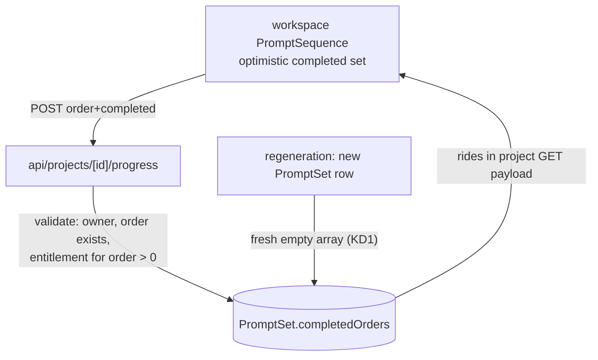

# VibesClone Interactive Sequence Tracker - Plan

## Goal Capsule

- **Objective:** Persist per-project Build Sequence progress server-side so mark-complete survives reload and devices, and make the workspace resume where the builder left off.
- **Product authority:** This Product Contract governs behavior. Adjacent areas from the content-platform plan (lead capture, programmatic SEO) are not active scope.
- **Execution profile:** Additive change inside the existing Next.js app under `vibesclone/` — one additive migration on the sequence table, one new API sub-route following the established project-route pattern, workspace component wiring, one docs line. No worker, checkout, or funnel changes.
- **Stop conditions:** Do not ship if the paywall projection changes, a locked step's completion can be set or probed by an unlicensed project, any Clarity event is added, or any of `pnpm lint`, `pnpm typecheck`, `pnpm test`, `pnpm build`, `pnpm e2e` fails.
- **Tail ownership:** The invoking pipeline owns simplification, code review, commit, PR, CI observation, and merge.
- **Open blockers:** None.
- **Product Contract preservation:** Product Contract unchanged (planning resolved its four deferred questions into KTDs below).

---

## Product Contract

### Summary

Move Build Sequence completion state from ephemeral client memory to per-user, per-sequence server persistence, and use it: the sequence nav and canvas reflect saved progress after reload, a progress count shows how far the build is, "Next up" prefers the next incomplete step, and reopening a project lands on the first incomplete step. One line of the build-sequences doc is strengthened to say progress is saved.

### Problem Frame

The workspace lets a builder mark sequence steps complete, but the state lives only in client component memory keyed by array index — a reload, a different device, or any action that refreshes the project wipes it. "Next up" ignores completion entirely and just advances one index. For a product whose core discipline is "run the checks, then advance in order," losing the builder's place undermines the Build Sequence's own value proposition — and the shipped documentation already tells users they can "mark steps complete as you go," which today only holds until the next refresh.

### Key Decisions

- KD1. **Progress binds to the generated sequence, not the project.** A newly generated sequence (new approved understanding, platform, or template) starts with no completed steps — old checkmarks would describe different steps; returning to a reused sequence retains its progress. Governs R2.
- KD2. **Build the tracker now** (session-settled: user-approved — proposed as the next area with the touches-license-gated-surfaces risk surfaced; the user accepted and directed the same autonomous loop). Governs R1.
- KD3. **Entitlement and funnel guardrails carry over from the content-platform plan.** Locked follow-ups stay withheld server-side, paywall semantics are untouched, and the Clarity event allow-list does not change. Governs R10, R11.
- KD4. **Marking complete stays instant.** Persistence is silent background sync behind the existing toggle; there is no new save concept, and a failed sync surfaces through the existing workspace error style. Governs R6.

### Actors

- A1. **Builder:** The signed-in owner of a project working through its Build Sequence.

### Requirements

**Persistence**

- R1. Marking a Build Sequence step complete or incomplete persists server-side for that project's current generated sequence and is reflected on any later load, session, or device.
- R2. Completion is scoped to the generated sequence version per KD1: a regenerated sequence starts clean; a reused sequence retains its progress; progress on superseded sequences is simply irrelevant (the workspace only renders the newest).
- R3. Only the project's owning user can read or write its progress, following the product's existing per-user project authorization behavior.
- R4. The server accepts completion marks only for steps that exist in the stored sequence, and for an unlicensed project only the base prompt is markable; locked follow-up steps can be neither marked nor probed through the progress surface.
- R5. Progress data contains step identity and completion state only — never prompt content.

**Workspace behavior**

- R6. Toggling completion feels instant (per KD4) and the persisted state after reload renders identically to the pre-reload state in the nav and prompt canvas.
- R7. The sequence rail shows a progress summary: completed count out of the total steps in the rendered sequence.
- R8. "Next up" prefers the next incomplete step after the current one; when every rendered step is complete, the sequence presents itself as finished instead of offering a next step.
- R9. Opening a project with persisted progress selects the first incomplete step; with no progress, behavior is unchanged (base prompt first).

**Guardrails**

- R10. No changes to entitlement, paywall projection, checkout, license, prompt-generation, or approval/invalidation semantics.
- R11. No new Clarity events; the existing allow-list and masking behavior are unchanged; progress state is not sent to analytics.
- R12. The build-sequences documentation page states that completion progress is saved to the project; no other content changes.

### Key Flows

- F1. **Builder resumes a build.**
  - **Trigger:** A1 reopens a project days later, possibly on another device.
  - **Steps:** Workspace loads the newest sequence with persisted completion; the first incomplete step is selected; the rail shows progress.
  - **Outcome:** The builder continues exactly where they left off. **Covers R1, R6, R7, R9.**
- F2. **Builder finishes a step.**
  - **Trigger:** A1 runs a step's completion checks and marks it complete.
  - **Steps:** The toggle updates instantly, syncs in the background, and "Next up" points at the next incomplete step.
  - **Outcome:** Progress advances without any new interaction cost. **Covers R1, R6, R8.**
- F3. **Builder regenerates after a scope change.**
  - **Trigger:** A1 edits the understanding, re-approves, and regenerates.
  - **Steps:** The new sequence renders with zero completed steps; the old sequence's progress is not consulted.
  - **Outcome:** Checkmarks always describe the steps they were earned on. **Covers R2.**

### Acceptance Examples

- AE1. **Covers R1, R6.** Given a builder marks steps 0 and 1 complete, when they reload the workspace, then both steps render as completed in the rail and canvas.
- AE2. **Covers R2.** Given a project with completed steps, when the builder edits the understanding, approves, and regenerates, then the new sequence shows zero completed steps.
- AE3. **Covers R4.** Given an unlicensed project with locked follow-ups, when a request marks a locked step complete, then the server rejects it, while marking the base prompt succeeds.
- AE4. **Covers R9.** Given persisted completion on steps 0-1 of a five-step sequence, when the project opens, then step 2 is selected.
- AE5. **Covers R8.** Given a five-step sequence with steps 0-2 complete and the builder viewing step 3, when they look at "Next up", then it offers step 4 (the next incomplete step after the current one); once step 4 is also complete, the sequence presents its finished state instead.
- AE6. **Covers R11.** Given a builder toggles completion repeatedly, when the session is inspected, then no Clarity event outside the existing allow-list has fired.

### Scope Boundaries

**Deferred for later**

- Checkpoint analytics, operator dashboards, or completion metrics.
- Per-step notes, timestamps shown in UI, or reminder/nudge mechanics.
- A real share-token route ("Copy private link" remains a copy of the authenticated URL).
- Multi-device conflict handling beyond last-write-wins.

**Outside this product's identity**

- Auto-marking steps complete on the builder's behalf — completion checks are the builder's judgment, not the product's.

<!-- ce-section: work-relationships -->
### How This Work Fits Together

This plan owns persisted sequence progress. The broader value-prop direction from the content-platform plan (docs/plans/2026-08-03-001-feat-vibesclone-content-build-sequence-positioning-plan.md) remains the current understanding, not a committed roadmap:

- **Content platform and Build Sequence positioning** — shipped; this plan builds on the vocabulary and docs it established.
- **Lead capture and lifecycle email** — independent of this plan; still to decide.
- **Programmatic SEO surfaces** — independent of this plan; still to decide.

### Dependencies / Assumptions

- The workspace continues to render only the newest generated sequence; this plan does not add UI for historical sequences.
- Last-write-wins is acceptable for concurrent sessions of the same user.
- English-only UI strings, matching the workspace.

---

## Planning Contract

### Key Technical Decisions

- KTD1. **Progress is a `completedOrders` integer-array column on the existing sequence record (`PromptSet`), not a new table.** The sequence row is already unique per (project, understanding version, platform, template) and single-owner, so a column gives KD1's binding for free: a new row starts empty, a reused row retains its array, superseded rows are never read (the workspace renders only the newest row). Instantiates KD1 (governs R2) and advances R1. Rejected: a separate progress table — a second entity, joins, and cleanup for a strictly 1:1 relationship.
- KTD2. **One additive hand-written SQL migration** following the repo's `YYYYMMDD####_label` convention: add the array column with a NOT NULL empty-array default. No backfill needed; rollback is a column drop.
- KTD3. **A single `POST /api/projects/[id]/progress` toggle endpoint** using the established route pattern (`ensureUser(await requireSessionIdentity())`, owned-project lookup, `authErrorResponse` catch; POST handlers are dynamic by default, matching the unlock exemplar). Body carries the step's `order` and desired `completed` boolean; the server validates the order exists in the stored sequence content, enforces R4's entitlement rule (order 0 only for unlicensed projects), computes the new array read-modify-write (last-write-wins per the Product Contract), and returns the updated `completedOrders`. Reads need no new endpoint: the project GET already returns the newest sequence row whole, so the new column rides along. In the unlicensed projection, `completedOrders` is filtered down to the base prompt's order alongside the existing `content` replacement — entitlement is revocable (refunds/disputes deactivate the purchase), and without this filter a revoked-license project would expose and mis-count completions for steps it can no longer render. The stored array stays intact so re-licensing restores progress; while unlicensed, follow-up completions are frozen (R4 rejects both marking and unmarking them). Same-user double-toggle races are accepted within the Product Contract's last-write-wins tolerance.
- KTD4. **The workspace derives all progress UI from the persisted array, through small pure helpers.** Initialization filters `completedOrders` to orders present in the rendered prompts before deriving anything (stale orders from a revoked license are ignored client-side — defense in depth behind KTD3's projection). The derivations — completed index set, first-incomplete initial selection, next-incomplete-after-current "Next up" (no wrapping; all-complete renders the finished state per R8), and the `completed/total` count — live in an extracted pure module so R8/R9 logic is unit-testable without a component harness. Toggles update state optimistically and sync via the endpoint; on sync failure the toggle reverts and the existing error-message style surfaces it (per KD4).
- KTD5. **Test seam: route-level unit tests with the established mock pattern plus pure-helper unit tests; no new e2e.** `tests/project-paywall.test.ts` models the auth/billing/db mocking for project routes; the progress route follows it, with the stub extended to carry a `promptSet` delegate whose update payload the tests assert (the existing stub is stateless and has no promptSet model). R8/R9 selection logic is proven at the pure-helper layer. AE1/AE4's reload semantics are proven by the route persisting to the (mocked) store plus the GET payload carrying the column; workspace e2e would require seeding an analyzed project through the queue, which the suite deliberately avoids.

### High-Level Technical Design

The array lives on the same row the workspace already renders, so persistence, projection, and reset-on-regenerate all fall out of existing data flow rather than new machinery.

---

## Implementation Units

### U1. Progress column and migration

- **Goal:** The sequence record can store completed step orders.
- **Requirements:** R1, R2 (per KTD1, KTD2; KD1 governs R2).
- **Dependencies:** None.
- **Files:** `vibesclone/prisma/schema.prisma`, `vibesclone/prisma/migrations/202608040001_sequence_progress/migration.sql`.
- **Approach:**
  1. Add `completedOrders Int[] @default([])` to the `PromptSet` model.
  2. Hand-write the additive migration SQL per the repo's convention (`ALTER TABLE ... ADD COLUMN ... INTEGER[] NOT NULL DEFAULT '{}'`).
  3. Regenerate the Prisma client.
- **Patterns to follow:** `vibesclone/prisma/migrations/202607310002_project_licenses/migration.sql` (hand-written SQL, naming).
- **Test scenarios:** Test expectation: none — schema/migration scaffolding; behavior is exercised by U2's route tests against the mocked store and by the type-checked client.
- **Verification:** `pnpm typecheck` clean with the regenerated client; migration applies cleanly via `pnpm prisma:migrate` (prisma migrate deploy) against a dev database.

### U2. Progress toggle endpoint

- **Goal:** An authenticated owner can persist a step's completion state, within R4's bounds.
- **Requirements:** R1, R3, R4, R5; AE3.
- **Dependencies:** U1.
- **Files:** `vibesclone/app/api/projects/[id]/progress/route.ts`, `vibesclone/tests/sequence-progress.test.ts`.
- **Approach:**
  1. POST handler per KTD3: auth + owned-project lookup including the newest sequence row; 404 when absent.
  2. Parse body `{ order, completed }` with zod; validate `order` against the parsed stored sequence content (base plus follow-ups), not client data.
  3. Enforce R4: when the project lacks entitlement, only the base prompt's order is accepted; reject others — in both the mark and unmark directions — with the identical status code and error body as a nonexistent order (no oracle distinguishing locked vs nonexistent).
  4. Update the row's array (add or remove the order, dedup, sort) and return `{ completedOrders }`.
- **Execution note:** Write the route tests against the paywall-test mock pattern first for the rejection paths (invalid order, locked order, unauthenticated) and observe them fail before implementing the handler.
- **Patterns to follow:** `vibesclone/app/api/projects/[id]/unlock/route.ts` (POST sub-route shape), `vibesclone/tests/project-paywall.test.ts` (mock pattern — extend its stateless prisma stub with a `promptSet.update` delegate and assert the update payload; prove AE1's persistence half by feeding the updated row back through the mocked project GET).
- **Test scenarios:**
  - Covers AE3. Unlicensed project: marking order 0 succeeds; marking or unmarking a follow-up order is rejected with the same status code and body as a nonexistent order.
  - Licensed project: marking and unmarking a follow-up order round-trips (array gains then loses the order).
  - Covers AE1 (persistence half). A completed order written by the route appears in the stored row the project GET returns.
  - Order outside the stored sequence (negative, beyond last follow-up) is rejected with 4xx.
  - Unauthenticated request receives 401 via the existing auth error path.
  - Malformed body (missing order, non-boolean completed) is rejected with 4xx.
- **Verification:** `pnpm test` green including the new suite.

### U3. Workspace progress wiring

- **Goal:** The workspace initializes from, displays, and writes persisted progress.
- **Requirements:** R6, R7, R8, R9; F1, F2; AE1, AE4, AE5.
- **Dependencies:** U1, U2.
- **Files:** `vibesclone/components/workspace.tsx`, `vibesclone/lib/progress.ts`, `vibesclone/tests/sequence-progress-ui.test.ts`.
- **Approach:**
  1. Extract pure helpers into `vibesclone/lib/progress.ts` per KTD4 (filter persisted orders to rendered prompts, derive completed index set, first-incomplete selection, next-incomplete-after-current, completed/total) and initialize the workspace from them, falling back to index 0.
  2. Toggle optimistically, POST to the progress endpoint, revert and surface the existing error style on failure (KD4).
  3. Progress summary in the sequence rail: completed count out of rendered prompts.
  4. "Next up" targets the next incomplete prompt after the current selection; when none remain incomplete, render the finished state instead of a next-step control (R8).
  5. Keep reload behavior coherent: `onReload` refetches the project, and the re-initialized state must equal the persisted state (R6).
- **Patterns to follow:** Existing `PromptSequence` state handling and `copyText`/error-message styles in `vibesclone/components/workspace.tsx`.
- **Test scenarios:** (pure-helper suite in `vibesclone/tests/sequence-progress-ui.test.ts`; rendering verified by the browser pass and the e2e suite staying green — the component has no test harness today)
  - Covers AE4. Persisted orders 0-1 on a five-step sequence derive initial selection index 2.
  - Covers AE5. Steps 0-2 complete with step 3 current derive next-up step 4; all-complete derives the finished state (no next step).
  - Stale orders absent from the rendered prompts (revoked license) are ignored in the completed set, count, and selection.
  - Empty persisted array derives selection 0 and count 0.
- **Verification:** `pnpm build` and `pnpm e2e` green; manual browser pass shows persisted completion after reload, first-incomplete selection, progress count, and next-incomplete "Next up".

### U4. Docs line and gates

- **Goal:** The build-sequences doc says progress is saved; all gates green.
- **Requirements:** R12.
- **Dependencies:** U3.
- **Files:** `vibesclone/app/docs/build-sequences/page.tsx`.
- **Approach:** Extend the workspace-controls sentence to state that completion progress is saved to the project. No other content changes.
- **Test scenarios:** Test expectation: none — one sentence of static copy; the content e2e suite continues to pass.
- **Verification:** Full Verification Contract green.

---

## Verification Contract

| Gate | Command | Applies to | Done signal |
|---|---|---|---|
| Lint | `pnpm lint` | all units | exits clean |
| Types | `pnpm typecheck` | all units | exits clean (regenerated Prisma client) |
| Unit tests | `pnpm test` | U2 | all pass, including `tests/sequence-progress.test.ts` |
| Build | `pnpm build` | all units | production build succeeds |
| E2E | `pnpm e2e` | U3, U4 | existing marketing + content specs stay green |

All commands run from `vibesclone/`.

---

## Definition of Done

- U1-U4 complete in dependency order; all Verification Contract gates green.
- R1-R12 satisfied; AE1-AE6 enforced by U2's cited scenarios, the browser pass, and the unchanged Clarity allow-list (AE6 holds because no analytics code is touched).
- The diff touches no checkout, webhook, license, prompt-generation, worker, or analytics code; the paywall projection in the project GET is unchanged (R10, R11).
- The migration is additive-only and follows the repo's naming convention.

---

### Sources

- Grounding dossier with verbatim quotes and `file:line` pointers: `/tmp/compound-engineering-501/ce-brainstorm/sequence-tracker-1785781526/grounding.md`
- `vibesclone/components/workspace.tsx` — the ephemeral completion state, mark-complete control, "Next up" logic this plan replaces the storage for.
- `vibesclone/prisma/schema.prisma`, `vibesclone/app/api/projects/` — the data model and per-user route/auth pattern persistence must follow.
- `vibesclone/lib/domain.ts`, `vibesclone/worker/jobs.ts` — approval/regeneration semantics behind KD1.
- `vibesclone/app/docs/build-sequences/page.tsx` — the doc line R12 updates.
