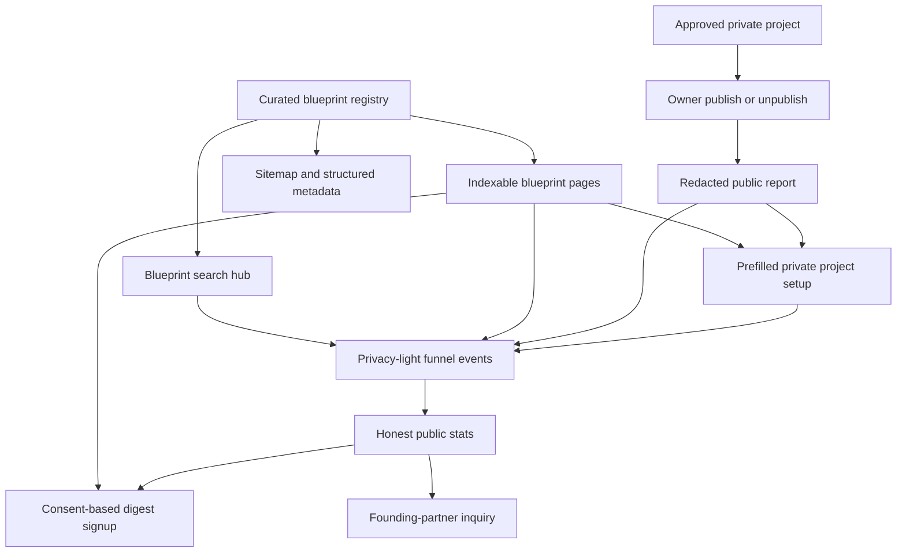

# VibesClone Public Blueprint Flywheel - Plan

## Goal Capsule

- **Objective:** Make VibesClone discoverable, useful before sign-in, naturally shareable, and measurable without weakening its per-project paid prompt sequence.
- **Product authority:** This plan owns the public blueprint, remix, opt-in publishing, retention, transparent stats, and sponsor-interest loop. It does not replace the private analyze, verify, and generate workflow.
- **Open blockers:** None. Early performance targets are hypotheses to measure after launch, not release blockers.

---

## Product Contract

### Summary

Add a public blueprint library and an opt-in project-report loop that turns product research into useful search pages, customized build starts, and shareable outcomes. Preserve the paid boundary by giving away high-quality analysis and a base-prompt preview while licensing the complete user-specific prompt sequence per project.

### Problem Frame

VibesClone's strongest value currently appears inside a private workflow. That makes the product useful to a buyer but gives search engines, curious visitors, and a successful user's network little durable value to discover or share.

The reference product demonstrates that a plain-language utility, many useful detail pages, actionable free output, and explicit share actions can create rapid public distribution. Its public stats and sold-out sponsor inventory also show that audience credibility can become a monetization surface. VibesClone needs an equivalent compounding system that fits its own promise: verified niche adaptation, not generic replacement verdicts.

### Key Decisions

- **Public utility, private depth.** Public pages reveal enough product logic and one starting prompt to be useful; complete customized follow-up sequences remain licensed. Governs R3, R4, R9.
- **Curated quality before page count.** Launch with a small set of distinct editorial blueprints instead of hundreds of generated pages. Governs R1, R2, R5.
- **Private by default.** A project becomes public only through an informed owner action and can return to private at any time. Governs R10, R11, R12.
- **Share transformations, not raw paid output.** A public report explains what the builder adapted and why, then invites a remix without exposing licensed follow-up prompts. Governs R13, R14.
- **Proof before sponsor checkout.** The product may collect relevant sponsor interest now, but fixed paid inventory waits for measurable audience demand. Governs R22, R23.
- **No fabricated proof.** All public counters and activity claims come from recorded product behavior; testimonials and shipped projects appear only after users provide them. Governs R19, R20.

### Actors

- A1. **Explorer:** A visitor researching whether and how to build a version of an existing product.
- A2. **Builder:** A signed-in user who turns a blueprint or URL into a niche-specific private project.
- A3. **Project owner:** The builder who controls whether a completed project report is public.
- A4. **Remixer:** A visitor who starts a new private project from a blueprint or public report.
- A5. **Subscriber:** A visitor who consents to receive buildable-product updates and can unsubscribe.
- A6. **Sponsor prospect:** A relevant builder-tool company asking about future audience placements.

### Requirements

**Discoverable blueprint utility**

- R1. The product shall provide a browsable public library of distinct clone blueprints for at least eight recognisable software products at launch.
- R2. Each blueprint shall explain cloneability, effort, buildable core, difficult or moat-bearing parts, key flows, niche directions, and important scope exclusions in product-specific language.
- R3. Each blueprint shall provide a useful base-prompt preview and clearly distinguish it from the complete customized prompt sequence.
- R4. Every blueprint shall offer a primary action to build a customized version with the source product already carried into the private workflow.
- R5. Blueprint pages shall be discoverable through a searchable hub, relevant internal links, descriptive metadata, structured data, and the public sitemap.
- R6. The homepage shall let an explorer search the blueprint library or paste a product URL before sign-in.
- R7. A recognised product shall resolve to its public blueprint, while an unknown public URL shall continue into the existing private analysis flow with the URL prefilled.

**Qualified activation and paid boundary**

- R8. Starting from any public blueprint or report shall retain the selected source context and label the new project as a remix origin.
- R9. Public surfaces shall not reveal licensed follow-up prompts, private project URLs, provider details, model names, or internal generation metadata.

**Opt-in public project reports**

- R10. Only the authenticated project owner may publish or unpublish a project report.
- R11. A project shall remain private until its owner completes an explicit publish action that explains what will become public.
- R12. Unpublishing shall remove public access while preserving the owner's private project and paid entitlements.
- R13. A public report shall show the source product, chosen niche, USP, target user, approved product summary, key jobs, flows, and feature decisions that are safe to share.
- R14. A public report shall not show the full generated prompt sequence and shall invite visitors to remix the approved understanding into their own private project.
- R15. Public blueprints and reports shall provide copy-link, X, and LinkedIn sharing with a concise transformation statement and a legible social preview.

**Retention and consent**

- R16. Public blueprint and stats surfaces shall offer an email digest signup with a concrete content promise and no invented subscriber count.
- R17. A subscriber shall receive a confirmation of consent and have a working one-step unsubscribe path.
- R18. The privacy notice shall explain newsletter storage, public-report publication, first-party product events, Microsoft Clarity, and the owner's ability to unpublish.

**Measurement and transparent proof**

- R19. The product shall record privacy-light events for blueprint views, remix starts, public-report publication, share actions, newsletter signups, and prompt copies without storing an IP address in the product event record.
- R20. A public stats page shall show only database-backed counts, state when measurement began, and avoid implying that early activity is third-party-verified.
- R21. Existing Microsoft Clarity tracking shall remain in place for behavioral diagnostics while first-party events define the product funnel counters.

**Sponsor demand without premature inventory**

- R22. A public sponsor page shall explain the future audience fit for builder tools, infrastructure, AI, payments, and growth products and accept a founding-partner inquiry.
- R23. The sponsor page shall not claim active placements, sold-out demand, guaranteed traffic, or a fixed checkout until VibesClone has measured audience evidence.
- R24. Sponsor inquiries shall reach the existing team sales channel and receive a clear success or failure response.

### Key Flows

- F1. **Explore and build from a known product**
  - **Trigger:** An explorer searches for a recognisable product or pastes its URL.
  - **Actors:** A1, A2
  - **Steps:** The product resolves the blueprint; the explorer reads the cloneability analysis; the explorer starts a customized build; authentication occurs only when the private project requires it; the source context is prefilled.
  - **Outcome:** Public research becomes a qualified private project start.
  - **Covers R1–R9.**

- F2. **Analyze an unknown product**
  - **Trigger:** An explorer submits a valid public product URL that has no curated blueprint.
  - **Actors:** A1, A2
  - **Steps:** The product explains that a custom analysis is needed; the visitor continues to the private workflow; sign-in occurs; the submitted URL remains present.
  - **Outcome:** The limited public catalog does not become a dead end.
  - **Covers R6–R9.**

- F3. **Publish and share a project report**
  - **Trigger:** A project owner completes or approves a private understanding and chooses to publish.
  - **Actors:** A3
  - **Steps:** The owner reviews the public fields; confirms publication; opens the public report; shares its transformation statement; may later unpublish it.
  - **Outcome:** A private result becomes a reversible, portfolio-worthy acquisition artifact.
  - **Covers R9–R15, R19.**

- F4. **Remix a public report**
  - **Trigger:** A visitor chooses “Remix this blueprint” on a public report.
  - **Actors:** A1, A4
  - **Steps:** The product opens a new private build with safe source, niche, and USP context prefilled; the visitor can change every carried value before analysis.
  - **Outcome:** One builder's share creates a qualified starting point for another builder.
  - **Covers R8, R9, R13, R14, R19.**

- F5. **Subscribe and leave**
  - **Trigger:** A visitor submits an email on a public surface or uses an unsubscribe link.
  - **Actors:** A5
  - **Steps:** The product records consent and source; sends confirmation; treats repeat signup idempotently; disables future sends after unsubscribe.
  - **Outcome:** Search traffic can become a permission-based returning audience.
  - **Covers R16–R18.**

- F6. **Qualify sponsor interest**
  - **Trigger:** A relevant company submits the sponsor inquiry form.
  - **Actors:** A6
  - **Steps:** The page sets honest expectations; the prospect submits business context; the team receives the request; the prospect sees confirmation.
  - **Outcome:** VibesClone learns sponsor demand before creating inventory or promising reach.
  - **Covers R22–R24.**

### Acceptance Examples

- AE1. **Given** an explorer searches for “Linear,” **when** a matching blueprint exists, **then** the result opens a Linear-specific analysis and its build action carries Linear into the private project. **Covers R1, R2, R4, R6, R7.**
- AE2. **Given** an explorer pastes a valid URL with no blueprint, **when** they continue to analysis, **then** the private workspace opens with that exact URL prefilled after sign-in. **Covers R6, R7.**
- AE3. **Given** a project has never been published, **when** anyone guesses or receives its private identifier, **then** no public report is available. **Covers R10, R11.**
- AE4. **Given** an owner has published a report, **when** they unpublish it, **then** the public address no longer reveals the report and the owner's private project still exists. **Covers R10–R12.**
- AE5. **Given** a visitor opens a public report, **when** they inspect its content, **then** they can understand the transformation but cannot read licensed follow-up prompts or internal model metadata. **Covers R9, R13, R14.**
- AE6. **Given** a remixer starts from a public report, **when** the private setup opens, **then** safe source, niche, and USP values are prefilled and editable. **Covers R8, R14.**
- AE7. **Given** an email is already subscribed, **when** it is submitted again, **then** the product confirms subscription without creating a duplicate active subscriber. **Covers R16, R17.**
- AE8. **Given** no share or prompt-copy events have been recorded, **when** the stats page renders, **then** it displays truthful zero or omitted counts rather than seeded activity. **Covers R19, R20.**
- AE9. **Given** a sponsor prospect visits before paid placements exist, **when** they read and submit the sponsor page, **then** they see an interest form rather than a purchase claim or checkout. **Covers R22–R24.**

### Success Criteria

- Every public blueprint offers useful standalone analysis, a working remix path, unique metadata, and indexable structured data.
- The share loop is measurable from blueprint or report view through remix start without exposing personal data in the event record.
- A project owner can publish, inspect, share, and unpublish a report without affecting the private project or license.
- The public product never invents usage, testimonials, sponsor demand, or revenue proof.
- The existing paid checkout and one-project license behavior continue to work unchanged.
- The release establishes measurable baselines for blueprint-to-remix conversion, report-share-to-remix conversion, and newsletter signup conversion.

### Scope Boundaries

#### Deferred for later

- A community submission and moderation workflow for new blueprints.
- Anonymous voting, “I shipped this” proof, and public comments.
- Automated weekly editorial sends and audience segmentation beyond consent capture and confirmation.
- Fixed sponsor inventory, placement checkout, and impression guarantees.
- Hundreds of long-tail or automatically generated blueprint pages.

#### Outside this product's identity

- Publishing private projects without owner consent.
- A generic “kill this SaaS” verdict directory that copies the reference product's positioning.
- Giving away the complete customized prompt sequence on public pages.
- Fake activity feeds, seeded success counters, fabricated testimonials, or unverified revenue claims.

### Dependencies / Assumptions

- The initial public library is editorially maintained and small enough for each page to remain distinct.
- Existing Clerk, database, Resend, Microsoft Clarity, and team sales-email capabilities remain available in production.
- Virality is an outcome to measure, not a feature that can be guaranteed; this release creates the acquisition and sharing loops required to test it.
- Social platforms may change their share composers, so copied links and remix actions remain the durable core behavior.

### Sources / Research

- [Can I Vibe Code It](https://canivibecodeit.com/) — public utility and app directory shape.
- [Public stats](https://canivibecodeit.com/stats) — traffic, prompt actions, inventory impressions, and public proof pattern.
- [Sponsor page](https://canivibecodeit.com/sponsor) — ten fixed 30-day placements and published per-slot pricing.
- [Linear detail page](https://canivibecodeit.com/linear) — verdict, prompt, sharing, agent handoff, alternative, and FAQ pattern.
- [Public repository](https://github.com/canivibecodeit/canivibecodeit) — open dataset, one-file-per-app contribution model, and free-prompt position.
- `docs/ideation/2026-08-13-vibesclone-viral-growth-ideation.md` — ranked ideas and rejected directions.

---

## Planning Contract

### Existing Patterns to Extend

- `vibesclone/lib/content.ts` provides the static-registry pattern for typed, editorial content and route metadata.
- `vibesclone/app/sitemap.ts` already expands registry content into canonical sitemap entries.
- `vibesclone/app/api/projects/[id]/route.ts` is the owner-scoped read pattern and already redacts unpaid follow-up prompts.
- `vibesclone/app/api/sales/route.ts` provides validation, honeypot, submission throttling, database capture, and Resend notification behavior.
- `vibesclone/components/analytics/clarity.tsx` is the current browser-event boundary; it should dispatch both allowed Clarity events and privacy-light first-party events.
- `vibesclone/components/workspace.tsx` owns project setup, completed output actions, and URL state, so remix prefill and publish controls should enter through this surface.
- `vibesclone/app/privacy/page.tsx` and `vibesclone/app/terms/page.tsx` are the canonical legal surfaces.

### Key Technical Decisions

- KTD1. **Keep curated blueprints in a typed code registry.** Eight launch pages do not justify an admin CMS, moderation surface, or database publishing lifecycle. The registry can drive hub search, detail pages, related links, sitemap entries, metadata, schema, and test assertions from one authority. Covers R1–R7.
- KTD2. **Use stable opaque public IDs separate from private project IDs.** Publication creates an unguessable public identifier; public reads require both that identifier and an active publication flag. Covers R10–R14.
- KTD3. **Store publication state and the explicitly published understanding version on the project.** Public output reads that immutable version from the existing understanding lineage, so later edits neither break a shared link nor silently replace what the owner consented to publish. Covers R10–R14.
- KTD4. **Store only an allowlisted product-event name and optional public content reference.** Do not persist IP address, user agent, free-form referrer, email, prompt text, or project input in funnel events. Covers R19–R21.
- KTD5. **Use idempotent subscriber records with opaque unsubscribe tokens and an intentional unsubscribe action.** Re-subscribing reactivates the same normalized address; the email link opens a server-rendered confirmation page and only a user click performs the unsubscribe, so automated mail scanners cannot silently remove subscribers. Covers R16–R18.
- KTD6. **Reuse the sales-inquiry delivery path for sponsor prospects while labeling the source.** A separate sponsor checkout and inventory model remains deferred until traffic qualifies it. Covers R22–R24.
- KTD7. **Server-render public content and metadata.** Blueprint, report, stats, sponsor, and unsubscribe routes should not depend on client JavaScript for their primary content or indexability. Covers R2, R5, R13, R20, R22.
- KTD8. **Use query-string prefill only for safe remix inputs.** Source URL, niche, USP, and an origin label may cross into setup; approved detail, prompt text, user identity, and internal identifiers do not. Covers R7–R9, R14.

### High-Level Technical Design

### Data and Privacy Shape

- Extend `Project` with a nullable unique public identifier, publication flag, publication timestamp, and optional remix-origin label.
- Add an indexable `ProductEvent` record containing an allowlisted event name, optional blueprint slug, optional public-report identifier, and creation timestamp.
- Add a unique normalized `NewsletterSubscriber` record containing email, consent source, active state, consent timestamp, unsubscribe timestamp, opaque unsubscribe token, and timestamps.
- Use a forward-only Prisma migration. Existing projects remain private because publication fields default to false or null.
- Public report queries select only the project fields and approved-understanding JSON required by R13; they never include user, provider run, license, evidence excerpt, or prompt-set records.

### Failure and Abuse Behavior

- Invalid or unknown blueprint slugs return the standard not-found response.
- Public-report lookups return not found when the identifier is missing, inactive, or unpublished; they do not reveal whether a private project exists.
- Publish, unpublish, and sponsor APIs validate payloads, enforce owner or throttling rules, and return user-safe errors.
- Event ingestion rejects unknown names and oversized identifiers and may drop duplicate page-view bursts without changing the primary user action.
- Newsletter capture uses a honeypot and per-address submission ceiling; email delivery failure does not discard recorded consent, but the UI reports that confirmation is delayed.
- Stats degrade to truthful zero counts when the database is empty and remain available if one aggregation fails.

### Sequencing

1. Land the content registry and data migration first so all public and private surfaces share stable shapes.
2. Build public blueprint routes and homepage activation on the registry.
3. Add event, newsletter, stats, and sponsor capture before exposing the new public CTAs so the funnel is measurable at release.
4. Add owner publication, public reports, social sharing, and remix prefill.
5. Update legal, metadata, sitemap, tests, and production verification as the release gate.

---

## Implementation Units

### U1. Curated Blueprint Discovery Layer

- **Goal:** Deliver the public utility that creates search acquisition and useful pre-sign-in value.
- **Requirements:** R1–R7, R9.
- **Files:**
  - Add `vibesclone/lib/blueprints.ts`.
  - Add `vibesclone/components/blueprint-explorer.tsx` and `vibesclone/components/public-actions.tsx`.
  - Add `vibesclone/app/blueprints/page.tsx`, `vibesclone/app/blueprints/[slug]/page.tsx`, and route-level social images when needed.
  - Update `vibesclone/app/page.tsx`, `vibesclone/app/sitemap.ts`, and `vibesclone/app/globals.css`.
  - Add `vibesclone/tests/blueprints.test.ts` and `vibesclone/e2e/viral-loop.spec.ts`.
- **Patterns:** Follow the typed registry and static route patterns in `vibesclone/lib/content.ts` and the metadata conventions in existing docs/blog routes.
- **Test scenarios:**
  - Registry slugs, source hosts, and titles are unique; every entry contains all required substantive sections.
  - Known product names and canonical URLs resolve to the correct blueprint.
  - Unknown valid URLs generate a workspace prefill URL without triggering public AI work.
  - Detail pages expose canonical metadata, schema, internal links, base-prompt preview, and remix action.
  - Hub search filters by product, category, and job without hiding the unknown-URL path.
- **Verification:** Unit registry tests, browser coverage at desktop/mobile widths, metadata/schema inspection, and a production fetch of at least two detail pages.

### U2. Consent, Funnel Events, Transparent Stats, and Sponsor Interest

- **Goal:** Convert public visits into measurable activation, a permission-based audience, and honest future monetization demand.
- **Requirements:** R15–R24.
- **Files:**
  - Update `vibesclone/prisma/schema.prisma` and add `vibesclone/prisma/migrations/202608130001_public_growth_loop/migration.sql`.
  - Add `vibesclone/lib/product-events.ts` and `vibesclone/lib/newsletter.ts`.
  - Add `vibesclone/app/api/events/route.ts`, `vibesclone/app/api/newsletter/route.ts`, and `vibesclone/app/api/sponsor-interest/route.ts`.
  - Add `vibesclone/components/newsletter-form.tsx` and `vibesclone/components/sponsor-form.tsx`.
  - Add `vibesclone/app/stats/page.tsx`, `vibesclone/app/sponsor/page.tsx`, and `vibesclone/app/unsubscribe/page.tsx`.
  - Update `vibesclone/components/analytics/clarity.tsx`, `vibesclone/app/privacy/page.tsx`, `vibesclone/app/terms/page.tsx`, and `vibesclone/app/sitemap.ts`.
  - Add `vibesclone/tests/product-events.test.ts` and `vibesclone/tests/newsletter.test.ts`.
- **Patterns:** Reuse sales form validation, throttling, Resend calls, and confirmation UI; keep analytics calls non-blocking.
- **Test scenarios:**
  - Event API accepts only the allowlist and stores no free-form personal or prompt data.
  - Stats show recorded counts and measurement start truthfully, including an empty database.
  - Newsletter signup normalizes, deduplicates, reactivates, confirms, and unsubscribes an address.
  - Bot-trap and submission ceilings reject abusive newsletter and sponsor requests.
  - Sponsor requests persist and notify the team without exposing a checkout.
- **Verification:** Unit/API tests, a local database migration, form browser tests with API stubs, and production smoke submissions using non-customer test addresses only when safe.

### U3. Owner-Controlled Public Reports and Remix Loop

- **Goal:** Turn a successful private analysis into a reversible public artifact that creates another qualified build.
- **Requirements:** R8–R15, R19.
- **Files:**
  - Add `vibesclone/lib/public-projects.ts`.
  - Add `vibesclone/app/api/projects/[id]/publish/route.ts`.
  - Add `vibesclone/app/r/[publicId]/page.tsx` and `vibesclone/app/r/[publicId]/opengraph-image.tsx`.
  - Update `vibesclone/app/api/projects/[id]/route.ts`, `vibesclone/app/api/projects/route.ts`, and `vibesclone/components/workspace.tsx`.
  - Add `vibesclone/tests/public-projects.test.ts` and extend `vibesclone/e2e/viral-loop.spec.ts`.
- **Patterns:** Keep all mutations owner-scoped as in existing project routes; keep free/paid redaction behavior as in the current owner project read.
- **Test scenarios:**
  - Non-owner and unauthenticated publication requests are rejected.
  - Publishing requires an approved understanding, creates a stable opaque address, and is idempotent.
  - A public query returns the allowlisted report shape but never user, evidence, license, provider, or prompt-set data.
  - Unpublishing makes the public route unavailable without deleting the private project.
  - Remix carries only source URL, niche, USP, and origin into editable setup fields.
  - Workspace publication copy explains public fields and replaces the misleading private-link action.
- **Verification:** Pure redaction tests, route tests with mocked auth/database boundaries, owner-flow browser QA, and direct inspection of a production public response.

### U4. Release Integration and Quality Gate

- **Goal:** Make the flywheel navigable, indexable, legally accurate, responsive, and safe to release without regressing the paid path.
- **Requirements:** All.
- **Files:**
  - Update `vibesclone/app/layout.tsx`, `vibesclone/app/manifest.ts`, `vibesclone/app/sitemap.ts`, `vibesclone/app/globals.css`, and public footers/navigation.
  - Extend `vibesclone/e2e/content.spec.ts` and `vibesclone/e2e/marketing.spec.ts` where existing assumptions change.
  - Add any focused test helpers under `vibesclone/tests/` rather than embedding fixture logic in production routes.
- **Patterns:** Preserve current brand, accessibility, legal, billing, and Clerk behavior; use real counts only.
- **Test scenarios:**
  - Homepage, blueprint hub/detail, report, stats, sponsor, privacy, terms, and workspace have working return navigation and no horizontal overflow at mobile or desktop widths.
  - Sitemap includes every curated blueprint and new public hub while excluding public user reports from bulk indexing until moderation exists.
  - Existing analysis-to-base-prompt flow and Dodo checkout entry remain intact.
  - No public UI mentions model names, providers, internal template versions, cohort access, or unearned proof.
- **Verification:** `pnpm test`, `pnpm typecheck`, `pnpm lint`, `pnpm build`, focused Playwright coverage, Railway health/readiness checks, and production browser QA.

---

## Verification Contract

| Gate | Command or inspection | Done signal |
|---|---|---|
| Unit | `pnpm test` in `vibesclone/` | All registry, privacy, publication, newsletter, analytics, and existing tests pass. |
| Types | `pnpm typecheck` in `vibesclone/` | No TypeScript or generated Prisma-client errors. |
| Lint | `pnpm lint` in `vibesclone/` | No ESLint errors. |
| Production build | `pnpm build` in `vibesclone/` | Next.js compiles every static and dynamic route successfully. |
| Browser | `pnpm e2e -- e2e/viral-loop.spec.ts e2e/marketing.spec.ts e2e/content.spec.ts` | Public discovery, forms, navigation, and responsive states pass. |
| Migration | `pnpm prisma:migrate` against the release database | Forward migration applies with existing projects remaining private. |
| Production web | Fetch `/`, `/blueprints`, two blueprint details, `/stats`, `/sponsor`, `/privacy`, `/terms`, `/api/health`, and `/api/readiness` | Expected success responses, canonical metadata, and no server errors. |
| Paid regression | Manual fixture or production-safe path from analysis to base prompt and upgrade panel | Base prompt remains free; follow-ups remain redacted until entitlement. |

---

## Definition of Done

- Eight differentiated public blueprints are live, searchable, internally linked, included in the sitemap, and capable of starting a prefilled private build.
- Project owners can publish and unpublish a redacted report, share it with a meaningful social preview, and create a safe remix start.
- First-party funnel events, honest stats, newsletter consent/unsubscribe, and sponsor-interest delivery work in production without fabricated counters.
- Privacy and terms match public reports, consent capture, product events, Clarity, email, and owner controls.
- Existing authentication, analysis, free base prompt, per-project license, and Dodo checkout behavior pass regression checks.
- All Verification Contract gates pass, the Railway deployment is healthy, and the production domain serves the release.
