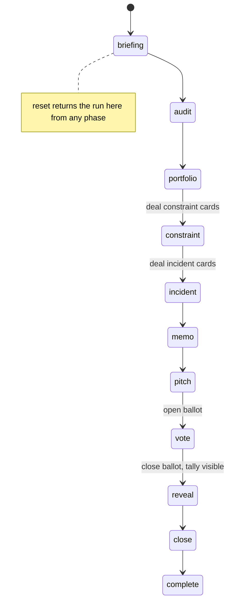
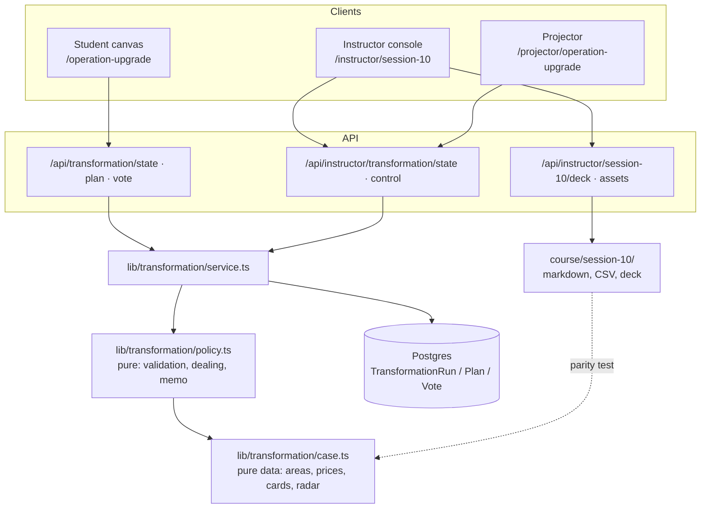
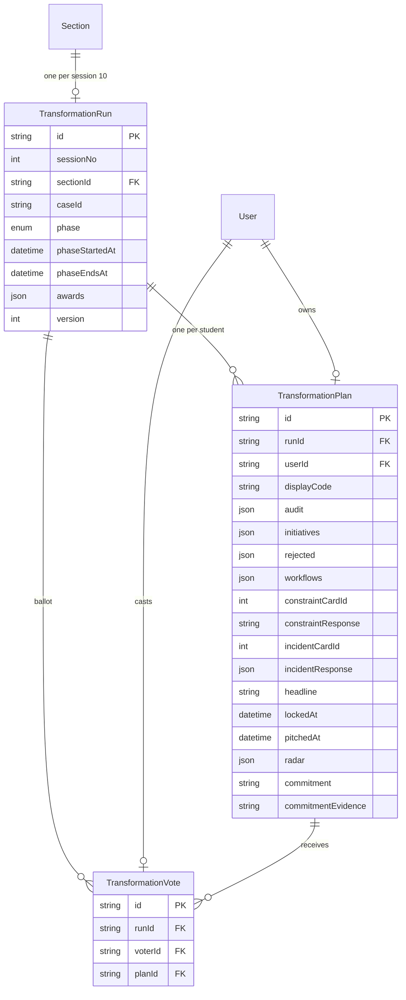
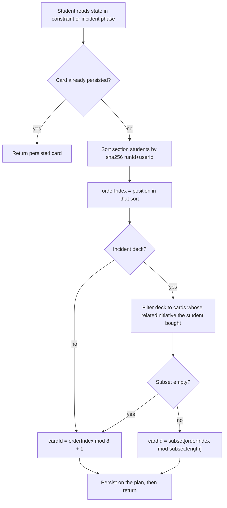

# Session 10 Operation Upgrade - Plan

## Goal Capsule

- **Objective:** Every student in all eight sections finishes Session 10 having personally made and defended a bounded 90-day AI-transformation decision — under a points budget, a surprise constraint, and a live failure — and leaves holding a one-page memo they wrote plus a follow list they will actually maintain. The facilitator runs the full 120 minutes to time with the closing 20 minutes intact, and can still run the session on paper if every screen fails.
- **Means:** A phase-driven live simulation inside the existing Forge LMS (student canvas, instructor console, projector) plus a printable course pack under `lms/course/session-10/` (KTD1, KTD2).
- **Authority hierarchy:** (1) this plan; (2) `lms/CLAUDE.md` architectural invariants and `lms/AGENTS.md` (read `node_modules/next/dist/docs/` before writing Next.js code — this repo runs Next 16.2.12, newer than model training data); (3) `lms/docs/BRAND.md`; (4) the Session 10 source context reproduced in `lms/course/session-10/source-ledger.md` at U2. Live code and tests win over all prose about what the code currently does.
- **Execution profile:** Nine dependency-ordered units. Pure policy and dealing functions are test-first. The course pack (U2, U3) lands before the app so the paper floor is secured first. Every ambiguity gets a call plus a line in `lms/docs/DECISIONS.md`, never a blocking question.
- **Stop conditions:** Stop and surface rather than substitute if the migration cannot be made purely additive; if any student-facing payload would carry another student's name, email, or private brief before the instructor reveal; if the case pack and `lib/transformation/case.ts` diverge with no parity test guarding them; or if adding Session 10 would change an existing assessment weight, gate, or grade path.
- **Tail ownership:** The invoking LFG pipeline owns simplify, review, commit, PR, and CI. This plan owns implementation and local verification only.

---

## Product Contract

### Summary

Build "Operation Upgrade", the Session 10 finale: an individual AI-transformation simulation on the fictional company Bharat Bites. Students audit seven problem areas, buy a portfolio of at most four initiatives inside a 60-point budget, design the chosen workflows, absorb a dealt constraint card and a dealt incident card, and lock a 90-Day Decision Memo. An instructor console drives one phase machine per section; a projector screen turns the room's aggregate answers into the shared spectacle. The session closes with the AI Radar 3-2-1 follow list and a 30-day commitment. Everything ships with a paper equivalent.

### Problem Frame

Sessions 1–9 taught nine separable capabilities: prompting, data, app-building, automation, media, voice, RAG, MCP, and GitHub. Students can each perform them, but nothing in the course has yet forced one student, alone, to decide which of them a real business should buy first, what it should refuse to automate, and where a human must stay accountable. The original capstone-presentation ending was displaced when delivery shifted, so the last two hours of the course are currently unassigned. Without a designed finale the course ends on a tool parade, and the operating judgment underneath the nine sessions never gets named or practised.

The room also has hard delivery physics. There are 50–60 students per section across eight sections, uneven paid-AI access, mixed technical comfort, and a 20-minute closing ritual that must survive whatever runs late.

### Key Decisions

- **Build inside the Forge LMS, not a separate service.** (session-settled: user-approved — chosen over a separate Railway service or standalone project: students already hold roster-gated Clerk accounts in the Forge, and a second service would duplicate auth and add a live-classroom failure mode on the last day of the course.) Governs R8, R28.
- **No new authentication; the existing roster and section model carries the session.** (session-settled: user-approved — chosen over a public link or per-session join code: dealt cards must bind stably to a known student, and the roster gate is already hardened for this cohort.) Governs R8, R28.
- **The in-LMS memo is the submission; the GitHub pull request is an optional bonus lane.** (session-settled: user-approved — chosen over a mandatory pull request to an instructor repository: at 50–60 students per section a mandatory PR is the single most likely way to lose the protected 20-minute close.) Governs R14, R31.
- **Session 10 is recorded as participation plus optional proof-of-work; it introduces no weighted grade component and changes no existing assessment weight.** (session-settled: user-directed — chosen over grading the memo: the source brief forbids silently replacing an assessment obligation without the academic team.) Governs R20, R32.
- **Constraint and incident cards are dealt server-side, deterministically, and persisted on first deal.** (session-settled: user-approved — chosen over student self-selection or a per-load random draw: self-selection lets a student dodge the hard card, and an unstable draw breaks on refresh mid-activity.) Governs R11, R12.
- **Shared surfaces show student codes, never names, until an instructor reveal.** (session-settled: user-approved — chosen over showing real names live: it matches the established gallery and vote reveal behaviour and keeps personal data out of projected artifacts.) Governs R23, R30.
- **Clay is an instructor-run demonstration with a shipped fictional CSV fallback.** (session-settled: user-directed — chosen over requiring individual Clay accounts: free-plan terms are unstable and the segment is 15–20 minutes of a 120-minute finale.) Governs R6.
- **Every Bharat Bites fact, policy, employee, candidate, and incident is fictional and ships as repo content.** (session-settled: user-directed — chosen over a real company or real candidate profiles: privacy, and the case must be identical across eight sections.) Governs R1, R2, R5.

### Requirements

**Case and course pack**

- R1. The pack carries a Bharat Bites company brief under 1,000 words, the seven problem areas A–G, and the board constraints, all fictional.
- R2. The pack carries five short fictional knowledge documents: menu and allergens, customer policy, brand guide, hiring policy, website change policy.
- R3. The pack carries the eight constraint cards and eight incident cards, each with a stable id and title.
- R4. The pack carries a printable transformation canvas and a decision-memo template that a student can complete on paper with no account and no AI tool.
- R5. The pack carries the instructor reference architecture, a 120-minute run sheet with contingencies, and a source ledger stating what is fictional and what is externally sourced.
- R6. The pack carries a Clay demonstration runbook and a fictional shortlist CSV usable as the credit-free fallback.
- R7. The card decks, initiative price board, problem areas, and AI Radar list have one owner in `lib/transformation/case.ts`; the pack markdown is held identical to it by a test.

**Student experience**

- R8. A rostered student in a section with a configured run opens one canvas at `/operation-upgrade` and works through audit, portfolio, workflow design, constraint, incident, memo, and close.
- R9. The audit records one of automate, augment, or keep-human for each of the seven areas, and a written reason for at least three.
- R10. The portfolio enforces the board rules on lock: at most four initiatives, at most 60 points (40 under constraint card 1), at least 8 points on evaluation, monitoring, training, or adoption, and exactly one named rejected initiative with a reason.
- R11. When the run reaches the constraint phase the student's constraint card is revealed as an event, and the student records a removal, narrowing, or resequencing.
- R12. When the run reaches the incident phase the student's incident card is revealed, biased toward an initiative they chose, and the student answers what failed, what should have prevented it, what control is added, and whether the workflow continues, pauses, or is killed.
- R13. Locking composes a one-page 90-Day Decision Memo from the student's own answers plus an edited headline recommendation, and makes the plan read-only.
- R14. The student can copy the memo and download it as `<student-code>.md` from the browser, and is shown the optional GitHub lane.
- R15. The canvas remains usable when the instructor never advances a phase, and remains editable for all reached phases until the student locks.
- R33. The student names one chosen initiative as their lead and completes all nine workflow-design fields for it; every other chosen initiative needs AI capability, human gate, and success metric only.

**Instructor control**

- R16. One console at `/instructor/session-10` selects a section and advances the run through the phases in run-sheet order.
- R17. The console sets, extends, and clears an advisory countdown for the current phase; the countdown never advances a phase by itself.
- R18. The console marks and unmarks plans as selected for a lightning pitch, and records award winners by category.
- R19. The console can unlock one student's plan, and every phase change, deal, unlock, and award is written to `AuditLog`.
- R20. The console exports the section's participation and memo text as CSV for the academic record.

**Room**

- R21. A projector screen at `/projector/operation-upgrade` renders one view per phase on Pine with Cream type, with a full-screen control and a server-anchored countdown.
- R22. The projector shows the room's aggregate audit heatmap, portfolio spread, rejection tally, incident verdict split, and investment-vote tally.
- R23. Projected and student-visible shared views identify plans by student code only, until the instructor reveal.
- R24. Every student casts at most one investment vote, never for their own plan, and cannot see the tally on their own screen until the run reaches the reveal phase.

**Close**

- R25. The close screen carries the 3-2-1 AI Radar action with the five newsletter links from the source and the people, podcasts, and organisations as names to search.
- R26. The student records a 30-day commitment and its evidence, and can copy both as text.
- R27. The radar and commitment stay editable after the plan is locked.

**Safety and degradation**

- R28. Only rostered students with a section reach the canvas; instructor and admin roles reach the console and projector.
- R29. Student payloads never carry another student's name, email, or plan contents outside the vote candidate list and the reveal.
- R30. The vote candidate list carries student code, headline, and chosen initiatives only.
- R31. Nothing in the flow requires a paid AI account, a Clay account, or a GitHub account.
- R32. No existing assessment weight, gate, assignment type, submission, or grade path changes.

### Success Criteria

- A facilitator can run the full 120 minutes from the console and the run sheet without a second operator.
- The protected 20 minutes survive: reaching the close phase requires one click regardless of how far behind the earlier phases ran.
- With the app entirely unavailable, the printed canvas plus the run sheet still delivers the same six-part activity.
- A student who joins 30 minutes late can complete every earlier section without instructor intervention.

### Scope Boundaries

- The starter GitHub repository is created operationally from the shipped template files; this change does not create, fork, or write to any GitHub repository.
- The Clay demonstration is run live by the instructor from their own account; no Clay API integration is built.
- No AI provider call is added. Nothing in Session 10 is graded by a model.

### Deferred to Follow-Up Work

- Writing the 30-day commitment into `PortfolioEntry` or the Praxy export.
- A pre-recorded CEO cold-open audio or video asset.
- Printable implementation-point tokens and physical award cards.
- Cross-section aggregate views; every view in this change is section-scoped.

### Outstanding Questions

- Deferred: who owns post-session review of any student GitHub pull requests. Does not block; the LMS lane is primary.
- Deferred: whether the academic team later attaches weight to the memo. The data model records everything needed if they do; no weight is encoded now.

---

## Planning Contract

### Key Technical Decisions

- KTD1. **The run is a per-section phase machine modelled on the Session 3 Data Race.** One `TransformationRun` row per `(sessionNo 10, sectionId)` holds `phase`, `phaseEndsAt`, and an optimistic `version`; students, the console, and the projector all poll. (session-settled: user-approved — chosen over a separate Railway service: reuses the roster, section, audit, and projector patterns the room has already run twice.) Governs R8, R16, R21. Follow `lib/data-race.ts` and `app/projector/data-race/`.
- KTD2. **Phase control gates reveals, not work.** Reaching a phase opens its section permanently for that student until they lock; the phase machine authoritatively controls only card release, vote opening, and the tally reveal. A console or projector failure therefore degrades the room's theatre, never a student's ability to finish. Governs R15.
- KTD3. **No new `GateTarget` enum value.** The run phase is the gate. Adding a value to a shared Postgres enum days before a live class buys nothing that `phase` does not already provide. Governs R8.
- KTD4. **Cards are dealt by balanced round-robin over a deterministically sorted roster, then persisted.** Sort the section's students by `sha256(runId + userId)`, take the position modulo the deck size, persist `constraintCardId` and `incidentCardId` on first deal. Persisting makes a later roster change unable to move an already-dealt card; the balanced deal spreads all eight cards evenly so the projector's verdict split and the show-of-hands moment have real spread. (session-settled: user-approved — chosen over student self-selection and over a per-load random draw: dodging the hard card, and losing the card on refresh.) Governs R11, R12.
- KTD5. **Incident selection is biased to a chosen initiative.** Each incident card declares a `relatedInitiative`. Deal from the subset whose related initiative the student bought; fall back to the full deck when that subset is empty. Governs R12.
- KTD6. **The polled student endpoint returns run state only; the plan is fetched on mount and after each save.** At 54 students per section on a 2-second poll, returning the whole plan every tick is wasted payload for data only that student writes. `GET /api/transformation/state` returns phase, server time, countdown, dealt card ids, lock state, and vote state. Governs R8, R15.
- KTD7. **Memo export is composed in the browser from data already on the page.** A `Blob` download and a clipboard copy produce `<student-code>.md` with no server download route and no S3 object, keeping the app tier out of file bytes. Governs R14.
- KTD8. **Full nine-field workflow design is required for one lead initiative; other chosen initiatives require capability, human gate, and success metric.** Thirty-six free-text fields cannot be completed in the 14 minutes the run sheet allots. The printed canvas still carries the full nine-field grid for every initiative, so the exercise is not diminished on paper. (Deviates from the source brief's Part 3, which asks for all nine fields on every initiative; recorded in `lms/docs/DECISIONS.md`.) Governs R33.
- KTD9. **Investment-vote candidates are the plans the instructor marked as pitched, falling back to all locked plans in the section.** The source runs the vote after the lightning pitches, and a ballot of five is usable where a ballot of 54 anonymous codes is not. Governs R24, R30.
- KTD10. **The migration is purely additive: one new enum type, three new tables, and Prisma back-relations on `User` and `Section` that generate no columns.** No existing table, enum, or index is altered. Governs R32.
- KTD11. **`wordCount` is defined locally in `lib/transformation/policy.ts`.** The identical helper exists in `lib/app-reviews/policy.ts`; a shared extraction would touch the peer-review path that shipped days before this class. Duplicating three lines is the smaller risk.
- KTD12. **Only the five newsletter URLs from the source brief are shipped as links.** People, podcasts, and organisations ship as names to search, which is both what the source asks for and immune to link rot. Governs R25.
- KTD13. **The countdown is advisory.** `phaseEndsAt` drives the display; reaching zero changes nothing. An auto-advance mid-sentence would take the room away from the facilitator. Governs R17.

### High-Level Technical Design

**Phase machine.** One row per section. Every transition is an instructor action, audited, and guarded by the row's `version`.



**Component topology.** Three clients poll three read endpoints; one service module owns every write.



**Data model.** Three additive tables.



**Card dealing.** Runs once per student per deck, at the moment the phase is first read.



### Assumptions

- Session 10 is delivered within days of this plan. Sequencing puts the paper-usable pack before the app so the floor exists first.
- Every section that runs Session 10 gets a `TransformationRun` row created by the loader script before class; a student in a section with no run sees a plain "not configured for your section" message rather than an error.
- Students reach the canvas from the shell navigation; no new sign-in, invite, or join flow is needed.
- The `sessionNo` for this work is 10, matching the `DataRace.sessionNo` convention.
- Roughly 54 students per section poll every 2 seconds, matching the load the Data Race already carries in production.

### System-Wide Impact

- **Schema:** three new tables and one new enum. No column, enum value, index, or constraint on an existing table is modified. Back-relations added to `User` and `Section` generate no SQL.
- **Navigation:** one student link and one instructor link added to `components/shell.tsx`.
- **Deployment:** `Dockerfile.web` and `Dockerfile.staging` gain a `COPY` for `course/session-10`, matching the Session 8 line. Missing that line makes the deck and asset routes return 503 in production while passing locally.
- **Privacy:** one new personal-data surface (free-text memo, commitment). It is section-scoped, code-identified in shared views, and covered by the existing `AuditLog`. It is not added to the Praxy export or to DPDP erasure paths in this change, because the plan rows cascade from `User`.
- **Assessment:** untouched by design (R32).

### Risks & Dependencies

- **Same-week delivery.** Mitigated by the degradation ladder: pack → canvas → console → projector. Each earlier layer is independently usable.
- **Polling load on the state endpoint.** Mitigated by KTD6's small payload and by the jittered poll interval already used in `app/(student)/data-race/student-client.tsx`.
- **Typing loss during a 14-minute round.** Mitigated by debounced per-section autosave with a visible save state; a student's own plan has exactly one writer, so last-write-wins per section is safe.
- **Pack and code drift.** Mitigated by the parity test in U2, modelled on `tests/session8-live.test.ts`.
- **Next 16 API drift.** `lms/AGENTS.md` requires reading `node_modules/next/dist/docs/` before writing route or page code. `proxy.ts` already documents the Next 16 proxy behaviour; new API routes follow the existing `withAuth` route shape rather than any remembered convention.

### Sources & Research

- Live-simulation pattern, end to end: `lms/lib/data-race.ts`, `lms/app/(student)/data-race/student-client.tsx`, `lms/app/instructor/data-race/race-console.tsx`, `lms/app/projector/data-race/projector-client.tsx`, `lms/app/api/data-race/state/route.ts`.
- Stable per-student assignment, advisory locking, and privacy allowlisting: `lms/lib/app-reviews/service.ts`, `lms/lib/app-reviews/policy.ts`.
- Course-pack conventions, deck serving, and pack parity testing: `lms/course/session-08/`, `lms/app/api/instructor/session-8/deck/route.ts`, `lms/tests/session8-live.test.ts`, `lms/Dockerfile.web:51`.
- Reveal-gated tallies and the no-self-vote rule: `lms/lib/votes.ts`.
- Brand tokens and the zero-radius, one-Ochre-accent rules: `lms/docs/BRAND.md`, `lms/app/globals.css`, `lms/components/ui.tsx`.
- Projector containment regression guarded by a dev-only fixture: `lms/docs/DECISIONS.md` entry dated 2026-07-30 on projector grid boundaries, and `lms/app/layout-test/`.

---

## Output Structure

```text
lms/
├── course/session-10/
│   ├── README.md
│   ├── source-ledger.md
│   ├── run-sheet.md
│   ├── ai-radar.md
│   ├── session-10-operation-upgrade-instructor.html
│   ├── case/
│   │   ├── company-brief.md
│   │   ├── problem-areas.md
│   │   ├── constraints.md
│   │   ├── incidents.md
│   │   └── reference-architecture.md
│   ├── knowledge-pack/
│   │   ├── menu-and-allergens.md
│   │   ├── customer-policy.md
│   │   ├── brand-guide.md
│   │   ├── hiring-policy.md
│   │   └── website-change-policy.md
│   ├── templates/
│   │   ├── transformation-canvas.md
│   │   ├── transformation-decision-memo.md
│   │   └── github-lane.md
│   └── clay/
│       ├── clay-demo-runbook.md
│       └── bharat-bites-store-manager-shortlist.csv
├── public/session-10/knowledge-pack/   (mirror of the five knowledge docs)
├── lib/transformation/
│   ├── case.ts
│   ├── policy.ts
│   └── service.ts
├── app/(student)/operation-upgrade/
├── app/instructor/session-10/
├── app/projector/operation-upgrade/
├── app/layout-test/operation-upgrade-projector/
├── app/api/transformation/{state,plan,vote}/route.ts
├── app/api/instructor/transformation/{state,control,export}/route.ts
├── app/api/instructor/session-10/{deck,assets/[asset]}/route.ts
├── scripts/load-session-10.ts
├── e2e/operation-upgrade-projector.spec.ts
└── tests/
    ├── transformation-policy.test.ts
    ├── transformation-dealing.test.ts
    ├── transformation-memo.test.ts
    ├── transformation-service.test.ts
    └── session10-live.test.ts
```

---

## Implementation Units

### U1. Case data and pure policy

- **Goal:** One owner for the Bharat Bites case content and every rule that can be decided without a database.
- **Requirements:** R1, R3, R7, R9, R10, R12, R25; KTD4, KTD5, KTD8, KTD11, KTD12.
- **Dependencies:** none.
- **Files:**
  - `lms/lib/transformation/case.ts` (create)
  - `lms/lib/transformation/policy.ts` (create)
  - `lms/tests/transformation-policy.test.ts` (create)
  - `lms/tests/transformation-dealing.test.ts` (create)
  - `lms/tests/transformation-memo.test.ts` (create)
- **Approach:**
  1. `case.ts` exports pure data with `as const` types: `CASE_ID = "bharat-bites-v1"`, the seven `PROBLEM_AREAS` (key A–G, title, current-state summary, likely capabilities), the ten `INITIATIVES` (key, label, points, and a `capabilityClass` of `"delivery" | "enablement"` where evaluation-and-monitoring and staff-training-and-adoption are `"enablement"`), the eight `CONSTRAINT_CARDS` (id 1–8, title, body, `budgetOverride?: 40` on card 1), the eight `INCIDENT_CARDS` (id 1–8, title, body, `relatedInitiative`), `REFERENCE_ARCHITECTURE` phases, and `AI_RADAR` (people, newsletters with the five source URLs, podcasts, organisations).
  2. `policy.ts` exports `validatePlan(plan, { budget })` returning `{ ok, violations: [{ code, message }] }` and covering: seven audit calls present; at least three reasons of at least eight words; at most four initiatives; total within the effective budget; at least eight enablement points; exactly one rejection with a reason; the lead initiative's nine workflow fields present; every other chosen initiative's capability, human gate, and success metric present; constraint response at least fifteen words; four incident answers of at least eight words each plus a verdict of `continue | pause | kill`; headline between 25 and 80 words.
  3. `policy.ts` exports `effectiveBudget(constraintCardId)` returning 40 for card 1 and 60 otherwise.
  4. `policy.ts` exports `orderIndex(runId, userIds)` producing the `sha256`-sorted roster order, `dealConstraint(orderIndex)`, and `dealIncident(orderIndex, chosenInitiativeKeys)` per KTD4 and KTD5. These take plain arrays, never a Prisma client.
  5. `policy.ts` exports `composeMemo(plan, case)` returning the one-page memo markdown: three most important problems, selected initiatives with points and total, a text system diagram of trigger → AI step → deterministic step → human gate → output per initiative, human approval gates, three success metrics, the constraint response, the incident response and verdict, the rejected initiative and reason, and the headline recommendation.
  6. `policy.ts` exports a local three-line `wordCount` (KTD11) and `displayCode(sectionCode, orderIndex)` producing `BB-A17`.
- **Execution note:** Implement test-first. These functions are the grading-free correctness core of the session and must be provable without a database.
- **Patterns to follow:** `lms/lib/app-reviews/policy.ts` for the pure-policy module shape, zod schemas, and word-count refinement. `lms/lib/data-race-pack.ts` for `as const` case constants with derived types.
- **Test scenarios:**
  - A portfolio of four initiatives totalling 60 with 8 enablement points and one rejection validates clean.
  - Five initiatives fail with a `too-many-initiatives` violation even when the point total is legal.
  - A 62-point portfolio fails with `over-budget`; the same portfolio under constraint card 1 fails with an effective budget of 40.
  - A 60-point portfolio containing zero enablement initiatives fails with `enablement-minimum`.
  - A portfolio naming no rejected initiative, and one naming two, both fail.
  - Six audit calls present and one missing fails; seven present with only two written reasons fails.
  - A reason of seven words fails the eight-word floor; eight words passes.
  - A lead initiative missing `humanGate` fails; a non-lead initiative missing `newWorkflow` passes (KTD8).
  - An incident verdict outside `continue | pause | kill` fails.
  - A headline of 24 words fails, 25 passes, 80 passes, 81 fails.
  - `orderIndex` is stable across calls for the same `runId` and roster, and changes when `runId` changes.
  - Dealing across a 56-student roster yields each of the eight constraint cards exactly seven times.
  - `dealIncident` returns a card whose `relatedInitiative` the student bought whenever at least one such card exists.
  - `dealIncident` falls back to the full deck when the student bought no initiative related to any incident card.
  - `composeMemo` emits every required memo section and contains no student name or email.
  - `displayCode` is unique across a 60-student section and stable for a fixed roster order.
- **Verification:** `pnpm test tests/transformation-*.test.ts` passes; `pnpm typecheck` clean. No import of `@/lib/db` appears in either new module.

### U2. Course pack, paper canvas, and pack parity

- **Goal:** The session is fully deliverable on paper before any application code exists.
- **Requirements:** R1, R2, R3, R4, R5, R6, R7, R31.
- **Dependencies:** U1.
- **Files:**
  - `lms/course/session-10/README.md`, `source-ledger.md`, `run-sheet.md`, `ai-radar.md` (create)
  - `lms/course/session-10/case/company-brief.md`, `problem-areas.md`, `constraints.md`, `incidents.md`, `reference-architecture.md` (create)
  - `lms/course/session-10/knowledge-pack/*.md` — five files (create)
  - `lms/course/session-10/templates/transformation-canvas.md`, `transformation-decision-memo.md`, `github-lane.md` (create)
  - `lms/course/session-10/clay/clay-demo-runbook.md`, `bharat-bites-store-manager-shortlist.csv` (create)
  - `lms/public/session-10/knowledge-pack/*.md` — five files (create)
  - `lms/Dockerfile.web`, `lms/Dockerfile.staging` (modify)
  - `lms/tests/session10-live.test.ts` (create)
- **Approach:**
  1. Write the case content once, sourced from the brief reproduced in `source-ledger.md`. The company brief stays under 1,000 words (R1).
  2. `constraints.md` and `incidents.md` render one section per card with the id in the heading, so the parity test can match on id and title.
  3. `transformation-canvas.md` is the printable worksheet and carries the full nine-field workflow grid for every chosen initiative, which the app narrows (KTD8). State that difference in the canvas itself so a facilitator handing out paper is not surprised.
  4. `clay/bharat-bites-store-manager-shortlist.csv` holds ten fictional rows with evidence, inference, and missing-information columns kept separate, matching the runbook's teaching point. No real person appears.
  5. Mirror the five knowledge documents byte-identically into `lms/public/session-10/knowledge-pack/` for student links, following the Session 8 `public/session-8/knowledge` precedent.
  6. Add `COPY --from=build /app/course/session-10 ./course/session-10` to both Dockerfiles beside the existing Session 8 line.
  7. `session10-live.test.ts` asserts: every referenced pack file exists; the public knowledge mirror is byte-identical to the authored pack; every `CONSTRAINT_CARDS` and `INCIDENT_CARDS` id and title appears in the matching markdown and no extra card headings exist; every `INITIATIVES` label and point value appears in the pack; both Dockerfiles carry the `course/session-10` COPY.
- **Patterns to follow:** `lms/course/session-08/README.md` and `source-ledger.md` for pack shape and the fictional-content declaration. `lms/tests/session8-live.test.ts` for the parity and packaging assertions.
- **Test scenarios:**
  - Every file named in `README.md` resolves on disk.
  - Each of the five public knowledge mirrors is byte-identical to its authored source.
  - Card ids 1–8 in both decks appear in the pack markdown with titles matching `case.ts`.
  - A deliberately altered card title in `case.ts` fails the parity assertion.
  - Both `Dockerfile.web` and `Dockerfile.staging` contain the `course/session-10` COPY line.
  - The company brief is under 1,000 words.
- **Verification:** `pnpm test tests/session10-live.test.ts` passes. A printed `transformation-canvas.md` walks a reader through all six parts with no reference to a screen.

### U3. Instructor deck and pack asset routes

- **Goal:** The facilitator has one projector deck and one place to open every pack asset during class.
- **Requirements:** R5, R6, R16.
- **Dependencies:** U2.
- **Files:**
  - `lms/course/session-10/session-10-operation-upgrade-instructor.html` (create)
  - `lms/app/api/instructor/session-10/deck/route.ts` (create)
  - `lms/app/api/instructor/session-10/assets/[asset]/route.ts` (create)
  - `lms/tests/session10-live.test.ts` (modify)
- **Approach:**
  1. The deck is a single self-contained HTML file: arrow-key advance, `N` for notes, `F` for full screen, one slide per run-sheet block carrying `data-minutes`, and a talk track in speaker notes. It links pack assets only through `/api/instructor/session-10/assets/<asset>`.
  2. The deck route reads the file, serves it under the same CSP and `no-store` headers as the Session 8 deck, and returns 503 when the pack is missing.
  3. The assets route exposes a fixed allowlist keyed by short name: company brief, problem areas, constraints, incidents, reference architecture, canvas, memo template, run sheet, AI radar, Clay runbook, Clay CSV. The CSV is served as an attachment; everything else inline.
  4. Extend `session10-live.test.ts`: the deck's `data-minutes` values sum to 120, every asset link in the deck resolves to an allowlist key, and the deck contains no relative `href` into `case/` or `clay/`.
- **Patterns to follow:** `lms/app/api/instructor/session-8/deck/route.ts` and `lms/app/api/instructor/session-8/assets/[asset]/route.ts` verbatim in shape, including `withAuth(..., { role: "instructor" })`, the CSP header, and the 503 on a missing pack.
- **Test scenarios:**
  - The deck's `data-minutes` sum to exactly 120.
  - Every `/api/instructor/session-10/assets/` reference in the deck matches an allowlist key.
  - The deck contains no relative link into `case/`, `clay/`, `templates/`, or `knowledge-pack/`.
  - An unknown asset key returns 404; the Clay CSV carries an attachment disposition.
  - A student-role session receives 403 from both routes.
- **Verification:** `pnpm test tests/session10-live.test.ts` passes. Opening `/api/instructor/session-10/deck` as an instructor renders the deck and every asset link opens.

### U4. Schema and migration

- **Goal:** Persist runs, plans, and votes without touching any existing table.
- **Requirements:** R32; KTD1, KTD10.
- **Dependencies:** U1.
- **Files:**
  - `lms/prisma/schema.prisma` (modify)
  - `lms/prisma/migrations/<timestamp>_session10_operation_upgrade/migration.sql` (create)
- **Approach:**
  1. Add `enum TransformationPhase` with `briefing, audit, portfolio, constraint, incident, memo, pitch, vote, reveal, close, complete`.
  2. Add `TransformationRun` — `sessionNo` defaulting to 10, `sectionId`, `caseId`, `title`, `phase`, `phaseStartedAt`, `phaseEndsAt`, `awards` Json defaulting to an empty array, `version`, timestamps, `@@unique([sessionNo, sectionId])`, `@@index([sectionId])`.
  3. Add `TransformationPlan` — `runId`, `userId`, `displayCode`, `orderIndex`, `audit` Json, `initiatives` Json, `rejected` Json, `workflows` Json, `leadInitiative`, `constraintCardId` Int?, `constraintResponse` String?, `incidentCardId` Int?, `incidentResponse` Json?, `headline` String?, `lockedAt`, `pitchedAt`, `radar` Json?, `commitment` String?, `commitmentEvidence` String?, timestamps, `@@unique([runId, userId])`, `@@unique([runId, displayCode])`, `@@index([runId, lockedAt])`.
  4. Add `TransformationVote` — `runId`, `voterId`, `planId`, `createdAt`, `@@unique([runId, voterId])`, `@@index([planId])`.
  5. Cascade plan and vote rows from `User` on delete, matching `DataRaceResponse` and `AppReview`, so DPDP erasure keeps working with no new code.
  6. Add back-relations on `User` and `Section`. Confirm the generated SQL contains only `CREATE TYPE`, `CREATE TABLE`, `CREATE INDEX`, and `ALTER TABLE ... ADD CONSTRAINT ... FOREIGN KEY` — no `ALTER` against an existing table's columns and no change to an existing enum.
- **Execution note:** Inspect the generated `migration.sql` before committing. Migrations here are forward-only; a wrong file cannot be edited later.
- **Patterns to follow:** `DataRace` / `DataRaceQuestion` / `DataRaceResponse` for the run-scoped shape and the `sessionNo_sectionId` unique. `AppReview` for cascade-from-`User` and the partial-index style comment.
- **Test scenarios:** Test expectation: none — schema definition. Behavioural coverage arrives with U5's service tests. The migration is verified by inspection against the additive-only rule in KTD10.
- **Verification:** `pnpm prisma migrate dev --name session10_operation_upgrade` succeeds against a local database; `pnpm typecheck` clean after client regeneration; the generated SQL touches no pre-existing table or enum.

### U5. Service layer

- **Goal:** One module owns every read and write for the run, the plans, and the ballot.
- **Requirements:** R8, R10, R11, R12, R13, R16, R17, R18, R19, R22, R24, R28, R29, R30; KTD2, KTD4, KTD5, KTD6, KTD9, KTD13.
- **Dependencies:** U1, U4.
- **Files:**
  - `lms/lib/transformation/service.ts` (create)
  - `lms/app/api/transformation/state/route.ts`, `plan/route.ts`, `vote/route.ts` (create)
  - `lms/app/api/instructor/transformation/state/route.ts`, `control/route.ts` (create)
  - `lms/tests/transformation-service.test.ts` (create)
- **Approach:**
  1. Export `TransformationError` carrying a 400/403/404/409 status, mirroring `DataRaceError`.
  2. `getStudentState(user)` returns the small polled payload of KTD6: `serverNow`, `phase`, `phaseEndsAt`, `version`, `constraintCardId`, `incidentCardId`, `lockedAt`, `pitchedAt`, `votingOpen`, `myVotePlanId`, `sectionCode`, `displayCode`. It lazily creates the student's plan row on first read and lazily deals the card when the phase has reached that card's phase.
  3. `getPlan(user)` returns the student's own full plan plus the case constants the client needs. `savePlanSection(user, section, payload)` writes one named section — `audit`, `portfolio`, `workflows`, `constraint`, `incident`, `headline`, `radar`, `commitment` — refusing every section except `radar` and `commitment` once `lockedAt` is set, and refusing a section whose phase the run has not reached (KTD2).
  4. `lockPlan(user)` re-runs `validatePlan` server-side against the effective budget, stores the composed memo inputs, and sets `lockedAt`. Validation failures return 409 with the violation list.
  5. `castVote(user, planId)` requires phase `vote`, refuses a self-vote, refuses a plan outside the voter's run, and upserts on `(runId, voterId)` so a student may change their mind while the ballot is open.
  6. `getInstructorState(sectionCode)` returns run state plus aggregates: audit heatmap counts per area per call, initiative purchase counts and point spread, rejection tally, incident verdict split, lock count over participant count, pitched plans with `displayCode` and headline, and the vote tally. Names appear only after the reveal phase.
  7. `getVoteCandidates(user)` returns pitched plans in the run, excluding the voter's own, as `{ planId, displayCode, headline, initiatives }` (R30). Falls back to all locked plans when nothing is pitched (KTD9).
  8. `controlRun({ sectionCode, action, actorId, payload })` handles `start`, `next`, `back`, `set_timer`, `clear_timer`, `deal`, `pitch`, `unpitch`, `unlock_plan`, `set_award`, `reset`. Every transition is an optimistic update on `version`, wrapped in a transaction with an `AuditLog` row, exactly as `controlDataRace` does. `reset` clears plans and votes for the run and is confirmed on the client.
  9. Route handlers stay thin: `withAuth`, role check, zod-parsed body, service call, `TransformationError` to JSON.
- **Execution note:** Write the service tests against the pure seams and injected rows where possible; database-backed cases follow the repo's existing pattern of skipping without `DATABASE_URL`.
- **Patterns to follow:** `lms/lib/data-race.ts` for the phase machine, `FOR UPDATE` locking on submit, optimistic `version` guards, and audit rows. `lms/lib/app-reviews/service.ts` for the transaction options, the student assertion helper, and the payload allowlist function that forms the privacy boundary. `lms/lib/votes.ts` for the no-self-vote and reveal-gated tally rules.
- **Test scenarios:**
  - A student in a section with no run receives a 404 with a plain "not configured" message.
  - A first read creates exactly one plan row; a second read creates none.
  - Reading state in the `constraint` phase persists a constraint card; reading again returns the same card id.
  - A card already persisted does not change when the section roster grows.
  - Saving the `portfolio` section while the run is still in `audit` is refused.
  - Saving the `audit` section after the run advanced to `memo` succeeds, because reached phases stay open (KTD2).
  - Locking an invalid portfolio returns 409 carrying the violation codes and does not set `lockedAt`.
  - Locking a valid plan sets `lockedAt`; a second lock is refused.
  - Saving `audit` after lock is refused; saving `radar` and `commitment` after lock succeeds.
  - An instructor `unlock_plan` clears `lockedAt` and writes an `AuditLog` row.
  - Voting outside the `vote` phase is refused; voting for one's own plan is refused; voting twice replaces the first vote.
  - A vote for a plan in another section's run is refused.
  - The student state payload contains no other student's name, email, or plan content.
  - The vote candidate list contains only `displayCode`, headline, and initiatives.
  - The instructor tally is present during `vote`; the student payload carries no tally until `reveal`.
  - Two concurrent `next` actions on the same run leave the phase advanced exactly once and the loser receives 409.
  - `reset` removes the run's plans and votes and returns the phase to `briefing`.
- **Verification:** `pnpm test tests/transformation-service.test.ts` passes; `pnpm typecheck` and `pnpm lint` clean. No route file contains a Prisma query.

### U6. Student canvas

- **Goal:** The student experience — six parts, two dealt cards as events, a memo they own, and the close.
- **Requirements:** R8, R9, R10, R11, R12, R13, R14, R15, R24, R25, R26, R27, R28, R31; KTD6, KTD7, KTD8.
- **Dependencies:** U5.
- **Files:**
  - `lms/app/(student)/operation-upgrade/page.tsx` (create)
  - `lms/app/(student)/operation-upgrade/canvas-client.tsx` (create)
  - `lms/app/(student)/operation-upgrade/portfolio-board.tsx` (create)
  - `lms/app/(student)/operation-upgrade/card-reveal.tsx` (create)
  - `lms/app/(student)/operation-upgrade/close-panel.tsx` (create)
  - `lms/app/(student)/operation-upgrade/operation-upgrade.module.css` (create)
  - `lms/tests/session10-live.test.ts` (modify)
- **Approach:**
  1. The server page requires a session, redirects a non-student to the console, renders a plain message when the student has no section or the section has no run, and passes the initial plan and case constants into the client.
  2. The client polls `/api/transformation/state` on the jittered 2-second loop from the Data Race student client, with the same request-sequence guard and server-time offset. It does not poll the plan.
  3. Sections render as reached-phase-gated panels in run order. Each panel autosaves its own section on a debounce and shows a save state of saving, saved, or a retry affordance. Text is never cleared on a failed save.
  4. `portfolio-board.tsx` renders the ten initiative cards with Geist Mono prices, four visible slots, and a budget meter: a 1px Sand track filling Pine, with the eight-point enablement reserve marked, turning Ochre past the effective budget. Buying with all four slots full is refused with a plain sentence. Live violation text sits under the meter; nothing blocks typing, only locking (R10).
  5. `card-reveal.tsx` renders a dealt card as a full-width Pine block with Cream Fraunces type and one short wipe animation, wrapped in `@media (prefers-reduced-motion: reduce)` so the animation is skipped. The same component serves the constraint and incident cards.
  6. The memo panel renders the composed memo read-only beside the editable headline, then the lock action. After lock it offers copy-to-clipboard and a client-side `Blob` download named `<displayCode>.md` (KTD7), plus the GitHub lane instructions and the starter-repo link.
  7. `close-panel.tsx` renders the 3-2-1 radar as persisted checkboxes with the five newsletter links, and the two commitment fields, both editable after lock (R27). It also offers a copy action for the commitment text.
  8. The vote panel appears only in the `vote` phase, lists candidates by `displayCode` and headline, and shows no tally.
  9. Styling uses a CSS module in the `app-reviews` idiom, brand tokens only, zero radius, one Ochre accent per view, 44px minimum touch targets.
  10. Extend `session10-live.test.ts` with source-level guards: the client contains no answer-key or reference-architecture text, and the state poll target is the state endpoint.
- **Execution note:** Build the close panel before the pitch and vote panels. The close is the protected 20 minutes; it must not be the part that gets cut.
- **Patterns to follow:** `lms/app/(student)/data-race/student-client.tsx` for polling, sequencing, and the server-time offset. `lms/app/(student)/app-reviews/review-form.tsx` and `reviews.module.css` for the multi-panel form idiom, word counters, `aria-live` status, and the disabled-until-valid submit. `lms/components/ui.tsx` for `Card`, `Eyebrow`, `Button`.
- **Test scenarios:**
  - The client source contains no reference-architecture text and no incident-card answer guidance.
  - The client polls `/api/transformation/state` and never `/api/transformation/plan` on the interval.
  - The budget meter reports 58 of 60 for a three-initiative portfolio and flips to over-budget at 62.
  - Under constraint card 1 the meter's ceiling reads 40.
  - Selecting a fifth initiative is refused and leaves the first four intact.
  - The lock action stays disabled while any violation is present and enables once validation passes.
  - After lock, audit and portfolio inputs are disabled and the radar and commitment inputs remain enabled.
  - The download action produces a file named for the student's display code.
  - The card reveal renders with the animation suppressed under `prefers-reduced-motion`.
  - A student with no section sees the plain guidance message and no canvas.
- **Verification:** `pnpm test`, `pnpm typecheck`, `pnpm lint` clean; `pnpm build` succeeds. Walking the canvas locally against a seeded run completes all six parts and produces a downloadable memo.

### U7. Instructor console

- **Goal:** One screen from which a facilitator runs 120 minutes.
- **Requirements:** R16, R17, R18, R19, R20; KTD13.
- **Dependencies:** U5.
- **Files:**
  - `lms/app/instructor/session-10/page.tsx` (create)
  - `lms/app/instructor/session-10/transformation-console.tsx` (create)
  - `lms/app/api/instructor/transformation/export/route.ts` (create)
  - `lms/tests/transformation-service.test.ts` (modify)
- **Approach:**
  1. The page requires the instructor role and passes the section codes in, exactly as the Data Race instructor page does.
  2. The console polls the instructor state endpoint every 2 seconds, with a section selector and a projector link carrying `?section=`.
  3. The primary control is one large Advance action labelled with the next phase and its run-sheet minutes. Back and Reset sit beside it; Reset confirms first.
  4. Timer controls set the current phase's default duration, add two minutes, or clear the countdown. The console states plainly that the countdown never advances a phase.
  5. Phase-specific panels appear only where useful: pitch selection during `pitch` (a list of locked plans by display code and headline with a mark action), award assignment during `reveal` (five categories, each choosing one plan), and an unlock action reachable in any phase.
  6. A live strip shows locked-of-participants, dealt-card coverage, and vote count, so the facilitator knows when to advance.
  7. The export route streams a CSV of the section's plans — display code, name, email, locked-at, chosen initiatives, points, constraint card, incident card and verdict, rejection, headline, commitment — for the academic record (R20). Instructor role only.
  8. Add the console and student links to `components/shell.tsx` in U9.
- **Patterns to follow:** `lms/app/instructor/data-race/race-console.tsx` for the section selector, polling, control POSTs, and the confirm-before-reset. `lms/lib/csv-export.ts` and `lms/app/instructor/exports/` for the export shape.
- **Test scenarios:**
  - Advancing from `briefing` moves to `audit` and writes an audit row naming the actor.
  - Advancing past `complete` is refused.
  - `set_timer` stores `phaseEndsAt`; passing that instant leaves the phase unchanged (KTD13).
  - Marking a plan as pitched adds it to the vote candidate list; unmarking removes it.
  - Assigning two awards in the same category replaces the first.
  - Unlocking a plan clears `lockedAt` and lets that student edit again.
  - The CSV export contains one row per student in the section and no row from another section.
  - A student-role session receives 403 from the control and export routes.
- **Verification:** `pnpm test`, `pnpm typecheck`, `pnpm lint` clean. Driving a seeded section from `briefing` to `complete` through the console leaves a complete audit trail.

### U8. Projector

- **Goal:** The room sees its own decisions.
- **Requirements:** R21, R22, R23.
- **Dependencies:** U5.
- **Files:**
  - `lms/app/projector/operation-upgrade/page.tsx` (create)
  - `lms/app/projector/operation-upgrade/projector-client.tsx` (create)
  - `lms/app/layout-test/operation-upgrade-projector/page.tsx` (create)
  - `lms/playwright.layout.config.ts` (modify if a new spec path is needed)
  - `lms/e2e/operation-upgrade-projector.spec.ts` (create)
- **Approach:**
  1. The page requires the instructor role, redirects on `AuthError`, and reads `?section=`, mirroring the Data Race projector page.
  2. The client polls the instructor state endpoint every 1.5 seconds with the same sequence guard and server-time offset, and carries the full-screen toggle.
  3. Per-phase views on Pine with Cream type: `briefing` renders the CEO mandate and the 90-day framing; `audit` renders the seven-by-three heatmap where cell weight encodes count; `portfolio` renders the initiative purchase spread as horizontal bars with the room's average spend; `constraint` renders the eight-card distribution; `incident` renders continue, pause, and kill as three large numbers; `memo` renders the lock counter; `pitch` renders the selected plan's display code, headline, initiatives, and verdict at display size; `vote` renders the live tally; `reveal` renders the reference architecture phases and then the awards; `close` renders the closing line; `complete` renders the course close.
  4. The countdown renders at display size and turns Ochre-adjacent in its last ten seconds, matching the Data Race projector's treatment.
  5. Every grid and bar boundary sets `min-width: 0` and any no-wrap rail scrolls inside its own container, per the projector containment decision already recorded in `lms/docs/DECISIONS.md`.
  6. The `layout-test` route mounts the real projector client with a fixture state per phase, and the Playwright spec asserts no horizontal page overflow at 1920×1080 for the heatmap, spread, and vote-tally phases.
- **Patterns to follow:** `lms/app/projector/data-race/projector-client.tsx` verbatim for polling, full screen, and the Pine display treatment. `lms/app/layout-test/data-race-projector/` and `lms/components/projector-gallery-layout.ts` for the dev fixture and containment guard.
- **Test scenarios:**
  - Each phase renders its own view without a client error when the fixture supplies that phase's aggregates.
  - The heatmap, portfolio spread, and vote tally produce no horizontal page overflow at 1920×1080.
  - No projected view renders a student name before the reveal phase.
  - A student-role session is redirected away from the projector route.
  - The countdown reads zero and stops rather than going negative when `phaseEndsAt` has passed.
- **Verification:** `pnpm exec playwright test --config playwright.layout.config.ts` passes; the projector renders correctly full-screen against a seeded run.

### U9. Loader, navigation, decisions, and runbook

- **Goal:** The session can be set up, found, and operated by someone who did not build it.
- **Requirements:** R5, R16, R28.
- **Dependencies:** U6, U7, U8.
- **Files:**
  - `lms/scripts/load-session-10.ts` (create)
  - `lms/package.json` (modify)
  - `lms/components/shell.tsx` (modify)
  - `lms/lib/transformation/case.ts` (modify — add the starter-repo constant)
  - `lms/docs/DECISIONS.md` (modify)
  - `lms/.env.example` (modify)
  - `docs/operations/session-10-operation-upgrade.md` (create)
- **Approach:**
  1. `load-session-10.ts` upserts a `TransformationRun` for each named section code, refusing to overwrite a run that already has plans unless `--force` is passed, and printing what it did. Add a `setup:session10` script.
  2. Add `TRANSFORMATION_STARTER_REPO_URL` to `.env.example` and read it in `case.ts` with a documented default, following `lib/session-8.ts`.
  3. Add `{ label: "Operation Upgrade", href: "/operation-upgrade" }` to the student links and `{ label: "Session 10", href: "/instructor/session-10" }` to the instructor links in `components/shell.tsx`.
  4. Add one `lms/docs/DECISIONS.md` line for each numbered Key Technical Decision, KTD1 through KTD13, plus one for the participation-not-graded product decision. Each line states the decision, the reason, and the rejected alternative, in the style of the existing entries.
  5. `docs/operations/session-10-operation-upgrade.md` is the activation and verification runbook: pre-class setup, the loader command, a rehearsal checklist, the degradation ladder, the paper fallback, and the post-class export step. Reference it from the pack README, matching the app-peer-review precedent.
- **Patterns to follow:** `lms/scripts/load-data-race.ts` for the loader's refuse-if-active guard. `lms/lib/session-8.ts` for the env-overridable constant. The 2026-08-31 `lms/docs/DECISIONS.md` entry for the decision-line style and the operations-doc cross-reference.
- **Test scenarios:**
  - The loader creates one run per named section and is idempotent on a second run.
  - The loader refuses a section whose run already has plans, unless forced.
  - The student nav shows Operation Upgrade and the instructor nav shows Session 10.
  - `lms/docs/DECISIONS.md` gains one line per numbered KTD, KTD1 through KTD13.
- **Verification:** `pnpm setup:session10` against a seeded database produces runs for every section; the links appear for the right roles; `pnpm test`, `pnpm typecheck`, `pnpm lint`, and `pnpm build` all pass.

---

## Verification Contract

| Gate | Command | Applies to |
| --- | --- | --- |
| Unit and contract tests | `pnpm test` | U1, U2, U3, U5, U6, U7, U9 |
| Type safety | `pnpm typecheck` | all units |
| Lint | `pnpm lint` | all units |
| Production build | `pnpm build` | U6, U7, U8 |
| Migration applies | `pnpm prisma migrate dev --name session10_operation_upgrade` | U4 |
| Projector layout | `pnpm exec playwright test --config playwright.layout.config.ts` | U8 |
| Run setup | `pnpm setup:session10` | U9 |

Additional gates:

- The generated `migration.sql` contains only `CREATE TYPE`, `CREATE TABLE`, `CREATE INDEX`, and foreign-key `ALTER TABLE ... ADD CONSTRAINT` statements (KTD10).
- `tests/session10-live.test.ts` holds `lib/transformation/case.ts` and `course/session-10/` identical and asserts the Dockerfile packaging.
- No file under `app/api/transformation/` or `app/api/instructor/transformation/` imports `@/lib/db`.
- Neither `lib/transformation/case.ts` nor `lib/transformation/policy.ts` imports `@/lib/db`.

---

## Definition of Done

**Global**

- All nine units are implemented and every Verification Contract gate passes.
- No existing assessment weight, gate, assignment type, submission, or grade path changed (R32).
- No AI provider call, no `lib/ai/` import, and no user-supplied URL fetch was added.
- Every non-obvious choice in this plan has a line in `lms/docs/DECISIONS.md`.
- Dead-end and experimental code from abandoned approaches is removed; the diff contains no commented-out alternatives, scratch routes, or unused fixtures.
- The paper fallback is complete: with the app switched off, `course/session-10/templates/transformation-canvas.md` and `run-sheet.md` deliver the same six-part activity.

**Per unit**

| Unit | Done when |
| --- | --- |
| U1 | `validatePlan`, the dealing functions, and `composeMemo` pass their enumerated scenarios with no database dependency. |
| U2 | The pack is complete, the public mirror is byte-identical, the parity test passes, and both Dockerfiles copy the pack. |
| U3 | The deck sums to 120 minutes, every asset link resolves through the allowlist, and both routes are instructor-only. |
| U4 | The migration applies cleanly and is verified additive-only by inspection. |
| U5 | Every service scenario passes, routes hold no Prisma queries, and no student payload carries another student's identity. |
| U6 | A student completes all six parts against a seeded run and downloads a memo named for their display code. |
| U7 | A facilitator drives a section from `briefing` to `complete`, exports the CSV, and every action is audited. |
| U8 | Every phase renders on the projector with no horizontal overflow at 1920×1080 and no name before the reveal. |
| U9 | The loader is idempotent, the navigation links appear per role, and the operations runbook covers setup, rehearsal, degradation, and export. |
