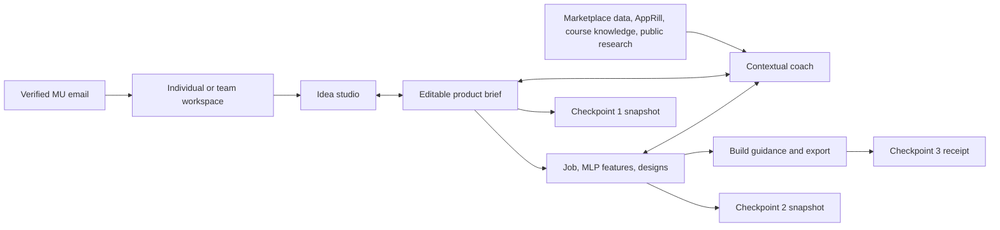
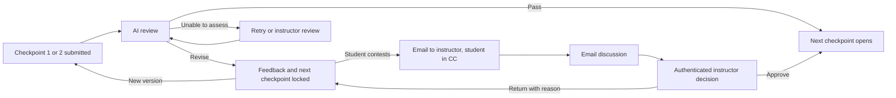

# Shipyard Venture Workspace - Plan

Implementation update: U1–U4 are implemented and locally exercised. The instructor-provided Anthropic key is configured and real Haiku fixtures pass; U5 production activation is complete; email-only signup awaits access to the owning Clerk dashboard. See `lms/docs/shipyard/STUDIO_RELEASE.md` and `docs/reviews/2026-09-19-shipyard-studio.md`. The user's later provider decision is direct Claude Haiku, superseding any earlier Gemini/OpenRouter fallback assumption for this new workspace.

## Goal Capsule

**Objective:** MU students working alone or in teams can turn an initial idea into a scoped, evidence-informed software product they can build and attempt to monetise during the two-month course.

**Means:** Evolve Shipyard into a collaborative product-development workspace with an idea coach, a persistent product brief, evidence-backed iteration, design/build guidance, and three simple checkpoint submissions.

**Product authority:** Pushpak's 19 September 2026 request supersedes the previous six-checkpoint Shipyard submission requirements and roster-dependent student entry. Requirements below distinguish those directions from proposed defaults. Course 1 rules remain outside this change.

**Progression authority:** Pushpak chose AI approval before the next checkpoint opens, with student-initiated appeals emailed to build@praxel.in and the student in CC. No product-direction blocker remains. This document is a product specification, not an implementation or deployment receipt.

## Product Contract

### Summary

Shipyard will help a team develop one coherent product through research, decisions, designs, and build guidance, while keeping formal submissions small. Students use verified MU email accounts and share a project workspace when working together.

### Problem Frame

Current Shipyard source centres the experience on a sequence of six checkpoints, rubric verdicts, tracker signals, and an individual product owner. A student submits evidence to be judged, but this does not itself provide the sustained help needed to identify a useful problem, compare alternatives, narrow a product, or translate a design into a buildable scope.

The supplied marketplace dataset and AppRill can make coaching more specific. Their records describe existing products, prices, features, and observed market activity. These are evidence about comparables, with uneven freshness and coverage; they do not establish that a student's proposed customer will buy a new product.

### Key Decisions

- **Use a project workspace as the main product.** Adding a chat box to the existing checkpoint spine would retain its assessment-first structure. A full hosted app builder would create a second coding platform. The proposed middle path is a coach that maintains an editable brief and produces usable build artifacts. Governs R4–R9, R23–R24.
- **Keep formal submissions deliberately small.** The coach may ask useful questions during development, but those questions must not quietly become additional required submission fields. Governs R15–R22.
- **Treat research as a way to challenge an idea.** Surface supporting evidence, counterevidence, and the most important unanswered question instead of a decorative viability score. Governs R7, R10–R14, R17.
- **Give every human their own account and let the project belong to the workspace.** Team signup must not mean a shared login or a record attached permanently to one student's identity. Governs R1–R3, R25–R27.
- **Use first external payment as the working meaning of monetisation within two months.** This is a proposed interpretation, not a profitability guarantee or an additional checkpoint submission requirement. Governs R17.
- **AI decides checkpoint progression, with instructor appeal.** (session-settled: user-directed — chosen over advisory-only feedback: Pushpak wants the AI to block progression until the submission passes.) The workspace remains available for iteration while a checkpoint is returned. Governs R18, R33–R39.
- **Use email for the appeal conversation and an instructor decision link for the recorded outcome.** Pushpak explicitly requested build@praxel.in as the recipient and the student in CC. The proposed secure link lets the discussion stay in email while a deliberate instructor action updates Shipyard; interpreting arbitrary email replies as decisions is deferred. Governs R34–R38.

### Actors

- A1. Student: signs in, explores ideas, edits the project, requests feedback, and submits work.
- A2. Team owner: also manages invitations and ownership; otherwise works in the same project as teammates.
- A3. Instructor: reviews team submissions and evidence, adds feedback, and records human decisions.
- A4. Coach: proposes questions, research, edits, and experiments; the team decides what enters the accepted brief.

### Requirements

#### Entry and team workspace

- R1. A student can sign up and return using a verified MU email without being present on the Course 1 LMS roster; institutional-domain verification must occur on the server after ownership of the address is verified.
- R2. After sign-in, a student can start individually, create a named team, or accept a team invitation; every team member must independently satisfy R1.
- R3. An individual workspace can become a team workspace without losing its ideas, evidence, or submissions.
- R4. Workspace members share candidate ideas, an active product brief, coaching history, evidence, feature decisions, designs, and checkpoint submissions.

#### Idea development

- R5. Students can begin with a rough idea or ask for directions based on their interests, skills, and access to potential customers; answering a long intake questionnaire is not a prerequisite.
- R6. The coach maintains an editable brief covering customer, recurring job, problem, current alternative, proposed value, smallest useful product, pricing hypothesis, acquisition route, and unresolved assumptions.
- R7. The coach asks the next useful question and offers concrete ways to narrow or change the idea, with reasons tied to the current brief and available evidence.
- R8. Students can accept, edit, or reject a proposed change; accepted revisions preserve the previous version and explain what changed.
- R9. A workspace can explore multiple candidate ideas and explicitly select the one used for formal submissions; changing that selection does not overwrite earlier submissions.

#### Evidence and research

- R10. Research starts from the supplied marketplace dataset, relevant AppRill records, and curated course knowledge, adding targeted public research when those sources leave a decision-relevant gap.
- R11. Every factual market claim shown as evidence includes its source link, capture date, evidence type, and the claim it supports; generated interpretation remains visibly distinct.
- R12. An idea review presents relevant comparables, recurring problems or workarounds, pricing signals, counterevidence, and an explicit account of what remains unknown.
- R13. Research uses bounded jobs with visible progress, cancellation, reuse of recent results, and administrator-controlled spending limits; ordinary conversation does not automatically start new scraping runs.
- R14. Missing, stale, inaccessible, duplicate, or contradictory source data remains visible as an evidence limitation and never becomes fabricated demand, a negative verdict by default, or a claimed successful research run.

#### Checkpoint 1: idea

- R15. The first submission requires exactly a title, an idea description of fewer than 200 words, and a landing-page URL; it does not require signup counts, ad spend, traffic tests, or screenshots.
- R16. The description counter and server validator use the same word-count rule, with the title and URL excluded from the description count.
- R17. Feedback primarily evaluates buildability within two months, a credible route to first external payment within two months, and a digital/software product whose core delivery requires minimal recurring manual service.
- R18. For each criterion, feedback states the assessment, its evidence and uncertainty, the main risk, and a specific change or test that would improve the idea; the recorded review returns an explicit pass or revise decision only when the evidence can be assessed.
- R19. Landing-page feedback checks whether the visible promise matches the submitted idea; inaccessible content is recorded as unreviewed evidence without inventing its contents or adding a new business criterion.

#### Checkpoint 2: job, features, and designs

- R20. The second submission contains a JTBD/job specification, a feature list with concise two-to-three-line descriptions and an MLP inclusion choice for each feature, at least one hand-drawn or Excalidraw design, and subsequent Stitch designs.
- R21. Feedback evaluates job-to-feature fit, whether the selected MLP delivers one complete outcome within the course window, and whether the designs support that outcome; it names concrete cuts, missing steps, and inconsistencies.
- R22. Design review considers both the early sketch and the Stitch output, using uploaded exports when shared links cannot be read; feedback never claims to have inspected an inaccessible design.

#### Build support and checkpoint 3

- R23. The coach can turn the accepted brief and designs into a portable build brief, a sequenced backlog, acceptance checks, and prompts for the student's chosen coding tool.
- R24. Students can return with a screenshot, error, code excerpt, or question for help with their next build step; the coach retains the chosen scope and labels advice it has not tested.
- R25. Checkpoint 3 accepts the working-product URL and optional demo/access notes, records the submission and receipt, and performs no automated product evaluation, AI grading, product browsing, or tracker-based verdict.

#### Collaboration, assessment, and continuity

- R26. Every checkpoint submission freezes the submitted artifacts, the submitting member, and the team membership at that moment; subsequent edits create a new draft or submission version.
- R27. Invitations require acceptance, membership changes are recorded, and departed members lose future workspace access without erasing the authorship recorded on past submissions.
- R28. Instructors can view one submission per workspace/version, its contributors, source evidence, AI feedback where applicable, and their own human feedback without mistaking a team submission for several independent products.
- R29. The new student entry and checkpoint experience must preserve existing Course 1 permissions and historical Shipyard work; old six-checkpoint results must not be silently reinterpreted as new three-checkpoint results.
- R30. Saved drafts and submitted receipts remain usable during research or model failures; retrying a failed job must not create duplicate submissions or unexpected repeated charges.
- R31. Workspace data, uploaded designs, and restricted knowledge sources remain available only to authorised participants and staff, with cross-workspace retrieval excluded from coaching by default.
- R32. Staff can inspect source freshness, failed research jobs, per-workspace cost, and feedback quality, and disable a broken source without disabling submissions.

#### AI gates and instructor appeals

- R33. Checkpoint 2 opens after checkpoint 1 passes, and checkpoint 3 opens after checkpoint 2 passes; an AI return keeps the next submission locked while coaching and draft editing remain available.
- R34. A student can contest a returned review by entering a reason and submitting an appeal tied to that exact submission version and AI review.
- R35. A submitted appeal sends an email to **build@praxel.in** with the appealing student's verified email in **CC**, containing the student's reason, product/team identity, checkpoint/version, submission link, AI decision and criterion-level reasoning, relevant evidence links, and an instructor decision link.
- R36. The appeal record and its email delivery state are durable and visible; repeated clicks reuse the same appeal, and failed delivery remains retryable without pretending the instructor was notified.
- R37. The instructor decision link requires staff authentication and lets Pushpak record approval or return-for-revision with a reason; approval clears the corresponding gate and the workspace shows the recorded outcome.
- R38. Discussion can continue through normal email replies, but only an explicit recorded instructor decision changes Shipyard progression; email delivery, a CC recipient, or a reply alone does not grant decision authority.
- R39. Each review and appeal is bound to a submission and rubric version, so an old worker result or appeal resolution cannot overwrite a newer review or silently unlock progression for a materially changed submission.
- R40. A source/model outage produces an unable-to-assess or retry state rather than an automatic pass or academic rejection, with an instructor-review route available when the evidence cannot be evaluated.

For R35, the configured sender must be able to send authenticated email, and reply routing must allow Pushpak and the student to continue the same conversation. No email is sent merely because an AI review returns a submission; the student's explicit appeal action triggers it. These are product requirements for the future workflow, not instructions to send a test email now.

### Workspace Shape

The proposed main screen has project navigation on the left, the active artifact in the centre, and a contextual coach beside it. Students can open an evidence drawer from a claim in either the brief or the feedback. On a narrow screen, the artifact and coach become switchable views; neither requires horizontal scrolling.

| Surface | What the student does | Durable result |
| --- | --- | --- |
| Idea studio | Explore, compare, select, and narrow ideas | Candidate ideas and accepted brief |
| Evidence | Inspect relevant comparables and source excerpts | Claim-linked evidence and open assumptions |
| Product plan | Define the job and select MLP features | Job specification and scoped feature list |
| Designs | Add a sketch, then Stitch designs; address feedback | Design versions linked to the core flow |
| Build | Work through the backlog and ask for contextual help | Build brief, tasks, and acceptance checks |
| Submissions | Submit a small snapshot at each checkpoint | Timestamped team receipt and feedback |

The workspace information flow is separate from formal progression. Checkpoint submission follows R33–R40:

### Key Flows

- F1. **Start a project.** A student verifies their institutional email, chooses individual or team, and enters the idea studio. An invitation recipient signs in independently and explicitly joins the existing workspace. **Covers R1–R5, R27.**
- F2. **Shape an idea.** The student describes a problem; the coach identifies the largest uncertainty, retrieves evidence, and proposes narrower options. The student chooses a direction and accepts edits to the brief. **Covers R6–R14.**
- F3. **Submit the idea.** The workspace previews the three required fields, submits a fixed snapshot, and receives a receipt followed by source-grounded feedback. The AI decision opens the next checkpoint or returns the work for revision. **Covers R15–R19, R26, R30, R33, R40.**
- F4. **Plan the product.** The team develops the job specification, marks MLP features, uploads its sketch, adds Stitch designs, and requests feedback before submitting. **Covers R20–R22, R26.**
- F5. **Build and submit.** The team exports a build brief, works through implementation in its chosen tool, and returns for guidance as needed. Its final product submission receives a receipt for instructor review. **Covers R23–R26, R28.**
- F6. **Revise without losing the record.** A member changes the idea or designs after feedback; the coach identifies downstream artifacts that may need revision, while submitted versions retain their original evidence and contributors. **Covers R8–R9, R26–R27.**
- F7. **Contest a decision.** The student reads the review, selects the appeal action, explains the disagreement, and submits. Shipyard records the appeal and sends the email with the student in CC. Pushpak and the student discuss by email, then Pushpak uses the authenticated decision link to record the outcome. **Covers R34–R39.**

### What Useful Feedback Looks Like

Illustrative example only; this is not a market finding:

> “An all-in-one platform for restaurants” is too broad for this course. A smaller candidate is a tool for independent cafe owners that turns a menu photo into editable social posts.
>
> **Build:** Start with upload → correct the extracted menu → choose a template → export. Defer scheduling, analytics, and multiple locations.
>
> **Monetisation:** The unresolved question is whether the owner will pay for this instead of reusing a template. Show a priced prototype to five owners you can reach this week and ask for a paid trial. The interviews are an experiment, not an extra submission field.
>
> **Operations:** If your team manually designs each customer's posts, it is still a service. The customer needs to produce and edit the output themselves.

With real research available, every external claim in such feedback must carry the receipts required by R11. A later review should explain what changed since the previous version instead of repeating the same general advice.

### Acceptance Examples

- AE1. **Covers R1–R2, R29.** A student with a verified permitted MU address but no Forge roster row can enter Shipyard, while access to Course 1 remains governed by its existing rules. An unverified address and a lookalike domain cannot enter.
- AE2. **Covers R3–R4, R26–R27.** An individual invites a teammate who verifies and accepts; both see the same project. Removing that member ends future access while prior submission attribution remains intact.
- AE3. **Covers R15–R16.** A 199-word idea with a title and landing-page URL is structurally accepted; a 200-word description is rejected by both client and server, without asking for traffic or signup evidence.
- AE4. **Covers R12, R17–R19.** A polished pitch for an agency delivering custom work receives a specific operations concern and a suggested self-serve product boundary, rather than praise based on presentation quality.
- AE5. **Covers R11–R14.** An old marketplace listing and a recent social complaint are shown with their separate dates and evidence types; neither becomes a revenue forecast for the student's product.
- AE6. **Covers R20–R22.** A visually polished Stitch screen cannot stand in for the required initial sketch; missing or inaccessible artifacts are identified precisely, and unseen screens receive no invented critique.
- AE7. **Covers R23–R24.** An exported backlog refers to the team's accepted MLP and core user flow; features previously deferred do not silently reappear as build requirements.
- AE8. **Covers R25, R30.** A final product submission saves successfully while the model and research services are unavailable, and no automated evaluator or tracker job is enqueued for it.
- AE9. **Covers R14, R30–R32.** A source timeout leaves the research result visibly partial, preserves the draft, and supports an explicit retry without duplicating the submission.
- AE10. **Covers R26–R27.** Two teammates editing from different versions see a conflict or refresh prompt; one cannot silently overwrite the other's accepted brief or submission.
- AE11. **Covers R29.** Existing six-checkpoint submissions remain identifiable as historical work during migration; no new completion or grade is inferred from dropping three old checkpoints.
- AE12. **Covers R33–R35.** A checkpoint-1 return leaves checkpoint 2 locked. The student can revise immediately or contest the review; contesting produces an email addressed to build@praxel.in with the appealing student's verified address in CC.
- AE13. **Covers R36.** An email-provider failure leaves a saved appeal marked delivery pending/failed and available to the instructor in Shipyard; pressing the button again does not create a second appeal or claim successful delivery.
- AE14. **Covers R37–R39.** After an email conversation, Pushpak approves through the instructor link. The matching checkpoint opens once; a student following the same link cannot approve their own work, and an outdated appeal cannot override a newer submission.
- AE15. **Covers R25, R33.** A checkpoint-2 pass opens checkpoint 3. Submitting the product then yields a receipt without asking an AI to pass it or waiting for payment/tracker signals.
- AE16. **Covers R40.** A research outage during review cannot create a course rejection. The submission remains awaiting assessment, the next formal checkpoint stays locked, and retry or instructor review remains available.

### Success Criteria

- A student can complete signup and reach a useful first coaching response without roster support or a lengthy onboarding form.
- An instructor can trace each substantive feedback claim to the student's artifact or a dated source, and identify the proposed next change.
- Representative course ideas receive consistent feedback on the three stated checkpoint-1 criteria, including borderline service businesses, oversized scopes, inaccessible evidence, and realistic small software products.
- The primary learning outcome is improvement in the scoped idea and build artifact between versions; chat volume and number of scraping runs are not success measures.
- Faculty trials establish feedback usefulness, pass/return agreement, false-pass and false-return tolerances, and appeal behavior before the replacement reviewer affects real assessment.

### Source Findings and Current Implementation

Inspected on 19 September 2026. Spreadsheet row capacities are not used as verified record counts.

| Source | Verified observation | Implication for this product |
| --- | --- | --- |
| [Buildpad](https://buildpad.io/) | Public site describes guided phases, social research, a canvas, and critical idea feedback. Its authenticated product was not inspected. | Borrow the guided iteration pattern; do not claim a feature-complete comparison or reproduce its full breadth. |
| [Supplied workbook](https://docs.google.com/spreadsheets/d/15-xYJEoMV-11YvGPUkt8DElIl7PYIda3A4iFOr9vYIc/edit) | Metadata lists AppSumo Products, Acquire Listings, TrustMRR Startups, a hidden revenue-history tab, and source/run status tabs. | Use source-specific retrieval with provenance rather than inserting the whole workbook into a prompt. |
| AppSumo sample and headers | Product descriptions, category, alternatives, target users, integrations, features, plans, prices, ratings, counts, and source/capture fields are present. | Strong starting material for comparisons and feature scoping; review counts are not review text or subscription demand. |
| Acquire sample and headers | Descriptions, categories, asking price, annual revenue/profit, multiples, and source/capture fields are present, with missing values. | Treat listing numbers as attributed marketplace claims, not audited or guaranteed outcomes. |
| TrustMRR headers | Persona, problem, pricing model, stack, channels, subscriptions, revenue windows, and sync/source fields are present. | Useful schema for business comparables; this inspection did not audit current revenue records or their derivation. |
| Source Status tab | Latest visible entries are dated 18 September. Acquire reports 35 consecutive empty executions; AppSumo says reviews remain disabled; TrustMRR revenue-history refresh was skipped. | Ingestion completion and fresh underlying observations need separate labels. Existing historical data is still useful, with its age visible. |
| [AppRill API documentation](https://apprill.app/docs) | The rendered public docs expose app search/detail, reviews, rankings/history, ads/videos, and source-aware revenue/coverage via REST and MCP. | Use the existing read interface. Authentication, account allowance, and relevant live result quality still require integration verification. |
| Existing Apify source | Reddit README describes keyword/subreddit search and comments; X README describes handles and exact post URLs; Instagram comments README documents frequent login walls. | Do not present all actors as universal keyword-search tools. Discover targets where needed, validate exact actor inputs/outputs, and preserve partial results. No actor was run during this review. |
| [Live Shipyard](https://lms.praxel.in/shipyard) | The available browser session redirects to Clerk sign-in. | Authenticated production behavior was not verified; current-flow findings below come from source inspection. |

Relevant implementation evidence:

- `lms/docs/build/SOURCE_OF_TRUTH.md`: newest user direction takes precedence; source-derived data has audience and processor boundaries.
- `lms/prisma/schema.prisma:1334`: `ShipyardProduct` currently has a unique individual `userId`; submissions are versioned by product and checkpoint.
- `lms/lib/shipyard/products.ts`: product creation and reads assume one product per student.
- `lms/lib/shipyard/checkpoints.ts`: six checkpoint definitions; checkpoint 1 requires demand-test evidence and the working-product checkpoint has a review gate.
- `lms/lib/shipyard/submissions.ts`: common submission validation, URL probes, uploads, cooldown, and review enqueueing require a separate receipt-only path for R25.
- `lms/proxy.ts`, `lms/lib/auth/session.ts`, `lms/lib/auth/webhook.ts`: roster checks exist in several layers; changing only the sign-in screen cannot deliver R1.
- `lms/docs/shipyard/ARCHITECTURE.md`: Shipyard already shares the Forge deployment and infrastructure while namespacing its domain logic.
- `lms/lib/shipyard/review-pipeline.ts`, `lms/lib/shipyard/review-complete.ts`, `lms/lib/shipyard/reviewer/`: reusable review infrastructure, but old prompts and gates are not the new assessment contract.
- `lms/lib/shipyard/review-escalate.ts`: existing dispute and human-resolution logic is a reuse candidate for appeals; no outbound email integration was found in the inspected LMS lib/worker/package configuration.
- `lms/lib/shipyard/scoring.ts`, `lms/lib/shipyard/grades.ts`, `lms/lib/dpdp-erasure-shipyard.ts`: scoring and data lifecycle assume the old product/assessment structure and need deliberate adaptation.

### Scope Boundaries

The coherent deliverable is the student product-development workspace and its three-checkpoint journey. The first implementation should deliver a complete path through that experience before adding more builder features.

Deferred: an infinite canvas editor, simultaneous multiplayer cursor editing, a built-in coding IDE, hosting students' products, direct control of Stitch, automatic publishing to external coding tools, and parsing incoming emails into instructor decisions. Existing tools can receive exported briefs and students can upload design exports.

Outside this product's identity: automatic claims of market validation, automated sales/outreach to research subjects, and generating every student's product without their decisions. Under R25, automated final-product assessment is explicitly excluded.

### Dependencies and Assumptions

- Clerk can be reused as an identity provider if verified-email onboarding and workspace membership are separated from Forge roster authorisation. A new Clerk instance is a possible implementation choice, not a product requirement.
- The precise permitted MU domain list must be taken from institutional configuration and verified examples before deployment; matching a substring containing “MU” is insufficient.
- Supplied data is for the requested MU learning experience. Preserve applicable source/audience/processor boundaries and keep restricted records out of public repositories or public galleries; this design does not require publishing the workbook.
- The team experience needs an explicit owner and accepted members. The proposed default lets any current member edit and submit, records who acted, and requires ownership transfer before the owner leaves.
- Suggested starting model: one active course submission workspace per student, with multiple candidate ideas inside it. Team-size limits and reassignment rules should follow the actual course policy, not an invented limit in the UI.
- Existing production enrollments, checkpoint row edits, submissions, and grades need an inventory before migration. Local seed definitions and the old status document are not a production snapshot.
- Final grade weights, individual contribution grading, and any course graduation rule are not specified by this request. Do not carry old tracker-based weights into the replacement by accident.

### Outstanding Questions

**Resolve before planning:** None. The user selected AI gates with instructor appeal by email.

**Deferred to implementation planning:** Confirm accepted MU domains and email-verification configuration; map existing students/products to initial workspaces; choose the identity-provider setup; inspect the live checkpoint configuration; define migration and rollback preservation; verify AppRill access and exact Apify actor contracts; set research budgets; design evaluator fixtures and failure recovery; verify the authenticated sending domain, email provider, reply routing, delivery receipts, and staff access for build@praxel.in.

**Deferred to assessment rollout:** Agree final grading and team-contribution policy before replacing grade calculations. Submission and formative feedback work can be planned independently of numerical grading.

## Planning Contract

Product Contract unchanged. The user authorised independent implementation and production deployment on 19 September.

The implementation adds a namespaced studio domain inside the existing Next.js application. New identities and workspace membership do not create Forge roster rows. Existing six-checkpoint records and routes remain available as historical work. The root Shipyard entry becomes the new workspace after verification.

### Key Technical Decisions

- KTD1. Use additive `ShipyardStudio*` tables for identities, workspace documents/revisions, memberships/invitations, immutable submissions, appeals, jobs, files, and knowledge records. This avoids rewriting the existing course's grade and ownership assumptions. Covers R1–R4, R26–R29.
- KTD2. Verify Clerk's primary email status on the server; admit exact configured MU domains and explicit staff identities. Bypass the Forge roster gate only for the new studio surface, retaining each route's membership or staff check. Covers R1, R31.
- KTD3. Save workspace documents using optimistic versions, retaining revisions. Submission snapshots bind document, membership, artifacts, and rubric versions. Gate resolution uses the latest submitted checkpoint version, with stale results rejected. Covers R8, R26, R33–R40.
- KTD4. Run research, coaching, review, and email through durable jobs consumed by the existing Shipyard worker. Use bounded retries, leases, idempotency, daily workspace budgets, and explicit failure states; never silently fall back to fake AI. Covers R10–R14, R30, R32, R36, R40.
- KTD5. Import the supplied workbook into private searchable knowledge records, retaining source IDs, URLs, dates, and evidence types. Query AppRill through its read API and allow bounded explicit social research. Retrieved content is untrusted context, never system instructions. Covers R10–R14, R31.
- KTD6. Preserve S3's presigned upload and immutable-version pattern for design artifacts. Workers inspect bounded images; the browser receives only authorised presigned downloads. Covers R20–R22, R31.
- KTD7. Send appeal emails through a verified transactional sender, using a fixed payload and provider idempotency key. Instructor decisions require authentication and an explicit POST. Covers R34–R39.

## Implementation Units

### U1. Identity and shared workspace foundation

**Requirements:** R1–R4, R8–R9, R26–R29, R31. **Dependencies:** None.

**Files:** `lms/prisma/schema.prisma`, additive migration, `lms/lib/shipyard/studio/`, `lms/lib/auth/clerk.ts`, `lms/proxy.ts`, Clerk webhook handling, `lms/tests/shipyard-studio*.test.ts`.

Implement separate studio identities, workspace/member/invitation ownership, versioned documents, and immutable file metadata. Test verified/nonverified and lookalike-domain boundaries, non-roster admission without Forge access, invitation acceptance, owner transfer, membership removal, cross-workspace denial, and concurrent-save conflicts against Postgres.

### U2. Evidence, coaching, and build artifacts

**Requirements:** R5–R14, R23–R24, R30–R32. **Dependencies:** U1.

**Files:** studio knowledge/research/worker modules, workbook import script, `lms/worker/shipyard.ts`, studio tests.

Implement private retrieval, source adapters, explicit bounded research, structured coaching proposals, durable chat, accepted brief revisions, and build-brief export. Test source failures, cancellation, duplicate requests, cost bounds, private retrieval boundaries, unsupported citations, and worker recovery. Validate real retrieval and a real model response before deployment.

### U3. Checkpoint gates and email appeals

**Requirements:** R15–R22, R25–R26, R28, R33–R40. **Dependencies:** U1–U2.

**Files:** studio submission/review/appeal modules, worker wiring, new reviewer fixtures, studio tests.

Implement exact submission schemas, three-criterion idea review, design review with real artifacts, deterministic sequential gates, receipt-only final submission, durable appeals and authenticated human decisions. Test the 199/200-word boundary, missing sketch/design, stale verdicts, no-AI final submission, email recipient/CC contract, delivery uncertainty, and instructor override. Live model fixtures must exercise good ideas, oversized ideas, service businesses, and incomplete designs.

### U4. Student and instructor interface

**Requirements:** R1–R40. **Dependencies:** U1–U3.

**Files:** new studio components/styles and API routes, Shipyard entry/layout, instructor studio page, browser checks.

Build the editable brief with contextual coach, source cards, product plan and design uploads, build export, three checkpoints, team management, and instructor review queue. Preserve existing brand tokens; provide empty/loading/error/locked states and responsive layouts. Verify the complete individual/team journey at desktop and mobile widths.

### U5. Release and production verification

**Requirements:** R29–R32 and all acceptance examples. **Dependencies:** U1–U4.

**Files:** deployment notes, environment example, release verification scripts, decision log.

Run focused and integration tests, typecheck, production build, security/correctness review, and authenticated browser checks. Inventory production data before applying additive migrations. Release web and worker from the same reviewed commit; import private knowledge and configure real integrations. Rollback switches the root entry to the historical view while retaining all new tables and receipts. Verify health, schema, worker progress, verified-email entry, real AI output, final submission, and appeal delivery behavior on the deployed build.

## Verification Contract

Unit tests prove parsers, email/gate contracts, and permission rules. Postgres integration tests prove version/race and submission/job transactions. Real worker calls prove source and model integration. Browser checks prove the rendered interface and uploads. Production receipts must distinguish configured, exercised, delivered, and blocked integrations; a successful build alone does not establish a live student flow.

## Definition of Done

The approved workspace is reachable at the production Shipyard entry, with real evidence and AI feedback, working individual/team membership, three checkpoint submissions and sequential AI gates, and a durable instructor-appeal workflow. Course 1 and historical Shipyard records remain intact. Tests, live review evaluations, source coverage, deploy identities, and any account-dependent verification gaps are recorded in release evidence.
