# Functional recreation contract · SignalShelf

**Benchmark category:** creator link-page builder  
**Public benchmark studied:** Liinks  
**Classroom product working title:** SignalShelf  
**Contract version:** S4-v1.0 · 30 July 2026  
**Timebox:** one live-build hour  
**Status:** Authored; frozen for the golden run, not yet validated in Lovable Free

## Plain-language contract

Build an original, responsive web app that lets a creator assemble a shareable profile from reusable content blocks, preview the result live, publish a public view, and inspect clearly labelled demo engagement. Every behavior in the golden contract must work. Every external service boundary must be either genuinely connected and tested or visibly labelled as a mock.

This is an educational functional recreation, not a copy of Liinks. The app must not use the names **Liinks** or **TrustMRR** in its product name, domain, logo, metadata or marketing; must not copy their logos, screenshots, icons, text, customer data, source code or distinctive visual trade dress; and must not imply affiliation or endorsement.

## User and job

**Primary user:** an early-stage creator or professional who needs one mobile-friendly page for important links and contact capture.

**Core job:** “Help me arrange the few things I want an audience to see, preview the page, share it, and learn which links get attention.”

**Context transfer:** Each student changes the fictional persona, message hierarchy and at least one core use case so the page serves their team’s industry or anchor company. Use only public research and fictional/demo content; do not expose client, employee, customer or internal company data.

## Complete classroom journey

```mermaid
flowchart LR
    A["Creator opens demo builder"] --> B["Edits identity and social links"]
    B --> C["Adds, edits, orders, hides or deletes blocks"]
    C --> D["Changes the original visual theme"]
    D --> E["Sees live mobile preview"]
    E --> F["Opens public profile route"]
    F --> G["Visitor opens a link or submits a dummy email"]
    G --> H["Creator sees browser-local demo analytics"]
    H --> I["Creator publishes and verifies in incognito"]
```



## Functional layers

| Layer | Required behavior | Evidence | Boundary |
| --- | --- | --- | --- |
| Identity | Edit display name, short bio, profile image URL and three social links | Live preview and refresh persistence | Use dummy identity and public placeholder image |
| Content model | Add link, text, divider, media, email-capture and folder blocks | All six types render in builder and public view | No claim that this is Liinks’ full block catalogue |
| Block operations | Edit, enable/disable, move up/down and delete with confirmation | Test log for each operation | Keyboard-capable buttons; drag-and-drop may be an enhancement |
| Design | Choose one of three original presets, change accent and type scale | Preview changes without reload | Do not reproduce Liinks themes or trade dress |
| Preview | Mobile preview updates immediately | Side-by-side builder recording or screenshots | Desktop preview is an enhancement |
| Public view | A published SPA-safe fragment URL renders only enabled blocks from the frozen, validated share envelope | Incognito URL shows the saved fictional profile | Public data is dummy; no private course data; payload has schema, integrity and size limits |
| Interaction | Valid links open safely; email capture accepts only the reserved `example.com` demo domain and stores dummy entries | Visible success/error and analytics count | No Mailchimp, real personal email or outbound email in V1 |
| Demo analytics | Count browser-local profile views, block clicks and dummy signups; show top link and CTR | Seed/reset control and test evidence | Label “Demo analytics · this browser only” |
| Persistence and sharing | Builder state survives refresh; `Copy public link` encodes the sanitised fictional profile in the frozen URL-fragment envelope so another browser can view it | Refresh evidence plus incognito share URL | LocalStorage holds editor state; the full `profile` fragment value is capped at 8,192 UTF-8 bytes; analytics/subscribers/private editor state are excluded |
| Failure states | Invalid URL, invalid email, empty state and delete confirmation are handled | Negative-test results | Never silently accept invalid data |
| Publication | Public Lovable URL loads without editor access | Incognito/mobile verification | Free/Pro publication is public; no sensitive data |

## Frozen public-share envelope · S4-SP-1

All supported builds use one interoperable public-share contract. Do not invent another payload during the live hour.

### Canonical URL

```text
https://<original-project-name>.lovable.app/#profile=v1.<base64url-json>.sha256-<16-hex>
```

- Use the published base origin plus the fragment. Do not rely on a nested server route.
- The fragment is not sent in the host’s HTTP request, but it is still public to anyone who receives the URL.
- The complete value after `profile=`—version, separators, payload and digest—must be no more than **8,192 UTF-8 bytes**.
- The digest is the first 16 lower-case hexadecimal characters of SHA-256 over the exact canonical JSON bytes. It detects accidental/stale-payload modification; it is not authentication or secrecy.

### Canonical JSON schema

Build a new public object in the exact key order below, normalise strings to Unicode NFC, and serialize with ordinary compact `JSON.stringify` semantics: UTF-8, no insignificant whitespace. Arrays preserve public display order. Omit optional fields instead of emitting `undefined`; do not add unknown keys. Do not hash the internal editor object.

```json
{
  "schemaVersion": 1,
  "creator": {
    "slug": "mira-demo",
    "name": "Mira Sen",
    "bio": "Product storyteller · Bengaluru",
    "avatarUrl": "https://example.com/avatar.png",
    "socials": [
      {"platform": "linkedin", "label": "LinkedIn", "url": "https://example.com"}
    ]
  },
  "blocks": [
    {"id": "portfolio", "type": "link", "order": 0, "title": "Portfolio", "description": "Selected work", "url": "https://example.com"}
  ],
  "theme": {"preset": "editorial", "accent": "#2855D9", "typeScale": "standard"}
}
```

Exact object keys and order:

| Object | Allowed keys in canonical order | Notes |
| --- | --- | --- |
| root | `schemaVersion`, `creator`, `blocks`, `theme` | All required; no unknown keys |
| creator | `slug`, `name`, `bio`, `avatarUrl`, `socials` | `bio`/`avatarUrl` may be omitted when empty |
| social | `platform`, `label`, `url` | `platform`: `linkedin`, `instagram`, `youtube`, or `website` |
| every block | `id`, `type`, `order`, then the type fields below | Encoder filters disabled blocks first; no editor/UI fields or `enabled` key |
| link | `title`, `description`, `url` | `description` optional |
| text | `heading`, `body` | `heading` optional |
| divider | `label` | `label` optional; empty divider remains meaningful visually |
| media | `title`, `url`, `mediaKind` | `mediaKind`: `youtube`, `spotify`, or `generic`; no arbitrary embed HTML |
| email | `heading`, `buttonLabel`, `successMessage` | Form configuration only; never encode submitted addresses |
| folder | `title`, `links` | Each child link uses exact keys `id`, `title`, `url` |
| theme | `preset`, `accent`, `typeScale` | All required and enum/format checked |

Validation limits:

- `schemaVersion` must be integer `1`; envelope prefix must be `v1`.
- `creator.slug` and every block ID match `^[A-Za-z0-9_-]{1,64}$`; name ≤80 characters; bio ≤240; URL ≤2,048.
- At most 3 socials and 24 blocks; a folder contains at most 8 public links.
- Block `type` is one of `link`, `text`, `divider`, `media`, `email`, `folder`; every type is checked against its allowed public fields.
- Titles/headings/labels/button labels ≤120 characters, descriptions/success messages ≤240 and text bodies ≤500. `order` is a unique non-negative integer after enabled blocks are filtered.
- Theme preset is `editorial`, `studio` or `mono`; accent is a six-digit hex color; type scale is `compact`, `standard` or `large`.
- Every destination/avatar/media URL uses `http:` or `https:`. External links open with `noopener,noreferrer`.
- Render every student/user string with text nodes or framework escaping—never `innerHTML`.
- The encoder includes enabled public profile content only. It excludes analytics/events, signup entries, drafts, instructor feedback, grades, tokens, account identifiers and all other editor-private state.
- The public footer disclosure is fixed in application code and is never accepted from the payload.

### Deterministic decoder behavior

Before rendering any public profile, check byte size → envelope shape → supported version → base64url/UTF-8 → digest → JSON → exact schema/limits. If any check fails, render no partial profile and show exactly:

> This demo link is invalid or too large. Return to the creator page.

`Return to the creator page` is a keyboard-focusable link to the published base origin. A schema-valid payload is public input, not trusted code. This envelope creates a portable classroom demo; it is not a secure account, private draft, durable database or production publishing architecture.

## What “mocked” means

A mock is acceptable only when it is honest, bounded and useful for testing the user flow.

| External capability | Golden-build treatment | Required label |
| --- | --- | --- |
| Instagram sync/import | A button may load two clearly fictional fixture posts | `Demo import — no Instagram connection` |
| YouTube/Spotify media | Render a safe preview card from a supplied URL; real embedded playback is optional | `External media preview` if not actually embedded |
| Mailchimp sync / outbound email | Store a dummy email locally; do not transmit it | `Demo signup — stored only in this browser` |
| Authentication | Use a single seeded demo creator | `Demo workspace — no account system` |
| Multi-profile management | Out of scope, not a disabled mystery button | `Planned, not implemented` only in the parity note |
| Custom domain / DNS | Out of scope | Do not show a fake “connected” state |
| Public API | Out of scope | No API key input or fake success response |
| Payments/subscriptions | Out of scope | No copied plans or checkout screen |
| Production analytics/geography | Browser-local counters only | `Demo analytics · this browser only` |

## Original-brand rules

SignalShelf is a classroom working title only. The demo uses an original visual system:

- off-white canvas, deep navy text, cobalt action and coral emphasis;
- square or subtly cut-corner controls, not copied block styling;
- system sans for UI and a high-contrast serif display face;
- original icon choices from an openly licensed library available in the project;
- original creator persona, copy, links and media placeholders;
- footer disclosure: `Independent educational build. Not affiliated with or endorsed by the benchmark product.`

Before a student publishes, they must replace “SignalShelf” with an original name and record a basic name-conflict search. This classroom check is not legal clearance.

## Explicit non-goals

- commercial launch readiness, legal compliance certification or security certification;
- pixel matching the benchmark;
- scraping or importing real Instagram data;
- real subscriber email delivery, payments, custom domains, team permissions or public API;
- fabricated user counts, customer logos, testimonials, geographic analytics or revenue claims;
- publishing TrustMRR row data or a feature labelled “copy this startup.”

## Parity statement students must use

> This is an independent educational build that implements the classroom feature contract for a creator link-page workflow. External integrations and analytics are mocked and labelled. It is not affiliated with or endorsed by Liinks, TrustMRR, or Lovable, and it does not claim full commercial-product parity.

## Change control

During the live hour, an item may leave scope only if:

1. the instructor records the reason;
2. the class sees the contract change before accepting the build;
3. the item becomes a Version 2 backlog entry;
4. no one continues to call the incomplete item “working.”

The grade ceiling is determined by the frozen core tests, not by adding uncontracted decorative features.
