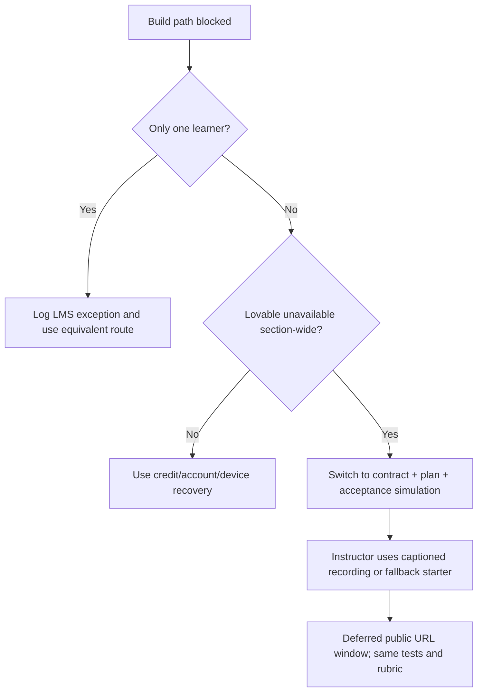

# Accessibility, outage and recovery playbook

**Purpose:** preserve the same outcomes and evidence when access, network, model, credit or attendance differs.  
**Rule:** equivalent route, not easier grade.

## Accessible classroom delivery

### Before class

- Provide the student handout and acceptance tests as tagged PDF/HTML plus plain text.
- Caption the fallback recording and provide a transcript with timestamps.
- Describe every product screenshot used in the deck; revenue/score tables must also exist as text.
- Confirm slide/body type is legible from the back; do not encode status by color alone.
- Share keyboard commands for Lovable and the browser where available.
- Keep a quiet seating option and allow headphones for screen-reader/speech input users.

### Golden app requirements

- semantic landmarks and one logical heading hierarchy;
- every input has a persistent label and useful error association;
- visible focus and logical keyboard order;
- move-up/move-down buttons with block-specific accessible names;
- no drag-only, hover-only or color-only action;
- at least WCAG AA contrast for normal text;
- alt text for meaningful images; decorative images ignored;
- reduced-motion preference respected;
- success/error announced without relying only on a toast disappearing;
- mobile target sizes and zoom do not obscure controls.

### Equivalent evidence route

If a learner cannot produce a screen recording, accept:

- timestamped screenshots plus the AT log;
- a screen-reader transcript or typed keyboard audit;
- a peer/TA witnessed test with initials;
- an audio explanation with a text transcript.

Do not require disclosure of a diagnosis.

## Fallback decision tree

## Scenario playbooks

### A. Lovable outage

**Trigger:** status page/majority of section cannot create or update projects for 10 minutes.

1. Freeze the ship clock and timestamp the outage.
2. Continue product selection, first prompt, direct plan edit and AT mapping in the LMS/offline handout.
3. Use the captioned build recording or screenshot checkpoints for instructor proof/debrief.
4. Students perform a paper/browser-static “failure hunt” against the fallback V1.
5. Open a section-wide exception: V1 due +24 hours after service recovery. Each learner's V1 receipt then creates their one V2 grant expiring ten calendar days after that receipt.
6. Do not label the session Piloted/Rehearsed until the live path is rerun.

### B. Student has zero build credits

1. Verify only whether the workspace says **daily allocation exhausted below the monthly cap** or **monthly cap reached**. Record category/reset timing, not a billing screenshot or private account detail.
2. Student completes product, industry/company transfer, contract, first prompt and student-approved plan. They pair as verifier during the live build and record test design/evidence.
3. Publish any existing safe working state through the free Publish dialog.
4. If only the daily allocation is exhausted and the monthly cap is not reached **and no safe V1 exists**, record `daily-credit-no-safe-v1`; submit the completed plan/test contract now and defer V1 until 24 hours after the first observed next daily grant. The learner then runs the identical AT-01–18 contract with no penalty. If a safe V1 exists, submit it and use one bounded Build request after the next daily grant through the ordinary V2 window.
5. If the monthly cap is reached, do not promise a next-day grant. Use the course fallback starter only after a release test proves the copy/restore is student-owned and costs zero build credits. Otherwise use the plan + peer-verifier path and record a tool-access exception.
6. For that monthly-cap exception, set V1 to 24 hours after the first accessible build day following the displayed reset; if access still does not return, extend through the first observed post-reset grant. The actual V1 receipt creates the ten-day V2 grant; any later extension must be explicit and audited.
7. No paid upgrade, alternate account, credential sharing or instructor-owned shared artifact is required.

The LMS records both daily-credit categories separately. The deferred V1 receipt—not the classroom date—starts the one ten-calendar-day V2 grant. This exception cannot grant V3 or reduce the acceptance-test, GitHub-V2, privacy, or originality standard.

### C. Account/login failure

1. Try a different supported browser/profile and institution email.
2. If unresolved in 5 minutes, switch the learner to the plan + peer-verifier path.
3. Record `tool-access` exception; never share another student’s login.

### D. Classroom network failure

1. Keep the lesson running from local deck/handout/recording.
2. Complete the contract, prompt, plan review and paper acceptance-test design.
3. If a local fallback app is provisioned, run verification against it.
4. Apply the section-wide deferred-publication rule.

### E. Model produces unsafe or wildly expanded plan

1. Do not approve.
2. Edit the formal plan directly to remove auth, payment, real integrations, secrets and unrelated scope.
3. If editing cannot recover it, start from the instructor fallback plan without spending repeated exploratory messages.
4. Record the mismatch as an instructor calibration observation.

### E2. Plan mode returns no formal editable plan

1. Save the response and record `NO_FORMAL_PLAN`; do not spend a second exploratory Plan credit.
2. Release `13-instructor-fallback-plan.md` only after the learner’s checkpoint is submitted.
3. Learner replaces bracketed context decisions and records at least two owned edits.
4. Switch once to Build mode and send the edited plan with the prescribed preface.
5. If the current UI cannot perform that transition, use the T-7-tested fallback starter and record `tool-access`; do not improvise an unvalidated live workaround.

### F. Student publishes real/private data

1. Unpublish immediately.
2. Do not capture/share the exposed value in screenshots or feedback.
3. Notify the instructor and follow the course incident route.
4. Remove data and rotate any exposed secret.
5. Republish and re-run privacy/incognito checks before gallery eligibility.

### G. Public URL or route fails only after publication

1. Check whether changes were republished; editor changes are not automatically live.
2. Open Publish → Publish changes.
3. Test base URL and public route in incognito.
4. If client routing fails, use the frozen S4-SP-1 base-origin fragment route; do not switch to an ad hoc query or nested route during class.
5. Submit the failure honestly if the deadline arrives; use V2 for repair.

### H. Browser-local edits do not appear for another viewer

Browser-local storage does not cross devices. The golden V1 generates a capped, sanitised, schema-validated public profile payload in the share URL. Analytics remain local to each browser. If the edited fictional profile cannot be shared, mark AT-16 failed and move real server-side persistence to V2; never claim this is a multi-user publishing system.

### I. Late or absent learner

Use the recovery sequence in `01-lesson-plan.md`: captioned recording/transcript, checkpoint before strong anchor, 60-minute build, peer/TA verification, and existing deadline/exception rules.

## Instructor fallback assets required before validation

- one tested Lovable V1 project copy with fictional data;
- source/export allowed by the tool and a documented restore path, including proof of whether a student-owned copy consumes build credits;
- captioned 60-minute build recording and transcript;
- static screenshots at every build checkpoint;
- one intentionally broken build for acceptance-test practice;
- plain-text deck and handout;
- printed prompt canvas and AT cards;
- tool-status and section-exception templates.

## No-disadvantage rule

Access/outage routes may change the tool or deadline but not the measured outcomes. The student still submits a product decision, feature contract, first prompt/plan evidence, working or honestly bounded V1, and verification. Extension features never compensate for missing core access or truth requirements.
