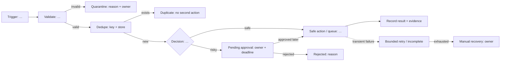

# Initial workflow design · before Make

**Submission:** Gate S5.1  
**Status:** formative, versioned, not graded  
**Rule:** describe business states and controls; do not start with Make module names.

## 1 · Problem frame

- Product/startup:
- Workflow pack: GTM (operations/revenue only with recorded preapproval)
- Current manual problem in one sentence:
- Measurable result:
- Named business owner:
- Trigger:
- Irreversible or externally visible actions:
- Explicit non-goal:

## 2 · Input contract

| Field | Type | Required? | Valid example | Invalid/edge example | Sensitive? | Retention need |
|---|---|---:|---|---|---:|---|
|  |  |  |  |  |  |  |

State the event identity and dedupe rule:

- Stable source event ID:
- Idempotency key:
- When the key is checked:
- Where final/waiting state is recorded:

## 3 · First flowchart

Replace every bracketed label. Every branch must reach a terminal or waiting state.

## Revision sections · complete after formative feedback

The first 15-minute gate requires sections 1–3 plus one row for each of normal, duplicate, malformed and approval-required in section 6. Complete sections 4–10 in the revised design before the build gate.

## 4 · State table

| State | How entered | Permitted next states | Owner | Evidence | Terminal/waiting? |
|---|---|---|---|---|---|
| received |  |  |  |  |  |
|  |  |  |  |  |  |

## 5 · Decision table

| Priority/order | Condition | Route | Action allowed | Action forbidden | Fallback if unknown |
|---:|---|---|---|---|---|
| 1 |  |  |  |  |  |

## 6 · Failure-first table

Commit a prediction before running anything.

| Fixture | Predicted final state | Outbound/irreversible count | Retry? | Approval? | Owner | Evidence expected |
|---|---|---:|---|---|---|---|
| normal |  |  |  |  |  |  |
| duplicate |  |  |  |  |  |  |
| malformed |  |  |  |  |  |  |
| timeout |  |  |  |  |  |  |
| approval required |  |  |  |  |  |  |

## 7 · Loop and concurrency check

- Can two runs process the same business event at once?
- What prevents a race between lookup and action/write?
- Does any retry/iterator/loop have a maximum?
- What is the exit condition?
- What happens to events waiting behind an incomplete execution?

## 8 · Approval contract

- Action requiring approval:
- Who may approve:
- Recorded approval state/location:
- Expiry or escalation time:
- What remains impossible while pending:
- What happens on rejection:

## 9 · Observability

- Trace ID:
- Health signal:
- Error/exception queue:
- Owner’s daily view:
- Alert threshold:
- One metric that would reveal silent failure:

## 10 · Safety declaration

I used synthetic/demo data. Scheduling is off. My chart contains no credentials, private webhook URL, customer PII, real company data, or instruction that permits an irreversible action before approval.

Name / team / timestamp:
