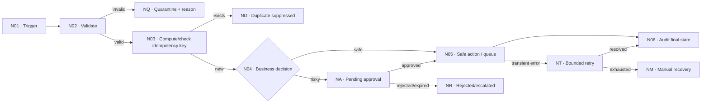

# Revised workflow design · after formative feedback

**Submission:** Gate S5.2  
**Rule:** keep the original artifact unchanged; this is a new version with a visible decision trail.

## 1 · Feedback disposition

| Feedback ID | AI claim and cited node | Decision: accept/adapt/reject/N/A | Why | Exact chart/contract change |
|---|---|---|---|---|
| F01 |  |  |  |  |

Required:

- at least one material suggestion handled;
- any unsafe suggestion explicitly rejected;
- any low-confidence/invented claim flagged for instructor review.

## 2 · Revised problem frame

- Result:
- Owner:
- Trigger:
- Non-goal:
- Risky actions:
- Assumption changed after feedback:

## 3 · Revised flowchart

Use stable node IDs such as `N01`, `N02`. Feedback and grading will cite these IDs.

## 4 · Control assertions

Write each as a testable statement.

- **C01 Idempotency:** Re-delivering ______ with the same key ______ creates ______ additional irreversible actions.
- **C02 Validation:** Missing/invalid ______ ends in ______ with reason ______.
- **C03 Retry:** Only ______ errors retry, at most ______ times; exhaustion ends in ______.
- **C04 Approval:** While state is ______, action ______ cannot run.
- **C05 Loop:** The maximum processed items/iterations is ______; exit condition is ______.
- **C06 Observability:** The owner detects silent failure using ______ within ______.
- **C07 Privacy:** The minimum personal fields retained are ______ for ______ time.

## 5 · Revised test matrix

| Fixture | Expected terminal/waiting state | Action count | Required log fields | Pass/fail rule |
|---|---|---:|---|---|
| normal |  |  |  |  |
| duplicate |  |  |  |  |
| malformed |  |  |  |  |
| timeout |  |  |  |  |
| approval |  |  |  |  |

## 6 · Build mapping

Only now map intent to Make.

| Flowchart node | Make module/filter/setting | Input mapping | Output/evidence | Error behavior |
|---|---|---|---|---|
| N01 |  |  |  |  |

## 7 · Known limitation and next test

- Limitation that remains:
- Why it is acceptable for the classroom version:
- Production control required:
- Next fixture/load/concurrency test:

## 8 · Revision attestation

I can explain every accepted, adapted, and rejected AI suggestion. The revised chart—not the AI response—is my design decision.

Name / team / timestamp:

