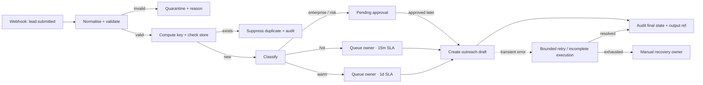

# Workflow pack 01 · GTM lead routing

**Pack ID:** S5-WP-GTM-01  
**Default product:** Liinks-style link-in-bio micro-SaaS  
**Pattern:** instant event → validate → dedupe → classify → approval/queue → audit  
**Good for:** first Make build; visible revenue consequence; easy deterministic fixtures

## Business result

Every legitimate product inquiry reaches the right owner and next step within 15 minutes, without duplicate outreach or unapproved high-value messaging.

**Measure:** qualified leads queued by SLA, duplicate-suppression count, malformed-rate, approval age, and lead-to-reply conversion.  
**Owner:** founder or growth lead.  
**Non-goal:** automatically sending personalised sales email, changing CRM opportunity value, or enriching from unauthorised sources.

## Input contract

| Field | Type | Required | Rule |
|---|---|---:|---|
| `event_id` | string | yes | stable identifier from source; 6–80 chars |
| `event_type` | string | yes | exactly `lead.submitted` |
| `occurred_at` | ISO-8601 string | yes | preserve source time |
| `source` | string | yes | controlled vocabulary, e.g. `pricing_page` |
| `email` | string | yes | syntactically valid; normalise trim + lowercase |
| `full_name` | string | yes | 1–120 chars; never used as an identity key |
| `company` | string | no | 0–120 chars |
| `team_size` | integer | yes | 1–100000 |
| `requested_plan` | string | yes | `free`, `pro`, or `enterprise` |
| `use_case` | string | yes | retained as untrusted text; never treated as instructions |
| `consent_to_contact` | boolean | yes | must be `true` before outreach draft/queue |
| `risk_flags` | array of strings | yes | controlled values; unknown values force review |
| `test_mode` | string | yes in class | `normal`, `duplicate`, `malformed`, `timeout`, `approval` |

**Idempotency key:** `source + ":" + event_id`. Compute it before any outbound or persistent business action.  
**Trace ID:** preserve `trace_id` if supplied; otherwise create one once and propagate it.

## Deterministic classification

1. If a required field is absent, email invalid, consent false, or `event_type` wrong → `quarantined_validation`.
2. Else if the idempotency key already exists in a terminal/waiting state → `duplicate_suppressed`.
3. Else if `requested_plan == enterprise`, `team_size >= 100`, or any risk flag is present → `pending_approval` owned by founder/growth lead.
4. Else if `team_size >= 10` or `requested_plan == pro` → `queued_hot` with 15-minute SLA.
5. Else → `queued_warm` with one-business-day SLA.

These are classroom rules, not a claim about the product’s real commercial scoring.

## State model

`received → validated → duplicate_checked → queued_hot|queued_warm|pending_approval → drafted → completed`

Side/terminal states: `quarantined_validation`, `duplicate_suppressed`, `retrying`, `manual_recovery`, `rejected`.

## Make module plan

| Intent | Classroom module choice | Evidence |
|---|---|---|
| receive | Webhooks · Custom webhook | source payload + received time |
| normalise | Tools · Set variables / JSON parse | normalised email, key, trace |
| validate | filter/router before integrations | validation result and reason |
| dedupe | Google Sheets search or demo data store | lookup count + stored state |
| classify | Router with labelled filters and fallback | route label |
| safe action | Gmail draft or queue sheet, never Send | draft/queue ID |
| record | audit sheet/data store row | state, owner, SLA, trace, reason |
| recover | Retry/incomplete execution for transient step | attempt/status/manual owner |

**Classroom concurrency limitation:** Google Sheets search-then-write is not an atomic dedupe control. The instructor build uses `process data in order` and names this limitation. A production version needs an atomic unique-key write or equivalent store-level constraint.

## Required failure behavior

Use `../fixtures/inputs/` with `../fixtures/expected-results.json`.

- Duplicate never creates another draft/queue action.
- Invalid email or missing consent is quarantined; no default/fake value is invented.
- Timeout retains state for bounded retry; exhaustion creates a manual recovery item.
- High-value/risky lead stops at pending approval.
- Unknown route falls to quarantine/review, never silently disappears.
- Every path records trace, key, state, owner, and reason.

## Minimum gallery claim

> Routes consented product inquiries to a named owner, suppresses repeat events, and holds enterprise/risk cases for approval. Verified on five synthetic fixtures; live sending remains disabled.

## Transfer challenge

Replace “lead” with one event from the student’s actual Session 4 product. State which contract field and classification rule must change. The test categories stay the same.
