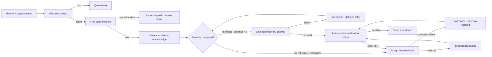

# Workflow pack 02 · Operations exception handling

**Pack ID:** S5-WP-OPS-02  
**Default product:** Liinks-style link-in-bio micro-SaaS  
**Pattern:** monitor event → validate → correlate → triage → recover/escalate → close  
**Distinctive mechanics:** incident state, ageing, bounded retry, acknowledgement and closure

## Business result

Every customer-visible page or publishing exception gets one incident record, one owner, a severity-based response clock, and a documented closure.

**Measure:** time to acknowledge, time to recover, open incidents by age/severity, retry-success rate, and repeat-incident rate.  
**Owner:** operations/on-call owner.  
**Non-goal:** automatically publishing a customer notice, modifying a live domain, deleting content, or claiming recovery before a verification check passes.

## Input contract

| Field | Type | Required | Rule |
|---|---|---:|---|
| `incident_id` | string | yes | stable from monitor/source |
| `resource_id` | string | yes | pseudonymous page/domain reference |
| `service` | string | yes | controlled service name |
| `detected_at` | ISO-8601 string | yes | original detection time |
| `signal` | string | yes | `http_error`, `publish_failed`, `domain_unverified`, `latency` |
| `severity` | string | yes | `sev1`, `sev2`, `sev3` |
| `customer_visible` | boolean | yes | drives communications gate |
| `retryable` | boolean | yes | source classification; verified against error type |
| `attempt` | integer | yes | starts at 0; maximum 3 in class |
| `details` | object | yes | minimum evidence; no customer text or credentials |
| `test_mode` | string | yes in class | fixture behavior |

**Idempotency key:** `service + ":" + incident_id`.  
**Correlation key:** `resource_id + ":" + signal` within the declared open-incident window.  
**Retry cap:** three attempts with increasing delay in the classroom design; after cap → `manual_recovery`.

## State model

`detected → validated → correlated → acknowledged → retrying|investigating|pending_approval → recovered → verified → closed`

Side/terminal states: `duplicate_signal`, `quarantined_validation`, `escalated`, `manual_recovery`, `false_positive`.

## Make scenario shape

This pack is deliberately not a lead router. It uses two cooperating scenarios:

1. **Intake and triage (instant):** receive event, validate, correlate, create/append incident, assign SLA and owner.
2. **Ageing and recovery (scheduled):** fetch open incidents due for retry/escalation, process a bounded batch, verify recovery, and close or escalate.

The ageing scenario’s iterator is bounded by the query/batch size. It never loops until success. The open-incident record carries `next_action_at`, `attempt`, `owner`, and `last_result`.

## Decision policy

Use `../fixtures/operations/inputs/` with `../fixtures/operations/expected-results.json`.

- `sev1` or customer-visible → owner immediately; any customer notice remains a draft pending approval.
- Retry only a declared transient failure and only while `attempt < 3`.
- Validation/configuration errors → human investigation, not retry.
- A recovery action does not close an incident. A separate verification check must pass.
- Repeat signals append to an open incident; they do not create notification storms.
- Ageing SLA breach escalates once per escalation level; dedupe its notification key.

## Observability contract

Every incident record includes:

- first/last seen time;
- severity and customer visibility;
- current state and owner;
- attempts and next action time;
- last error category;
- acknowledgement time;
- verification result;
- closure reason;
- trace IDs for child runs.

Daily health output: open count by severity, overdue count, median acknowledgement time, recovered by retry, manual-recovery queue, and oldest incident.

## Safe classroom substitute

Use a fixture sheet as the monitor source and an incident queue sheet as the system of record. Recovery is simulated by a deterministic `next_result` field. “Customer notice” is a text draft stored in the queue, never sent.

## Minimum gallery claim

> Correlates repeat service signals into one incident, assigns severity and ownership, retries only transient failures, and requires verification before closure. Customer communication stays approval-gated.

## Transfer challenge

Name one product operation where “action succeeded” is not enough and an independent verification step is required. Add that verification event to the chart.
