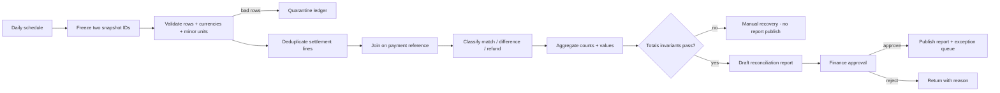

# Workflow pack 03 · Revenue reconciliation

**Pack ID:** S5-WP-REV-03  
**Default product:** Liinks-style link-in-bio micro-SaaS  
**Pattern:** scheduled snapshots → normalise → join → classify → aggregate → approve exceptions  
**Distinctive mechanics:** batch boundaries, two-source join, money invariants, exception ledger

## Business result

Produce a daily reconciliation report that proves which expected subscription charges match settlement activity and routes every difference to a named owner without changing money or accounting records automatically.

**Measure:** matched value/row rate, unresolved difference value, exception age, repeat exceptions, and time to close.  
**Owner:** founder/finance owner.  
**Non-goal:** issuing refunds, posting journal entries, changing invoices, or marking revenue recognised.

## Source contracts

### Expected charges

| Field | Type | Required | Rule |
|---|---|---:|---|
| `snapshot_id` | string | yes | identifies a frozen expected-source pull |
| `invoice_id` | string | yes | unique within source |
| `payment_reference` | string | yes | join key after trim/case normalisation |
| `amount_minor` | integer | yes | amount in minor units; never float |
| `currency` | string | yes | ISO-style uppercase code |
| `customer_ref` | string | yes | pseudonymous; no name/email needed |
| `expected_status` | string | yes | `due`, `paid`, `void` |
| `due_at` | ISO-8601 string | yes | source timestamp |

### Settlement lines

| Field | Type | Required | Rule |
|---|---|---:|---|
| `snapshot_id` | string | yes | identifies a frozen settlement pull |
| `settlement_id` | string | yes | provider batch |
| `line_id` | string | yes | unique line in settlement |
| `payment_reference` | string | yes | join key |
| `amount_minor` | integer | yes | signed minor units |
| `currency` | string | yes | uppercase |
| `type` | string | yes | `charge`, `refund`, `chargeback`, `fee` |
| `occurred_at` | ISO-8601 string | yes | source timestamp |

**Line idempotency key:** `settlement_id + ":" + line_id`.  
**Run identity:** `expected_snapshot_id + ":" + settlement_snapshot_id + ":" + rule_version`.

## Classification policy

- Exactly one expected and one charge line, same currency/amount → `matched`.
- Expected row with no settlement charge after declared timing window → `missing_settlement`.
- Settlement charge with no expected row → `unexpected_settlement`.
- Same reference but different amount → `amount_mismatch`.
- Same reference but different currency → `currency_mismatch`.
- Refund or chargeback → separate `refund_review` / `chargeback_review`; never net away silently.
- Multiple rows per reference → `ambiguous_many_to_many`; human review.
- Malformed money/reference → `quarantined_validation` and excluded from matched totals, but included in quarantine totals.

## State model

`snapshots_ready → validated → joined → classified → totals_checked → report_drafted → approved → published`

Side/terminal states: `source_incomplete`, `duplicate_line_suppressed`, `quarantined_validation`, `exception_open`, `approval_rejected`, `manual_recovery`.

## Reconciliation invariants

Use `../fixtures/revenue/inputs/` with `../fixtures/revenue/expected-results.json`.

All use integers in minor units and are computed per currency:

1. Every valid expected row appears in exactly one class.
2. Every valid settlement line appears in exactly one class.
3. `valid rows + quarantined rows = source rows` for each source.
4. `matched + all exception classes = classified rows` under the declared counting rule.
5. Duplicate settlement lines contribute zero additional value after suppression.
6. Refunds/chargebacks remain explicit; they are not hidden inside net revenue.
7. A source pull failure prevents “complete” publication; partial report is labelled partial and approval-gated.

## Make scenario shape

- Scheduler starts after the expected settlement window.
- Read frozen expected and settlement fixture ranges.
- Validate and normalise with deterministic mappings.
- Deduplicate settlement line keys.
- Iterate a bounded source range; search/index counterpart by payment reference.
- Classify into an exception ledger.
- Aggregate counts and minor-unit values by currency/class.
- Verify invariants.
- Write a draft report and approval item.

For a larger real dataset, move the join/aggregation to a database/query or code step rather than performing an unbounded Make search inside every row. Explain the cost and correctness trade-off.

## Failure and approval behavior

- Source timeout → Retry/incomplete execution; do not publish a “zero difference” report.
- One malformed row → quarantine it with reason; totals disclose the exclusion.
- Duplicate line → suppress by key and count the duplicate.
- Invariant failure → manual recovery; no approval request yet.
- Report approval authorises publication of the report, not movement or refund of money.
- Any correction to money/accounting remains a separate, authorised process.

## Minimum gallery claim

> Reconciles two frozen revenue snapshots using minor-unit money, preserves refunds and exceptions, proves totals invariants, and requires finance approval before publishing the report. It never moves money.

## Transfer challenge

Explain how settlement timing, fees, partial payments, taxes, or multi-currency behavior would change the contract. Add one rule without breaking the invariants.
